# Tutorial Integral de PRISM

## 1. Propósito de este documento

Este documento existe para recuperar el contexto completo del proyecto después de una evolución prolongada del repositorio. Su objetivo es convertir PRISM nuevamente en un sistema legible de extremo a extremo: qué problema resuelve, cómo está organizado, qué hace cada archivo relevante, cómo funciona internamente el profiling, cómo se construye el DAG, cómo se obtienen las métricas, cómo se formula y resuelve el modelo ILP, cómo se genera la frontera de Pareto, y cómo se pasa de una solución matemática a simulación y ejecución híbrida reales.

El texto está escrito como tutorial técnico integral. No asume que el lector recuerde decisiones previas del proyecto. Por eso define términos, identifica los puntos de entrada, explica las ecuaciones y conecta cada etapa con los archivos que realmente implementan esa etapa.

## 2. Qué es PRISM y qué problema resuelve

PRISM, sigla de *Partitioning and Resource Intelligence for System Memory*, es un sistema para optimizar el entrenamiento de modelos de aprendizaje profundo en arquitecturas heterogéneas CPU-GPU. El problema central que aborda no es simplemente medir tiempos de ejecución ni perfilar modelos, sino decidir de forma informada qué partes del modelo deben ejecutarse en GPU y cuáles pueden ejecutarse en CPU para reducir presión sobre la VRAM sin convertir a la CPU en un actor pasivo o residual.

La idea metodológica que sostiene el proyecto es la siguiente. No se puede plantear un modelo de optimización serio sin datos empíricos confiables. Por esa razón, PRISM empieza midiendo por capa tiempos, energía, memoria, FLOPs y costos de transferencia. Después transforma esa evidencia en coeficientes robustos que alimentan un modelo de programación lineal entera. Ese modelo genera un plan de partición CPU-GPU. Luego ese plan puede evaluarse en simulación y, finalmente, ejecutarse en un runtime híbrido real para comprobar si la política propuesta es operacionalmente válida.

En consecuencia, PRISM no es solo un profiler, ni solo un solver ILP, ni solo un runtime experimental. Es un pipeline completo con las siguientes etapas:

1. Medición por capa del entrenamiento.
2. Extracción estructural del grafo computacional.
3. Calibración de transferencia CPU-GPU.
4. Agregación robusta de múltiples réplicas.
5. Construcción y resolución del ILP.
6. Barrido de presupuestos de memoria para obtener soluciones de compromiso.
7. Simulación y validación del plan.
8. Ejecución híbrida real guiada por el plan.
9. Exportación de reportes y activos para tesis.

## 3. Arquitectura general del proyecto

### 3.1 Flujo lógico de extremo a extremo

El flujo operacional de PRISM puede describirse de forma continua.

Primero, se construye un modelo y un lote de entrada compatibles con una tarea determinada. Ese lote puede provenir de un dataset real o, de forma controlada, de entradas sintéticas. A continuación, el profiler ejecuta el entrenamiento del modelo y registra, por capa, tiempos, energía, memoria, tamaño de activaciones y estimaciones de FLOPs. Paralelamente, extrae una representación estructural del modelo como DAG y calibra costos de transferencia por arista.

Después, cuando existen varias corridas de una misma configuración, se agregan estadísticamente para obtener coeficientes robustos. Sobre esos coeficientes se construye el ILP. El ILP decide una asignación CPU-GPU por capa, y en sus versiones más avanzadas puede además distinguir forward y backward, y modelar estrategias sobre activaciones como retención, recomputación o checkpointing.

Con una solución ILP en mano, el proyecto puede seguir dos rutas. La primera es la simulación, donde se comprueba factibilidad, memoria y costo previsto sin ejecutar realmente la red en modo híbrido. La segunda es la ejecución híbrida real, donde se reconstruye el modelo, se asignan capas a dispositivos según el plan y se mide el comportamiento observado.

Finalmente, toda esa evidencia se exporta en tablas, resúmenes, gráficos y activos listos para tesis.

El flujo completo puede visualizarse así:

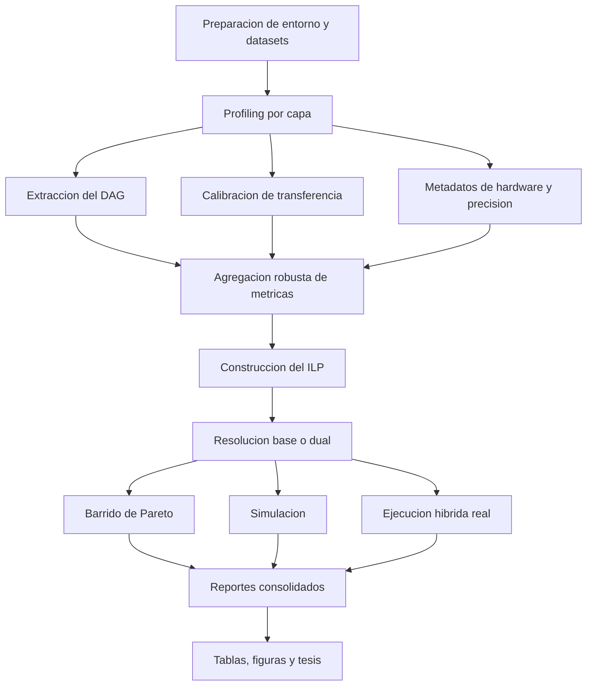

También conviene entender la relación temporal entre etapas:

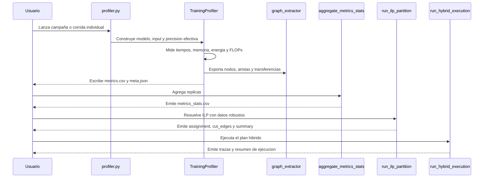

### 3.2 Mapa de directorios

La estructura general del repositorio es la siguiente:

```text
.
├── config/
├── data/
├── datasets/
├── docs/
├── logs/
├── reports/
├── scripts/
├── src/
├── tests/
├── thesis/
├── validation/
├── pytest.ini
└── README.md
```

La lectura correcta de esa estructura es funcional:

- `config/` define el entorno reproducible.
- `src/` implementa el núcleo lógico del sistema.
- `scripts/` orquesta campañas y flujos completos.
- `validation/` contiene herramientas de validación, agregación, ILP y reporting.
- `docs/` conserva el corpus documental.
- `tests/` contiene la batería automatizada.
- `thesis/` integra el manuscrito y sus artefactos generados.
- `data/`, `datasets/`, `logs/` y `reports/` son contenedores de evidencia experimental o de soporte operacional.

## 4. Cómo funciona el profiling

### 4.1 Punto de entrada

El profiling arranca en `src/profiler.py`. Este archivo cumple cuatro funciones:

1. Parsea la configuración del experimento desde CLI.
2. Decide la política de precisión efectiva.
3. Construye el modelo y el lote de entrada.
4. Invoca a `TrainingProfiler` en `src/runner/training_profiler.py`.

El flujo en código, simplificado, es el siguiente:

1. `_build_parser()` define argumentos como modelo, precisión, tamaño de lote, número de iteraciones de calentamiento y medición, uso o no de CPU, uso o no de RAPL, rutas de datasets y banderas de validación.
2. `_configure_precision()` consulta `src/core/precision_policy.py` para determinar si la precisión solicitada es admisible en el hardware disponible.
3. `build_model_input_target()` o funciones equivalentes de `src/models/factory.py` construyen el modelo y los tensores de entrada.
4. `TrainingProfiler.run_profiling()` ejecuta el pipeline de medición propiamente dicho.

### 4.2 Construcción del modelo y de la entrada

La construcción del modelo ocurre en `src/models/factory.py`. Este archivo encapsula la lógica de selección del modelo a partir del nombre solicitado y la construcción de entradas y objetivos compatibles.

PRISM soporta, en la versión actual:

- `resnet50`
- `resnet152`
- `vit_b16`
- `bert_base`
- `gpt2_small`
- `distilgpt2`
- `simple_mlp`

No todos estos modelos usan el mismo tipo de entrada. Los modelos de visión consumen tensores con forma espacial. Los modelos NLP consumen secuencias o diccionarios con tensores de entrada. Por eso la fábrica de modelos separa la creación del modelo de la creación del input y del target. Esa separación es importante porque el profiler, el validador híbrido y el pipeline ILP necesitan consistencia entre la forma del modelo y la semántica del dato.

### 4.3 Instrumentación por hooks

La instrumentación ocurre en `src/runner/training_profiler.py`, principalmente en `_register_hooks()`.

La decisión central aquí es medir solo módulos hoja. Un módulo hoja es un submódulo de PyTorch que no tiene hijos. Esta decisión evita el doble conteo de estructuras anidadas. Si un bloque residual contiene varias convoluciones y normalizaciones, no interesa medir el bloque como un todo y, a la vez, cada una de sus capas internas. Interesa medir la granularidad sobre la que después se tomarán decisiones de partición, y en PRISM esa unidad es la capa hoja.

Para cada módulo hoja se instalan dos hooks:

- un *forward pre-hook*, que registra el instante de inicio
- un *forward hook*, que registra el instante de fin y calcula métricas derivadas

En CPU, la medida temporal base usa `time.perf_counter()`. En GPU, además de la medición temporal en pared, se usan eventos CUDA (`torch.cuda.Event`) para estimar el tiempo de kernel con mayor fidelidad.

### 4.4 Tiempo de capa y overhead de dispatch

Cuando una capa termina de ejecutarse, PRISM calcula dos cantidades importantes:

1. tiempo de kernel
2. tiempo de pared

El tiempo de kernel representa el tiempo del cálculo en el dispositivo. El tiempo de pared incluye, además, overhead del framework, sincronizaciones, latencia de despacho y otros costos del runtime.

La diferencia entre ambas cantidades define el overhead de dispatch:

$$
T_{dispatch} = \max(0, T_{wall} - T_{kernel})
$$

donde:

- $T_{dispatch}$ es el overhead de despacho de la capa
- $T_{wall}$ es el tiempo total observado en pared
- $T_{kernel}$ es el tiempo asociado al cálculo efectivo

Esta ecuación es importante porque permite distinguir entre una capa costosa por cómputo real y una capa costosa por sobrecarga del framework.

### 4.5 Memoria y tamaño de salida

En el mismo hook de salida, el profiler calcula:

- tamaño de parámetros de la capa
- tamaño de la activación de salida
- memoria pico observada en GPU

El tamaño de activación se obtiene con `get_tensor_size_recursive()` en `src/core/metrics.py`, que recorre tensores, listas, tuplas y diccionarios para sumar el volumen total en bytes. Esta métrica es esencial porque alimenta dos partes del pipeline:

1. el contrato de memoria por capa
2. la estimación del costo de transferencia a lo largo del DAG

### 4.6 FLOPs

PRISM estima FLOPs teóricos para operadores conocidos mediante `estimate_flops()` en `src/core/metrics.py`.

Las ecuaciones centrales son las siguientes.

Para convolución 2D:

$$
\mathrm{FLOPs}_{conv} = 2 \cdot C_{out} \cdot H_{out} \cdot W_{out} \cdot \left(\frac{C_{in}}{groups} \cdot K_x \cdot K_y\right)
$$

donde:

- $C_{out}$ es el número de canales de salida
- $H_{out}$ es la altura de salida
- $W_{out}$ es la anchura de salida
- $C_{in}$ es el número de canales de entrada
- `groups` es el número de grupos de la convolución
- $K_x$ y $K_y$ son las dimensiones del kernel
- el factor $2$ representa multiplicación y suma

Para una capa lineal:

$$
\mathrm{FLOPs}_{linear} = 2 \cdot P \cdot in\_features \cdot out\_features
$$

donde:

- $P$ es el producto de las dimensiones posicionales anteriores al eje de características
- `in_features` es el tamaño de la entrada lineal
- `out_features` es el tamaño de la salida lineal

Para atención, PRISM usa una aproximación:

$$
\mathrm{FLOPs}_{attn} \approx 4BSD^2 + 2BS^2D
$$

donde:

- $B$ es el tamaño de lote
- $S$ es la longitud de secuencia
- $D$ es la dimensión oculta

Los FLOPs no son la función objetivo del sistema, pero sirven para contextualizar eficiencia y comparar capas heterogéneas bajo una métrica computacional común.

### 4.7 Energía

La captura energética vive en `src/core/energy.py` y se integra desde `TrainingProfiler._run_epoch()`.

PRISM usa dos fuentes:

- NVML para GPU
- RAPL para CPU, cuando el entorno lo permite

La energía total se aproxima con:

$$
E_{total} = P_{avg} \cdot T
$$

donde:

- $E_{total}$ es la energía total medida
- $P_{avg}$ es la potencia promedio muestreada
- $T$ es la duración total del experimento

En GPU, `EnergyMonitor` muestrea potencia con NVML en un hilo separado. En CPU, cuando RAPL está disponible, la lectura se hace sobre el paquete energético del procesador. Si RAPL no está disponible, el pipeline continúa, pero la energía de CPU puede quedar vacía o neutralizada según el contexto.

### 4.8 Forward y backward

Durante la ejecución del entrenamiento, PRISM ejecuta por iteración:

1. `opt.zero_grad()`
2. `forward`
3. cálculo de pérdida
4. `loss.backward()`
5. `opt.step()`

El profiler acumula tiempo y otras magnitudes a nivel de capa, y luego distingue términos forward y backward mediante la estructura de los artefactos agregados y los campos específicos usados por el ILP dual. En `ILPInputData`, por ejemplo, aparecen:

- `node_cost_gpu_fwd_ms`
- `node_cost_gpu_bwd_ms`
- `node_cost_cpu_fwd_ms`
- `node_cost_cpu_bwd_ms`

Si una corrida no aporta separación explícita, existen valores por defecto que reparten el costo total de forma simétrica. Esto es útil para diagnóstico, pero conceptualmente la tesis debe apoyarse en artefactos donde la distinción sea trazable y consistente.

### 4.9 Artefactos del profiling

Por cada configuración, PRISM produce al menos:

- `{model}_metrics.csv`
- `{model}_meta.json`
- `{model}_graph_nodes.csv`
- `{model}_graph_edges.csv`
- `{model}_transfer_edges.csv`

Los significados son:

- `metrics.csv`: mediciones por capa
- `meta.json`: metadatos de hardware, precisión, configuración y procedencia
- `graph_nodes.csv`: nodos del DAG
- `graph_edges.csv`: aristas del DAG
- `transfer_edges.csv`: costos de transferencia por arista

Cuando se ejecutan varias corridas equivalentes, la capa de agregación genera además:

- `{model}_metrics_stats.csv`

## 5. Cómo se construye el DAG y cómo se usa

### 5.1 Qué es el DAG en este proyecto

El DAG es el grafo dirigido acíclico que representa dependencias de datos entre capas del modelo. En términos prácticos, si una capa produce una activación y otra la consume, existe una arista dirigida entre ambas.

La razón por la que PRISM necesita este DAG es que el costo de una partición no depende solo del tiempo local de cada capa. También depende de cuántas veces la partición corta una dependencia entre dispositivos. Si dos capas conectadas quedan en dispositivos distintos, aparece un costo de transferencia que debe entrar en la función objetivo del ILP.

### 5.2 Estrategias de extracción del grafo

La extracción estructural está en `src/core/graph_extractor.py`, con soporte adicional en `src/core/decoder_export_backend.py`.

PRISM usa tres estrategias, en orden de preferencia según el caso:

1. `torch.export` para ciertos modelos decoder-only
2. `torch.fx.symbolic_trace()` para trazado simbólico general
3. una topología de respaldo basada en módulos hoja, solo para diagnóstico

La primera opción es especialmente importante en modelos como GPT-2 y DistilGPT2, donde `torch.export` puede producir una traza más adecuada que `torch.fx`. La segunda opción, `torch.fx`, es la ruta general. La tercera existe solo para no bloquear diagnóstico cuando el trazado estructural falla, pero no debe considerarse evidencia doctoral principal salvo excepción explícita.

### 5.3 Qué contienen los nodos

`{model}_graph_nodes.csv` contiene campos como:

- `node_id`
- `node_name`
- `op_type`
- `topo_index`
- `params_mb`
- `activ_out_mb`
- `trace_source`

El significado es:

- `node_id`: identificador técnico del nodo
- `node_name`: nombre legible de la capa o módulo
- `op_type`: tipo de operación
- `topo_index`: orden topológico
- `params_mb`: memoria de parámetros
- `activ_out_mb`: tamaño estimado de la activación de salida
- `trace_source`: procedencia de la traza

### 5.4 Qué contienen las aristas

`{model}_graph_edges.csv` contiene típicamente:

- `src_id`
- `dst_id`
- `tensor_mb`
- `tensor_shape`
- `producer_name`
- `consumer_name`
- `trace_source`

Cada fila dice que una activación producida por `producer_name` llega a `consumer_name`, y cuánto volumen de datos transporta esa dependencia.

### 5.5 Cómo se obtienen los costos de transferencia del DAG

PRISM calibra transferencia en `TrainingProfiler._measure_pci_and_overlap()` y genera después `transfer_edges.csv`.

La lógica conceptual es:

1. medir o aproximar ancho de banda CPU-GPU
2. medir latencia base de transferencia
3. estimar solapamiento entre cómputo y comunicación
4. aplicar esas cantidades al tamaño de tensor asociado a cada arista

El archivo `transfer_edges.csv` contiene, para cada arista relevante, un costo de transferencia simétrico `transfer_sym_ms` y, cuando aplica, valores direccionales o parámetros derivados.

### 5.6 Cómo se colapsa el grafo a capas medidas

No siempre el grafo estructural coincide exactamente con la granularidad del profiling. Por ello, `src/ilp/data_loader.py` implementa `_collapse_graph_to_measured_edges()`.

La idea de esa función es recorrer el DAG completo y reducirlo a un grafo entre nodos que sí tienen métricas medibles por capa. En ese proceso:

- se conservan solo nodos presentes en el conjunto medido
- se buscan caminos intermedios entre nodos medidos
- se asigna un costo de transferencia agregado al borde colapsado

Esto permite que el ILP se formule sobre la misma granularidad que el profiler, sin perder la semántica estructural esencial del DAG.

El colapso desde el DAG bruto hacia las aristas que finalmente importan al ILP puede representarse así:

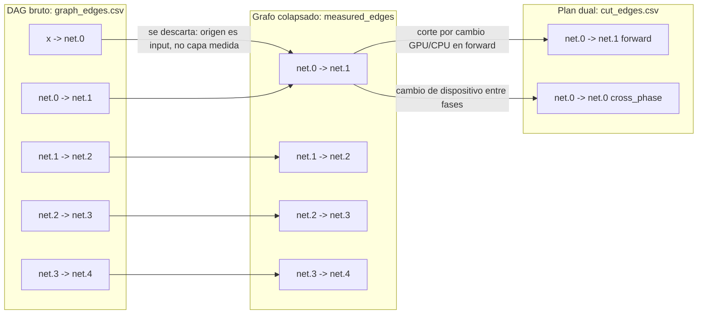

Este diagrama muestra tres niveles distintos que conviene no confundir. `graph_edges.csv` representa la dependencia estructural original. `measured_edges` representa el subconjunto o colapso compatible con las capas realmente perfiladas. `cut_edges.csv` ya no es una descripción estática del modelo, sino el resultado de una decisión de partición. En el caso dual, además de cortes topológicos como `net.0 -> net.1`, aparece una arista conceptual `cross_phase` para representar el cambio de dispositivo de una misma capa entre forward y backward.

En el caso controlado `simple_mlp`, el DAG bruto observado incluye las aristas:

- `x -> net.0`
- `net.0 -> net.1`
- `net.1 -> net.2`
- `net.2 -> net.3`
- `net.3 -> net.4`

Pero la solución dual solo corta dos relaciones:

- `net.0 -> net.1` en la fase forward
- `net.0 -> net.0` como transición `cross_phase`

Esa diferencia resume muy bien la lógica del proyecto: no todas las aristas del DAG generan costo, solo aquellas que la solución ubica entre dispositivos distintos o entre fases distintas.

## 6. Cómo se agregan las métricas

### 6.1 Motivo de la agregación

Una sola corrida no es suficiente para construir un modelo robusto. El entorno experimental introduce ruido: jitter del sistema, efectos térmicos, variabilidad de carga, fluctuaciones del runtime y diferencias entre servidores. Por eso PRISM agrega múltiples réplicas de una misma configuración.

### 6.2 Implementación

La agregación se implementa en:

- `validation/aggregate_metrics_stats.py`
- `src/core/stats_aggregator.py`

El agregador:

1. descubre todos los `*_metrics.csv` relevantes de una configuración
2. agrupa por capa y por identidad experimental
3. calcula estadísticas robustas
4. emite banderas de calidad

### 6.3 Estadísticas emitidas

Para cada métrica base, el agregador produce columnas con sufijos como:

- `_mean`
- `_std`
- `_p50`
- `_p90`
- `_p95`

Además agrega:

- `n_runs`
- `n_samples`
- `quality_flag`

`quality_flag` resume si los datos de una capa son suficientemente confiables para alimentar el ILP. Si la calidad es baja, el cargador ILP puede rechazar el artefacto bajo modo estricto.

### 6.4 Cómo se construyen los coeficientes robustos

El patrón general de robustificación en PRISM es:

$$
\hat{m} = \mu_m + k_\sigma \sigma_m
$$

donde:

- $\hat{m}$ es el valor robusto de la métrica
- $\mu_m$ es la media observada
- $\sigma_m$ es la desviación estándar observada
- $k_\sigma$ es un parámetro de conservadurismo

Si $k_\sigma = 0$, el sistema usa el valor medio nominal. Si $k_\sigma > 0$, penaliza variabilidad y hace el modelo más conservador.

## 7. Cómo se construye el modelo ILP

### 7.1 Punto de partida

El ILP se construye en:

- `src/ilp/data_loader.py`
- `src/ilp/model_builder.py`
- `src/ilp/solve.py`

La responsabilidad se divide así:

- `data_loader.py` lee, valida y estructura los datos
- `model_builder.py` transforma esos datos en coeficientes del problema
- `solve.py` formula y resuelve el modelo mediante PuLP/CBC, búsqueda exhaustiva o variantes auxiliares

### 7.2 Conjuntos, parámetros y variables básicas

Sea $V$ el conjunto de capas medidas. Sea $E$ el conjunto de aristas entre capas medidas derivado del DAG colapsado. Para cada nodo $n \in V$ existen costos de ejecución en CPU y en GPU, así como costos de memoria. Para cada arista $(u,v) \in E$ existe un costo de transferencia.

En el modelo base, la variable principal es:

$$
x_n \in \{0,1\}
$$

donde:

- $x_n = 1$ significa que la capa $n$ se asigna a GPU
- $x_n = 0$ significa que la capa $n$ se asigna a CPU

Además se define una variable binaria de corte por arista:

$$
y_{uv} \in \{0,1\}
$$

donde:

- $y_{uv} = 1$ significa que la arista entre $u$ y $v$ queda cortada entre dispositivos
- $y_{uv} = 0$ significa que ambos extremos están en el mismo dispositivo

### 7.3 Función objetivo del modelo base

En `build_problem_data()` se construyen dos diccionarios de costos nodales:

- `objective_node_gpu`
- `objective_node_cpu`

Para cada nodo $n$:

$$
C^{gpu}_n = w_{time} \cdot T^{gpu}_n + w_{energy} \cdot E^{gpu}_n
$$

$$
C^{cpu}_n = w_{time} \cdot T^{cpu}_n + w_{energy} \cdot E^{cpu}_n
$$

donde:

- $T^{gpu}_n$ es el costo temporal robusto de la capa en GPU
- $T^{cpu}_n$ es el costo temporal robusto de la capa en CPU
- $E^{gpu}_n$ es el costo energético robusto en GPU
- $E^{cpu}_n$ es el costo energético robusto en CPU
- $w_{time}$ es el peso del tiempo
- $w_{energy}$ es el peso de la energía

El costo de corte de arista se construye como:

$$
C^{cut}_{uv} = w_{transfer} \cdot T^{transfer}_{uv}
$$

donde:

- $T^{transfer}_{uv}$ es el costo robusto de transferencia de la arista
- $w_{transfer}$ es el peso del costo de transferencia

La función objetivo total es:

$$
\min Z = \sum_{n \in V} \left(x_n C^{gpu}_n + (1-x_n) C^{cpu}_n\right) + \sum_{(u,v) \in E} y_{uv} C^{cut}_{uv}
$$

Esta ecuación significa que el sistema suma, para cada capa, el costo correspondiente al dispositivo elegido y, además, agrega una penalización por cada dependencia del DAG que queda cruzando CPU y GPU.

### 7.4 Restricciones de corte

En `solve.py`, el comportamiento lógico de $y_{uv}$ se fuerza con cuatro desigualdades lineales:

$$
y_{uv} \ge x_u - x_v
$$

$$
y_{uv} \ge x_v - x_u
$$

$$
y_{uv} \le x_u + x_v
$$

$$
y_{uv} \le 2 - x_u - x_v
$$

Estas ecuaciones implementan linealmente la idea de que $y_{uv}$ debe valer 1 si y solo si los extremos están en dispositivos diferentes.

### 7.5 Restricciones de memoria

El modelo impone presupuestos de memoria para GPU y CPU:

$$
\sum_{n \in V} M^{gpu}_n x_n \le B_{gpu}
$$

$$
\sum_{n \in V} M^{cpu}_n (1-x_n) \le B_{cpu}
$$

donde:

- $M^{gpu}_n$ es la memoria de la capa si se asigna a GPU
- $M^{cpu}_n$ es la memoria de la capa si se asigna a CPU
- $B_{gpu}$ es el presupuesto de memoria GPU
- $B_{cpu}$ es el presupuesto de memoria CPU

Estas restricciones son las que convierten el problema en una optimización físicamente viable, no solo matemáticamente elegante.

### 7.6 Modelo dual: forward y backward separados

PRISM implementa también una versión dual en `build_problem_data_dual()` y `_solve_with_pulp_dual()`.

Aquí ya no existe una sola variable por nodo, sino dos:

$$
x^f_n \in \{0,1\}
$$

$$
x^b_n \in \{0,1\}
$$

donde:

- $x^f_n$ decide el dispositivo de la fase forward de la capa $n$
- $x^b_n$ decide el dispositivo de la fase backward de la capa $n$

Se definen también:

- $y^f_{uv}$ para cortes en forward
- $y^b_{uv}$ para cortes en backward
- $z_n$ para cruzamientos de fase, es decir, casos en que una capa cambia de dispositivo entre forward y backward

La función objetivo dual suma:

1. costo forward por nodo
2. costo backward por nodo
3. costo de corte forward
4. costo de corte backward
5. costo de transición entre fases

De forma conceptual:

$$
\min Z_{dual} = Z_{fwd} + Z_{bwd} + Z_{cut}^{fwd} + Z_{cut}^{bwd} + Z_{cross}
$$

El término de transición de fase usa en código `objective_cross_phase[n]`, que se construye como un costo proporcional a `node_time_io_ms[n]` ponderado por `w_transfer`.

El modelo dual puede visualizarse como dos problemas de asignación acoplados por la misma capa física:

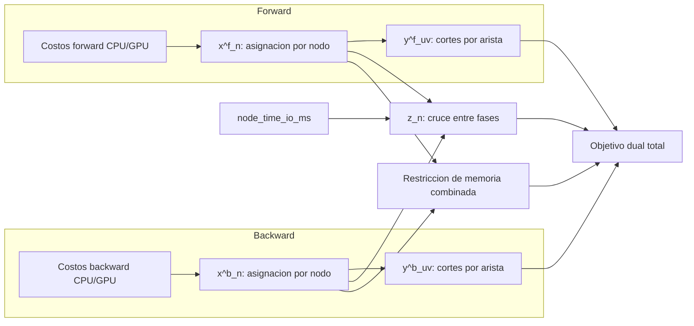

La semántica del diagrama es importante. La fase forward no decide aislada del backward, y el backward no decide aislado del forward. Las variables $x^f_n$ y $x^b_n$ comparten identidad de capa, pero pueden elegir dispositivos distintos. Esa libertad adicional mejora expresividad, pero obliga a introducir el término $z_n$, que penaliza el cambio de dispositivo entre fases, y la restricción de memoria combinada, que evita soluciones irrealizables desde el punto de vista del entrenamiento.

También puede leerse el dual capa por capa como una máquina de estados mínima:

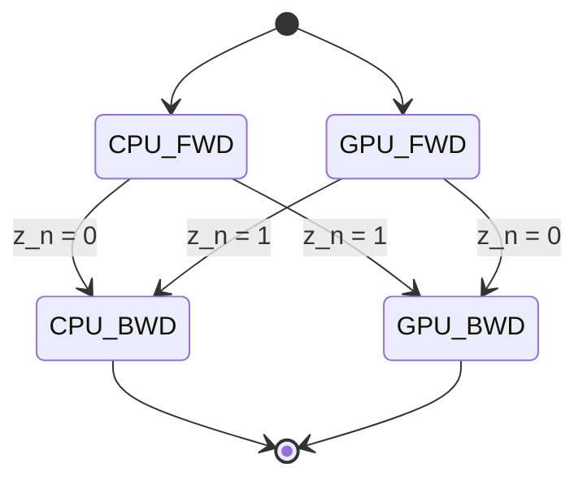

Ese diagrama no representa toda la optimización, pero sí ilustra el significado físico de $z_n$: vale 1 cuando la capa cambia de dispositivo al pasar de forward a backward.

### 7.7 Restricción de memoria combinada en el modelo dual

Durante backward no basta con considerar la memoria del backward aislado. El código impone además una restricción combinada: durante backward pueden coexistir activaciones de forward y tensores de backward. Por eso `_solve_with_pulp_dual()` añade restricciones de memoria conjunta que suman ambos consumos y los comparan con el presupuesto.

Esta decisión es importante porque hace el modelo más realista desde el punto de vista del entrenamiento.

### 7.8 Extensión de activaciones: Phase 4

PRISM incluye además una extensión en `src/ilp/advanced_terms.py` y `build_problem_data_phase4()`.

Aquí se modela, por capa, una estrategia sobre activaciones. Conceptualmente existen tres posibilidades:

- retener la activación
- recomputarla
- checkpointing

La intención es capturar el compromiso entre memoria, tiempo y costo de E/S. En términos de datos:

- `node_mem_activation_mb` representa memoria de activación
- `node_time_recompute_ms` representa costo temporal de recomputar
- `node_time_checkpoint_ms` representa costo temporal asociado a checkpointing
- `node_energy_io_j` representa costo energético de E/S

Aunque esta parte tiene mecanismos heurísticos por defecto cuando faltan metadatos explícitos, conceptualmente debe leerse como el bloque que amplía el modelo base hacia decisiones más finas de manejo de memoria.

### 7.9 Validación del ILP

Antes de construir el problema, `load_ilp_inputs()` valida:

- calidad muestral
- procedencia de la calibración de transferencia
- fuente estructural del grafo
- validez numérica de las métricas
- mapeo entre DAG y capas medidas

Esto significa que PRISM no solo resuelve un ILP. Primero verifica si los artefactos son metodológicamente aceptables para resolverlo.

## 8. Qué es la frontera de Pareto y cómo se construye aquí

### 8.1 Qué es la frontera de Pareto

La frontera de Pareto es el conjunto de soluciones no dominadas en un problema con objetivos en tensión. Una solución domina a otra si es al menos tan buena en todos los criterios relevantes y estrictamente mejor en al menos uno.

En PRISM, la tensión principal aparece entre:

- costo objetivo total
- memoria GPU disponible o usada

Si aumentar el presupuesto de GPU reduce el costo, pero consumir más memoria no siempre es deseable, entonces existe una familia de soluciones de compromiso. La frontera de Pareto representa precisamente ese conjunto de compromisos eficientes.

### 8.2 Cómo se implementa el barrido en PRISM

El barrido se implementa en `validation/sweep_ilp_pareto.py`.

La lógica es:

1. recibir una lista de presupuestos GPU, por ejemplo `400,600,800,1000`
2. para cada presupuesto, construir una configuración ILP nueva
3. resolver el ILP de forma independiente
4. guardar las métricas de la solución obtenida
5. evaluar además baselines como `all_cpu`, `all_gpu` y `greedy`

Cada fila del resultado contiene, entre otras cosas:

- estado de la solución ILP
- valor objetivo
- memoria GPU usada
- memoria CPU usada
- número de capas en GPU y CPU
- número de aristas cortadas
- resultados de baselines

### 8.3 Cómo interpretar la frontera

En el contexto del proyecto, la frontera de Pareto sirve para responder preguntas del tipo:

- cuánto empeora el costo objetivo si se obliga a usar menos VRAM
- cuándo conviene aceptar más memoria GPU a cambio de menos transferencia
- cuál presupuesto ofrece el mejor equilibrio para un entorno dado

La frontera no es una sola ecuación cerrada, sino el resultado de múltiples resoluciones ILP con distintos límites de memoria.

## 9. Cómo se simula el plan

### 9.1 Representación del plan

La representación canónica del plan vive en `src/runtime/plan_representation.py` y `src/runtime/device_plan.py`.

Un plan contiene, como mínimo:

- asignación de capas a dispositivos
- aristas cortadas
- en el caso dual, asignaciones separadas de forward y backward
- estrategias de activación, cuando aplica

### 9.2 Simulador

El simulador está en `src/runtime/simulator.py` y se usa desde `validation/validate_ilp_pipeline.py`.

La idea del simulador es evaluar la solución sin ejecutar entrenamiento real. Toma el plan, el DAG y los costos asociados y calcula:

- costo total previsto
- consumo de memoria
- violaciones de factibilidad, si existen

Conceptualmente, recorre nodos y aristas y suma:

1. costo nodal según dispositivo asignado
2. costo de transferencia por aristas cortadas

Si la memoria usada supera el presupuesto, el plan se declara inviable.

La simulación es importante porque permite detectar errores conceptuales antes de pasar a ejecución real, donde el costo experimental es mayor.

## 10. Cómo se hace la ejecución híbrida real

### 10.1 Punto de entrada

La ejecución real se lanza desde `validation/run_hybrid_execution.py`, que usa:

- `load_execution_plan`
- `DevicePlan`
- `run_hybrid_training` en `src/runtime/hybrid_executor.py`

### 10.2 Idea general

La ejecución híbrida real toma un plan ILP y reconstruye un modelo cuyo flujo de capas y tensores puede atravesar CPU y GPU según la asignación definida.

Aquí es importante aclarar una cosa: la decisión de asignación no se calcula de manera online durante el entrenamiento a partir de una política adaptativa que se reoptimiza a cada paso. La decisión principal es offline y viene del ILP. Lo que sí ocurre dinámicamente durante la ejecución es el movimiento de módulos, tensores y activaciones siguiendo esa política ya calculada.

### 10.3 Cómo se distribuyen las capas

`DevicePlan` actúa como traductor entre el archivo de solución y la ejecución real. Para cada capa, conoce:

- dispositivo de forward
- dispositivo de backward
- cortes relevantes
- estrategias de activación

Con esa información, el ejecutor resuelve el dispositivo efectivo de cada capa en cada fase del paso de entrenamiento.

### 10.4 Cómo se usa el DAG en la ejecución real

El DAG no se usa solo para construir el ILP. También informa la interpretación del plan. Las aristas cortadas señalan dónde deben ocurrir transferencias de activaciones. El plan conserva esa semántica estructural para que el runtime sepa cuándo mover datos entre CPU y GPU.

### 10.5 Cómo se mueve la información entre dispositivos

`hybrid_executor.py` implementa utilidades como:

- `_to_device()`
- `_to_device_non_blocking()`
- `_current_device()`
- `_all_tensor_devices()`

Además define estructuras como:

- `TransferEvent`
- `StepTrace`
- `HybridExecutionResult`

Estas clases permiten registrar, por paso:

- tiempo total
- tiempo de forward
- tiempo de backward
- tiempo de optimizador
- cantidad total de transferencia
- número de eventos de transferencia
- memoria pico GPU
- cantidad de recomputaciones y checkpoints

### 10.6 Ejecución por capas y estrategia dual

Cuando una capa requiere dispositivos distintos en forward y backward, el ejecutor puede recurrir a mecanismos específicos como `_run_layer_with_dual_placement()`. Esa función encapsula una estrategia en la que:

1. el forward se ejecuta en el dispositivo de forward
2. el backward se fuerza en el dispositivo de backward
3. la información necesaria se guarda o reconstruye para mantener coherencia de gradientes

Esto es uno de los puntos más importantes del proyecto, porque conecta directamente el modelo dual del ILP con una posibilidad real de ejecución física.

El flujo operativo de una capa con colocación dual puede visualizarse así:

```mermaid
sequenceDiagram
	participant Host as CPU Host
	participant GF as GPU forward
	participant GB as GPU backward
	participant C as Capa n
	participant Opt as Optimizer

	alt forward en CPU
		Host->>C: entrada en CPU
		C-->>Host: activacion forward
	else forward en GPU
		Host->>GF: mover entrada
		GF->>C: ejecutar forward
		C-->>GF: activacion forward
	end

	alt cambio de dispositivo entre fases
		GF->>Host: transferir activacion o estado intermedio
		Host->>GB: recolocar para backward
	else mismo dispositivo entre fases
		GF->>GB: conservar localidad
	end

	alt backward en CPU
		Host->>C: ejecutar backward
		C-->>Host: gradientes
	else backward en GPU
		GB->>C: ejecutar backward
		C-->>GB: gradientes
	end

	Host->>Opt: actualizar pesos o sincronizar estado
	GB->>Opt: actualizar pesos o sincronizar estado
```

La lógica de ese diagrama es la siguiente. Primero se ejecuta la fase forward en el dispositivo indicado por `assignment_forward`. Después el runtime inspecciona si `assignment_backward` coincide o no. Si coincide, puede reutilizar localidad y reducir movimiento de datos. Si no coincide, aparecen transferencias adicionales, y el ejecutor debe preservar la información necesaria para que el backward siga siendo correcto.

Otra forma útil de leer la ejecución dual es como decisión por frontera entre capas:

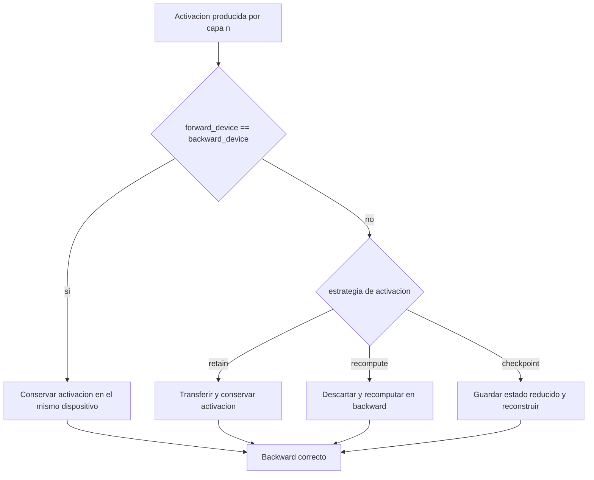

Este segundo diagrama conecta directamente el plan dual con las estrategias de activación avanzadas. No toda diferencia entre forward y backward implica la misma política de memoria. El runtime todavía debe decidir si retiene, transfiere, recomputa o checkpointa, y esa decisión modifica tanto el costo real como la presión de memoria.

### 10.7 Prefetching, transferencia asíncrona y activaciones

El ejecutor puede operar con:

- transferencia asíncrona
- prefetching
- estrategias de retención, recomputación o checkpointing

Estas decisiones se reflejan en campos del resultado final y permiten analizar cuánto del comportamiento previsto por el ILP se materializa de verdad en ejecución observada.

### 10.8 Qué devuelve la ejecución real

`HybridExecutionResult` resume:

- estado de la corrida
- energía total
- potencia media
- memoria pico GPU
- pérdida inicial y final
- métricas de calidad, cuando aplica
- trazas por paso
- advertencias y limitaciones

## 11. Cómo se usa el resultado ILP para entrenar el modelo seleccionado

El proceso completo es este:

1. Se perfila el modelo deseado para obtener métricas por capa y artefactos estructurales.
2. Esas métricas se agregan en `metrics_stats.csv`.
3. El cargador ILP valida y transforma esos artefactos en `ILPInputData`.
4. El solver produce `ilp_assignment.csv`, `ilp_cut_edges.csv` y `ilp_solution_summary.json`.
5. El runtime lee esos archivos, reconstruye un `DevicePlan` y ejecuta el modelo siguiendo esa política.

La decisión de asignación, por tanto, nace de una optimización offline basada en evidencia medida. La dinámica del runtime consiste en hacer cumplir esa asignación durante cada paso del entrenamiento.

### 11.1 Ejemplo visual completo: una capa real de `simple_mlp` desde profiling hasta ejecución híbrida

El caso más pedagógico del repositorio es el escenario controlado `simple_mlp_dual_runtime_evidence`, porque conserva artefactos del solver, de la simulación y del runtime real en un mismo bloque. En ese caso, la solución dual asigna:

- `net.0`: GPU en forward, CPU en backward
- `net.1`, `net.2`, `net.3`, `net.4`: CPU en ambas fases

La cadena base de capas es:

```text
net.0 (Linear 784->512) -> net.1 (ReLU) -> net.2 (Linear 512->256) -> net.3 (ReLU) -> net.4 (Linear 256->10)
```

El rastro extremo a extremo de `net.0` puede visualizarse así:

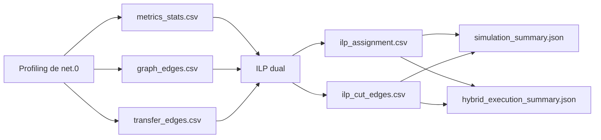

La lectura concreta del ejemplo es la siguiente.

En `simple_mlp_metrics_stats.csv`, `net.0` aparece como una capa `Linear` con alta dispersión en CPU y con tiempos robustos significativamente distintos entre CPU y GPU. Para `net.0`, los promedios observados del caso son aproximadamente:

- GPU forward: `0.220 ms`
- GPU backward: `0.441 ms`
- CPU forward: `3.448 ms`
- CPU backward: `6.895 ms`
- memoria de parámetros: `1.533 MB`
- activación de salida: `0.015625 MB`

Si se compara `net.0` con las otras dos capas lineales del mismo modelo, la razón de la frontera elegida por el solver se vuelve más visible:

| Capa | Tipo | GPU fwd ms | GPU bwd ms | CPU fwd ms | CPU bwd ms | Params MB | Activación MB | Transfer edge-aware ms | Asignación dual final |
| --- | --- | ---: | ---: | ---: | ---: | ---: | ---: | ---: | --- |
| `net.0` | Linear | 0.2204 | 0.4408 | 3.4475 | 6.8950 | 1.5332 | 0.015625 | 0.6217 | GPU en forward, CPU en backward |
| `net.2` | Linear | 0.1098 | 0.2197 | 3.9178 | 7.8356 | 0.5010 | 0.0078125 | 0.6212 | CPU en forward y backward |
| `net.4` | Linear | 0.0879 | 0.1758 | 0.0219 | 0.0437 | 0.0098 | 0.0003052 | 1.2354 | CPU en forward y backward |

La interpretación de esa tabla es la clave de la frontera:

1. `net.0` tiene una ventaja muy fuerte de GPU frente a CPU en forward y backward, y además es la capa con mayor peso paramétrico del modelo. Aunque cortar después de `net.0` introduce transferencia, el ahorro de cómputo en GPU compensa ese corte.
2. `net.2` también es mucho más rápida en GPU que en CPU, pero su activación es más pequeña, su peso paramétrico es menor y, en esta solución concreta, el solver prefiere no abrir un segundo frente de corte adicional río abajo. Mantener `net.2` en CPU evita más complejidad topológica después de haber explotado ya la mayor oportunidad en `net.0`.
3. `net.4` es el caso más claro de permanencia en CPU: aunque GPU sigue siendo más rápida en términos brutos, el costo CPU ya es muy bajo en valor absoluto y su término de transferencia edge-aware es proporcionalmente mucho menos atractivo. Llevar `net.4` a GPU produciría una ganancia marginal muy pequeña a cambio de introducir o sostener más movimiento de datos.

Dicho de otra manera, la solución no selecciona solo la capa con mejor aceleración relativa. Selecciona la frontera con mejor balance global entre beneficio de cómputo, costo de transferencia y estructura del grafo. En este ejemplo, esa frontera óptima aparece justo después de `net.0`.

En `simple_mlp_graph_edges.csv`, la salida de `net.0` alimenta a `net.1` con un tensor `8x512`, equivalente a `0.015625 MB`. En `simple_mlp_transfer_edges.csv`, esa dependencia recibe un costo de transferencia simétrico cercano a `0.224 ms`.

Con esa evidencia, el solver dual decide que `net.0` vale la pena en GPU durante forward, pero no durante backward. El resultado queda materializado en:

- `ilp_assignment.csv`: `net.0,GPU,GPU,CPU`
- `ilp_cut_edges.csv`: `net.0 -> net.1` en `forward` y `net.0 -> net.0` en `cross_phase`

Ese comportamiento puede visualizarse en un diagrama específico de capa:

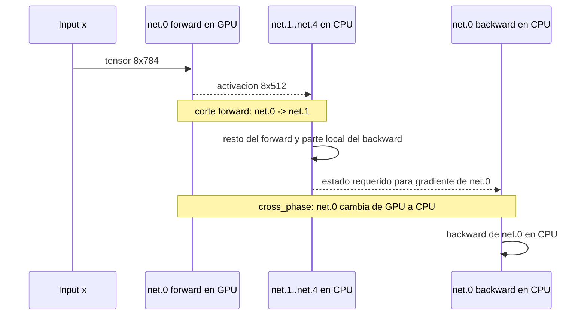

La simulación del mismo caso predice:

- `objective_value`: `19.8848`
- `total_time_ms`: `19.5474`
- `total_transfer_ms`: `0.3374`
- `gpu_mem_used_mb`: `19.3350`
- `layers_gpu`: `1`
- `layers_cpu`: `4`
- `cut_edges_count`: `2`

La ejecución híbrida real del mismo plan reporta:

- `avg_step_ms`: `147.6381`
- `forward_ms`: `146.1050`
- `backward_ms`: `0.7704`
- `optimizer_ms`: `0.6032`
- `total_transfer_mb`: `0.03955`
- `total_transfer_events`: `2`
- `peak_gpu_mem_mb`: `10.6978`
- `backward_relocation_layers`: `net.0`

La comparación visual entre predicción y observación puede resumirse así:

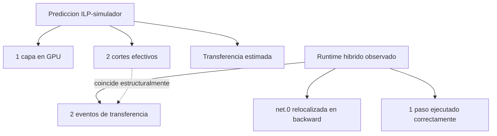

Lo importante de este ejemplo no es que la simulación y el runtime tengan exactamente la misma latencia absoluta, porque no miden la misma cosa con el mismo nivel de detalle operacional. Lo importante es que ambos coinciden en la estructura de la solución: una sola capa usa GPU, existen dos cortes relevantes y la relocalización backward ocurre precisamente en `net.0`, como anticipaba el plan dual.

### 11.2 Segunda tabla real: caso `resnet50` y lectura de frontera a escala grande

El repositorio contiene un caso real de `resnet50` con profiling agregado y barrido de Pareto en `data/zephyr/results_smoke/resnet50/SGD/fp32/batch_8`. Ese caso fue regenerado para este tutorial con el solver CBC operativo, de modo que la solución persistida ahora sí coincide con el estado real del ILP dual.

La solución regenerada para `gpu_budget_mb = 2000` tiene la siguiente forma estructural:

- `layers_gpu_forward = 0`
- `layers_gpu_backward = 9`
- `cut_edges_backward = 11`
- `cross_phase_edges = 9`

Es decir, el solver no empuja ninguna capa a GPU durante forward, pero sí considera rentable desplazar un subconjunto pequeño del backward temprano a GPU. Las capas elegidas por el solver en ese subconjunto incluyen:

- `bn1`
- `conv1`
- `layer1.0.bn2`
- `layer1.0.bn3`
- `layer1.0.conv1`
- `layer1.0.conv2`
- `layer1.0.conv3`
- `layer1.0.downsample.0`
- `layer1.1.conv1`

La tabla siguiente usa tres de esas capas realmente elegidas por el solver y una capa de contraste que permaneció completamente en CPU:

| Capa | Tipo | GPU fwd ms | GPU bwd ms | CPU fwd ms | CPU bwd ms | Params MB | Activación MB | Transfer edge-aware ms | Asignación dual final |
| --- | --- | ---: | ---: | ---: | ---: | ---: | ---: | ---: | --- |
| `bn1` | BatchNorm2d | 0.3028 | 0.6057 | 10.7249 | 21.4499 | 0.0005 | 24.5 | 5.4001 | CPU en forward, GPU en backward |
| `conv1` | Conv2d | 0.4177 | 0.8355 | 14.7308 | 29.4617 | 0.0359 | 24.5 | 4.3878 | CPU en forward, GPU en backward |
| `layer1.0.conv2` | Conv2d | 0.2266 | 0.4531 | 14.8536 | 29.7071 | 0.1406 | 6.1250 | 1.6958 | CPU en forward, GPU en backward |
| `fc` | Linear | 0.1133 | 0.2265 | 3.9675 | 7.9350 | 7.8163 | 0.0305 | 0.9294 | CPU en forward y backward |

La lectura exacta de esta tabla ya no es hipotética, sino consistente con la solución guardada.

1. `bn1` y `conv1` muestran un patrón claro: el backward en CPU es muy costoso y el ahorro al moverlo a GPU sigue siendo grande incluso pagando una transferencia elevada. El solver acepta ese precio porque se trata de capas tempranas cuyo backward concentra trabajo significativo.
2. `layer1.0.conv2` confirma la misma lógica en una zona más profunda del bloque residual. Su activación es bastante menor que la de `conv1`, lo que reduce el peaje estructural de la frontera y hace todavía más defendible su uso en GPU durante backward.
3. `fc` actúa como contraste útil. Aunque GPU sigue siendo más rápida en términos absolutos, el costo CPU de esa capa es mucho menor que el de las capas tempranas seleccionadas. Además, el solver ya está usando gran parte del presupuesto disponible para un conjunto de capas backward que ofrece más retorno global. Por eso `fc` permanece en CPU en ambas fases.

Este caso deja una lección importante: en modelos grandes, la frontera óptima puede ser asimétrica entre fases. Aquí el ILP dual no decide “estas capas van a GPU” de forma uniforme, sino “estas capas justifican GPU solo en backward”. Esa asimetría es precisamente una de las razones por las que el modelo dual existe.

### 11.3 Criterio práctico de selección de frontera

La experiencia de los casos `simple_mlp` y `resnet50` permite formular un criterio operativo simple para leer una frontera buena sin depender únicamente de la intuición visual.

Una frontera es atractiva cuando se cumplen simultáneamente cuatro condiciones:

1. La diferencia entre costo CPU y costo GPU de la capa o bloque es material, no marginal.
2. El tensor que cruza la frontera no es tan grande como para absorber toda la ganancia en transferencia.
3. La memoria liberada o la estructura preservada justifican el corte en el contexto del presupuesto total.
4. La frontera no obliga a abrir demasiados cortes adicionales río abajo.

En forma conceptual, el solver está buscando maximizar una ganancia neta aproximada:

$$
	ext{ganancia neta de frontera} \approx (C^{cpu}_{bloque} - C^{gpu}_{bloque}) - C^{transfer}_{frontera} - C^{complejidad}_{topologia}
$$

donde:

- $C^{cpu}_{bloque} - C^{gpu}_{bloque}$ resume la mejora de cómputo al mover el bloque a GPU
- $C^{transfer}_{frontera}$ resume el precio de cortar dependencias entre dispositivos
- $C^{complejidad}_{topologia}$ representa el costo inducido por abrir más cortes, más relocalizaciones o más presión de memoria en el resto del grafo

Esta expresión no es la función objetivo exacta del ILP, pero sí es una regla de lectura muy útil para entender las soluciones obtenidas. En `simple_mlp`, esa ganancia neta es claramente positiva justo después de `net.0`. En `resnet50`, la comparación entre `conv1`, `layer2.0.conv2` y `fc` muestra por qué la mejor frontera de una red grande rara vez coincide con la capa más rápida o con la primera capa disponible: la mejor frontera es la que mantiene positiva esa ganancia neta después de considerar la transferencia y la topología completa.

### 11.4 Cómo auditar una solución ILP inconsistente

El caso `resnet50` sirve además para fijar un procedimiento de auditoría cuando los artefactos de una solución no parecen coincidir entre sí. La inconsistencia original de este mismo caso era: el `pareto_summary` reportaba una solución mixta, mientras que `ilp_assignment.csv` mostraba una asignación enteramente en GPU.

La forma correcta de auditar un caso así es secuencial:

1. comparar `resnet50_pareto_summary.json` con `resnet50_pareto_sweep.csv` para identificar cuál presupuesto y cuál backend produjeron la fila sospechosa
2. abrir `ilp_solution_summary.json` y comprobar si sus contadores de capas y cortes coinciden con la fila de Pareto que se considera canónica
3. abrir `ilp_assignment.csv` e `ilp_cut_edges.csv` para verificar si la solución persistida representa realmente esos contadores
4. si no coinciden, regenerar `run_ilp_partition.py` y `sweep_ilp_pareto.py` con el mismo `config_dir`, el mismo presupuesto y el mismo backend
5. volver a validar la coherencia entre `summary`, `assignment`, `cut_edges` y `simulation_summary.json`

En este repositorio, la causa raíz del caso `resnet50` fue doble:

- el entorno activo del workspace no era inicialmente `prism_env`
- el solver CBC no estaba accesible para PuLP aunque sí podía instalarse en el entorno

Una vez corregidos esos dos problemas, la solución persistida pasó a ser coherente y el caso dejó de ser ambiguo. Esta lección es importante metodológicamente: cuando una solución ILP parece extraña, antes de concluir que el modelo está mal formulado conviene verificar si el problema está en el solver, en el entorno o en la persistencia de artefactos.

## 12. Catálogo de archivos versionados y explicación de cada uno

Esta sección cubre los archivos fuente, scripts, validadores, documentación y artefactos estáticos versionados. A diferencia de la primera versión de este tutorial, aquí sí se incorpora además una explicación operacional de `data/`, `logs/` y `reports/`, porque esos directorios son parte central del flujo experimental del proyecto.

### 12.1 Raíz del proyecto

- `README.md`: visión general operativa del proyecto, nombre oficial, mapa documental, citación e inicio rápido.
- `pytest.ini`: configuración global de `pytest`.

### 12.2 Configuración

- `config/environment.yml`: definición del entorno Conda recomendado para ejecutar PRISM.
- `config/requirements.txt`: dependencias base para instalación por `pip`.

### 12.3 Documentación en `docs/`

- `docs/README.md`: guía operativa breve y puerta de entrada a la documentación.
- `docs/PROJECT_STRUCTURE.md`: cartografía estructural del repositorio y responsabilidades por bloque.
- `docs/GLOBAL_PROJECT_DOCUMENTATION_ES.md`: referencia técnica integral en español.
- `docs/GLOBAL_PROJECT_DOCUMENTATION.md`: referencia técnica integral en inglés.
- `docs/CAPITULO_TESIS_PROFILING_ES.md`: desarrollo monográfico de la metodología de profiling.
- `docs/CAPITULO_TESIS_ILP_ES.md`: desarrollo monográfico de la formulación ILP y su validación.
- `docs/PROTOCOLO_VALIDACION_MULTISERVIDOR_ES.md`: protocolo maestro para campañas reales multiservidor.
- `docs/SERVER_LAUNCH_PROFILES.md`: perfiles de ejecución recomendados por clase de servidor.
- `docs/MULTI_NODE_ILP_RUNBOOK.md`: guía operativa para fusión multi-host y resolución ILP sobre hardware heterogéneo.
- `docs/schema.md`: mapa de escritura de la monografía doctoral.
- `docs/QUICK_START.sh`: ayuda rápida en shell para comandos frecuentes del proyecto.
- `docs/A New Parallelization Approach in Deep Learning Using CPU.docx`: documento ofimático heredado asociado al trabajo doctoral.

### 12.4 Scripts en `scripts/`

- `scripts/run_experiments.sh`: lanza campañas de profiling por rejilla sobre modelos, precisiones, optimizadores y tamaños de lote.
- `scripts/run_thesis_mode.sh`: orquesta un flujo doctoral amplio de profiling, agregación, ILP, Pareto y reporting.
- `scripts/run_thesis_smoke_workflow.sh`: versión reducida y rápida del flujo integral para comprobación operacional.
- `scripts/run_ilp_partition.sh`: envoltorio shell para resolver un ILP individual.
- `scripts/run_ilp_pareto_sweep.sh`: envoltorio shell para barrido de Pareto.
- `scripts/discover_ilp_config_dirs.sh`: descubre automáticamente directorios compatibles entre hosts para fusión multi-hardware.
- `scripts/download_datasets.py`: descarga y organiza datasets requeridos por modelos soportados.
- `scripts/export_ilp_tables_latex.sh`: exporta tablas LaTeX a partir de salidas consolidadas ILP.
- `scripts/generate_ilp_report_assets.sh`: coordina generación de activos de reporte del bloque ILP.
- `scripts/generate_thesis_figures.py`: produce figuras destinadas al manuscrito.
- `scripts/launch_grid5k.sh`: lanzador para entornos HPC específicos.
- `scripts/sanitize_cuda_env.sh`: limpia y endurece el entorno CUDA antes de una campaña para evitar conflictos por bibliotecas o stubs.

### 12.5 Núcleo del sistema en `src/`

- `src/__init__.py`: marca `src` como paquete Python.
- `src/profiler.py`: CLI principal del profiling.
- `src/profiler_en.md`: guía rápida del profiler en inglés.
- `src/profiler_es.md`: guía rápida del profiler en español.

#### `src/core/`

- `src/core/__init__.py`: marca el subpaquete `core`.
- `src/core/constants.py`: constantes globales como `BACKWARD_FACTOR`, pasos por defecto y factores auxiliares.
- `src/core/energy.py`: monitor de energía CPU/GPU mediante NVML y RAPL.
- `src/core/graph_extractor.py`: extracción del DAG y exportación de nodos y aristas.
- `src/core/decoder_export_backend.py`: backend especializado en `torch.export` para modelos decoder-only.
- `src/core/io_artifacts.py`: escritura y limpieza de artefactos CSV y JSON.
- `src/core/loss_utils.py`: funciones de pérdida estables y objetivos de entrenamiento.
- `src/core/metrics.py`: tamaño de tensores, estimación de FLOPs y utilidades métricas.
- `src/core/precision_policy.py`: detección de soporte FP32/FP16/BF16 y reglas de admisibilidad.
- `src/core/stats_aggregator.py`: agregación robusta de métricas entre réplicas.
- `src/core/system.py`: metadata de hardware, normalización de directorios y configuración de runtime CPU.

#### `src/models/`

- `src/models/__init__.py`: marca el subpaquete `models`.
- `src/models/factory.py`: construcción de modelos, inputs y targets compatibles con cada tarea.

#### `src/runner/`

- `src/runner/__init__.py`: marca el subpaquete `runner`.
- `src/runner/training_profiler.py`: implementación principal del profiling capa a capa.

#### `src/ilp/`

- `src/ilp/__init__.py`: marca el subpaquete `ilp`.
- `src/ilp/data_loader.py`: carga, validación y estructuración de insumos para el ILP.
- `src/ilp/model_builder.py`: construcción de coeficientes y datos del problema para modelos base, duales y extendidos.
- `src/ilp/advanced_terms.py`: términos avanzados sobre estrategias de activación y metadatos asociados.
- `src/ilp/solve.py`: resolución efectiva del ILP con backends disponibles.
- `src/ilp/export_solution.py`: exportación de la solución ILP a CSV y JSON.

#### `src/runtime/`

- `src/runtime/__init__.py`: marca el subpaquete `runtime`.
- `src/runtime/plan_representation.py`: representación canónica del plan de ejecución.
- `src/runtime/device_plan.py`: traducción entre plan lógico y dispositivos efectivos.
- `src/runtime/simulator.py`: simulador del plan sin ejecución real.
- `src/runtime/hybrid_executor.py`: ejecutor híbrido real para entrenamiento CPU-GPU.

### 12.6 Validación y reporting en `validation/`

- `validation/aggregate_metrics_stats.py`: wrapper para la agregación de métricas.
- `validation/comprehensive_check.sh`: auditoría estructural global del proyecto.
- `validation/export_ilp_tables_latex.py`: exportador de tablas LaTeX desde resultados ILP.
- `validation/generate_ilp_report_assets.py`: generador de activos consolidados de reporte.
- `validation/run_hybrid_execution.py`: punto de entrada a la ejecución híbrida guiada por ILP.
- `validation/run_ilp_ablation_suite.py`: batería de ablaciones sobre el ILP.
- `validation/run_ilp_partition.py`: resolución de una partición ILP.
- `validation/run_ilp_sensitivity.py`: análisis de sensibilidad del modelo ILP.
- `validation/run_unit_tests.sh`: lanzador unificado de la suite de pruebas.
- `validation/sweep_ilp_pareto.py`: barrido de Pareto sobre presupuestos GPU.
- `validation/validate_all_models.py`: validación de carga y preflight de todos los modelos soportados.
- `validation/validate_code.py`: validación estructural del código fuente.
- `validation/validate_ilp_pipeline.py`: validación del pipeline ILP y simulador.
- `validation/validate_zombie_fix.py`: validación de mitigaciones para timeouts y hilos huérfanos.
- `validation/VALIDATION_SUMMARY.sh`: resumen shell de validaciones del proyecto.

### 12.7 Pruebas automatizadas en `tests/`

- `tests/test_dataset_registry.py`: pruebas sobre el registro de datasets.
- `tests/test_factory_input_policy.py`: pruebas sobre políticas de creación de input en la fábrica de modelos.
- `tests/test_graph_extractor_export_backend.py`: validación del backend de exportación de grafo.
- `tests/test_hybrid_executor.py`: pruebas del ejecutor híbrido.
- `tests/test_ilp_data_loader_validity.py`: pruebas del cargador de datos ILP y sus validaciones.
- `tests/test_loss_utils.py`: pruebas sobre funciones de pérdida y objetivos.
- `tests/test_nlp_dataset_targets.py`: validación de targets y semántica de datasets NLP.
- `tests/test_phase1_integrity.py`: pruebas de integridad del pipeline básico.
- `tests/test_phase4_activation.py`: pruebas de términos de activaciones y estrategias extendidas.
- `tests/test_phase4_comparison.py`: pruebas comparativas asociadas a la extensión de activaciones.
- `tests/test_phase4_synthetic.py`: pruebas sintéticas del bloque extendido.
- `tests/test_precision_policy_unit.py`: pruebas unitarias de política de precisión.
- `tests/test_profiler_gpu_only_precision_policy.py`: validación del modo GPU-only y su política de precisión.
- `tests/test_report_assets.py`: pruebas de generación de activos de reporte.
- `tests/test_runtime_simulator.py`: pruebas del simulador.
- `tests/test_timeout_validation.py`: pruebas de validación de timeouts.

### 12.8 Manuscrito en `thesis/`

- `thesis/main.tex`: archivo principal del manuscrito LaTeX.
- `thesis/references.bib`: base BibTeX del manuscrito.
- `thesis/frontmatter/preliminaries.tex`: preliminares y elementos frontales del manuscrito.
- `thesis/chapters/chapter01_intro.tex`: capítulo 1 de introducción.
- `thesis/chapters/chapter02_estado_arte.tex`: capítulo 2 de estado del arte.
- `thesis/chapters/chapter03_arquitectura.tex`: capítulo 3 de arquitectura metodológica.
- `thesis/chapters/chapter04_profiling.tex`: capítulo 4 sobre profiling.
- `thesis/chapters/chapter05_ilp.tex`: capítulo 5 sobre ILP.
- `thesis/chapters/chapter06_simulacion_ejecucion.tex`: capítulo 6 sobre simulación y ejecución.
- `thesis/chapters/chapter07_conclusiones.tex`: capítulo 7 de conclusiones.

#### Artefactos LaTeX generados y versionados

Los siguientes archivos son artefactos generados por compilación LaTeX. No contienen lógica del proyecto, pero sí evidencia de compilación o salidas auxiliares del manuscrito:

- `thesis/main.aux`
- `thesis/main.bbl`
- `thesis/main.blg`
- `thesis/main.fdb_latexmk`
- `thesis/main.fls`
- `thesis/main.lof`
- `thesis/main.lot`
- `thesis/main.out`
- `thesis/main.pdf`
- `thesis/main.toc`
- `thesis/build/main.aux`
- `thesis/build/main.fdb_latexmk`
- `thesis/build/main.fls`
- `thesis/build/main.out`
- `thesis/build/main.pdf`
- `thesis/build/main.toc`

Estos archivos sirven para:

- registrar referencias cruzadas
- mantener el estado de compilación
- producir tabla de contenidos, listas de figuras o bibliografía
- conservar una copia del PDF final y de compilaciones auxiliares

### 12.9 Datos experimentales, logs y reportes

Aunque el contenido exacto de estas carpetas cambia con cada campaña, su estructura y semántica sí son estables y forman parte del diseño del proyecto.

#### `data/`

`data/` contiene artefactos primarios de profiling y ejecuciones por host o por campaña. En el estado actual del repositorio aparecen, entre otros:

- `data/zephyr/`: resultados asociados al host `zephyr`.
- `data/test-audit/`: carpeta de auditoría de validación.
- `data/test-audit-e2e/`: evidencia de pruebas extremo a extremo.
- `data/test-audit-status/`: artefactos de estado de auditoría.
- `data/test-gpu-only-fp16/`: campañas enfocadas en política de precisión y modo GPU-only.
- `data/test-gpu-only-policy/`: validaciones de la política de exclusión o fallback CPU.
- `data/test-graph-m1/` y `data/test-graph-m2/`: campañas orientadas a trazado y validación del DAG.
- `data/test-invalid-target/`: evidencia de manejo de targets inválidos o incompletos.
- `data/test-m3/`, `data/test-m3-device-fix/`, `data/test-m3-r2/`, `data/test-m4/`: campañas experimentales sucesivas sobre distintas hipótesis o servidores.
- `data/paccaA100.unicartagena.edu.co.tar.gz`: archivo empaquetado de evidencia procedente de un host remoto.
- `data/.obsidian/`: metadatos locales de un espacio de notas, no parte del pipeline científico.

El patrón canónico esperado para resultados de profiling es:

```text
data/<host>/results/<model>/<optimizer>/<precision>/batch_<N>/
```

Dentro de cada `batch_<N>/` pueden existir dos niveles:

1. artefactos directos de una sola corrida
2. subdirectorios `run_001`, `run_002`, ... cuando se ejecutan réplicas

Los artefactos típicos de esa carpeta son:

- `{model}_metrics.csv`
- `{model}_metrics_stats.csv`
- `{model}_meta.json`
- `{model}_graph_nodes.csv`
- `{model}_graph_edges.csv`
- `{model}_transfer_edges.csv`
- `ilp_solution/`

#### `logs/`

`logs/` contiene bitácoras cronológicas de ejecución. No reemplaza a los CSV de resultados; su función es proveer trazabilidad operacional, mensajes de error, secuencia de pasos y tiempo de cada campaña.

Los patrones visibles son:

- `experiments_YYYYMMDD_HHMMSS.txt`: logs de `scripts/run_experiments.sh`.
- `thesis_mode_YYYYMMDD_HHMMSS.txt`: logs de `scripts/run_thesis_mode.sh`.
- `thesis_smoke_workflow_YYYYMMDD_HHMMSS.txt`: logs de `scripts/run_thesis_smoke_workflow.sh`.

La lectura correcta de estos archivos es complementaria a los resultados CSV. Si un artefacto falta, el log permite localizar en qué etapa falló el pipeline.

#### `reports/`

`reports/` contiene productos derivados, ya consolidados o listos para análisis comparativo. En el estado actual aparecen:

- `reports/ilp_results/`: consolidaciones generales del bloque ILP.
- `reports/ilp_results_phase1/`: reportes asociados a la fase básica del modelo.
- `reports/ilp_results_phase1_smoke/`: reportes resumidos de campañas smoke.
- `reports/ilp_results_phase4_controlled/`: evidencia controlada de la extensión avanzada de activaciones.
- `reports/thesis_figures/`: figuras listas para inserción en tesis.

La relación entre `data/` y `reports/` es metodológicamente importante. `data/` conserva evidencia primaria por configuración y por host. `reports/` contiene síntesis y comparativas entre configuraciones.

## 13. Guía operativa paso a paso con comandos

Esta sección convierte la arquitectura conceptual en procedimientos ejecutables. Los comandos están escritos para ser lanzados desde la raíz del repositorio.

### 13.1 Preparar el entorno

Si se usa Conda:

```bash
conda env create -f config/environment.yml
conda activate prism_env
```

Si se usa `pip` sobre un entorno ya creado:

```bash
python -m pip install -r config/requirements.txt
```

Antes de ejecutar campañas con CUDA, conviene sanear el entorno:

```bash
source scripts/sanitize_cuda_env.sh
sanitize_cuda_runtime_env
```

Este paso elimina rutas `stubs` de `LD_LIBRARY_PATH` y desactiva variables CUDA genéricas que suelen provocar errores de enlace o detección falsa del runtime.

### 13.2 Descargar datasets requeridos

Comando mínimo:

```bash
python scripts/download_datasets.py --models all --datasets_root datasets
```

Comando para un subconjunto de modelos:

```bash
python scripts/download_datasets.py \
	--models resnet50,bert_base,gpt2_small \
	--datasets_root datasets
```

Forzar re-descarga y refresco:

```bash
python scripts/download_datasets.py \
	--models all \
	--datasets_root datasets \
	--force
```

Este script resuelve qué datasets necesita cada modelo, descarga solo lo necesario y devuelve un resumen JSON con el estado de preparación.

### 13.3 Ejecutar una corrida de profiling individual

El punto de entrada directo es `src/profiler.py`. Un ejemplo representativo es:

```bash
python src/profiler.py \
	--model resnet50 \
	--optimizer SGD \
	--precision fp32 \
	--batch_size 32 \
	--warmup 3 \
	--measure 10 \
	--output_dir data/zephyr/results/resnet50/SGD/fp32/batch_32/run_001 \
	--datasets_root datasets \
	--require_datasets \
	--seed 42 \
	--run_id run_001 \
	--rapl
```

En una máquina con problemas de profiling CPU o cuando interesa solo GPU:

```bash
python src/profiler.py \
	--model vit_b16 \
	--optimizer AdamW \
	--precision fp16 \
	--batch_size 8 \
	--warmup 2 \
	--measure 5 \
	--output_dir data/zephyr/results/vit_b16/AdamW/fp16/batch_8/run_001 \
	--datasets_root datasets \
	--require_datasets \
	--skip_cpu \
	--num_threads 16
```

Qué hace este paso:

1. construye modelo, entrada y target
2. aplica la política de precisión
3. ejecuta forward y backward medidos
4. exporta métricas, DAG, transferencia y metadatos

### 13.4 Ejecutar una campaña completa de profiling con `scripts/run_experiments.sh`

La forma más simple es dejar que el script use su rejilla por defecto:

```bash
bash scripts/run_experiments.sh
```

La forma recomendada es acotar la rejilla con variables de entorno:

```bash
MODELS_CSV=resnet50,vit_b16 \
OPTIMIZERS_CSV=SGD,AdamW \
PRECISIONS_CSV=fp32,bf16 \
BATCH_SIZES_CSV=8,32 \
REPEATS=3 \
WARMUP=2 \
MEASURE=5 \
BASE_OUTPUT_DIR=data/zephyr/results \
DATASETS_DIR=datasets \
bash scripts/run_experiments.sh
```

Modo smoke rápido:

```bash
SMOKE_MODE=true bash scripts/run_experiments.sh
```

Modo GPU-only para evitar bloqueos por CPU FP16:

```bash
USE_SKIP_CPU=true FORCE_THREADS=16 bash scripts/run_experiments.sh
```

Qué hace este script:

1. activa el entorno Conda si existe
2. sanea el entorno CUDA
3. prepara datasets opcionalmente
4. itera el producto cartesiano modelo-batch-precisión-optimizador
5. ejecuta réplicas por configuración
6. agrega métricas automáticamente cuando `AUTO_AGGREGATE_STATS=true`
7. escribe un log cronológico en `logs/experiments_*.txt`

### 13.5 Agregar réplicas manualmente

Si ya existen varios `run_*` para una configuración y solo se quiere construir el CSV robusto:

```bash
python validation/aggregate_metrics_stats.py \
	--input_dir data/zephyr/results/resnet50/SGD/fp32/batch_32 \
	--output_csv data/zephyr/results/resnet50/SGD/fp32/batch_32/resnet50_metrics_stats.csv
```

Si se desea incluir filas marcadas como omitidas:

```bash
python validation/aggregate_metrics_stats.py \
	--input_dir data/zephyr/results/resnet50/SGD/fp32/batch_32 \
	--include_skipped
```

Este paso produce la tabla robusta que el ILP consumirá.

### 13.6 Resolver una partición ILP individual

El wrapper shell recomendado es:

```bash
MODEL=resnet50 \
CONFIG_DIR=data/zephyr/results/resnet50/SGD/fp32/batch_32 \
K_SIGMA=1.0 \
W_TIME=1.0 \
W_ENERGY=0.0 \
W_TRANSFER=1.0 \
GPU_MEM_BUDGET_MB=1200 \
CPU_MEM_BUDGET_MB=1e18 \
BACKEND=auto \
bash scripts/run_ilp_partition.sh
```

Caso multi-host, usando `CONFIG_DIRS`:

```bash
MODEL=resnet50 \
CONFIG_DIRS=data/hostA/results/resnet50/SGD/fp32/batch_32,data/hostB/results/resnet50/SGD/fp32/batch_32 \
HW_AGGREGATE=max \
HW_DISPERSION_K=0.0 \
bash scripts/run_ilp_partition.sh
```

Este comando genera `ilp_solution/` con archivos como:

- `ilp_assignment.csv`
- `ilp_cut_edges.csv`
- `ilp_solution_summary.json`

### 13.7 Descubrir automáticamente configuraciones compatibles entre hosts

Si no se quiere escribir manualmente `CONFIG_DIRS`, el script adecuado es:

```bash
MODEL=resnet50 \
OPTIMIZER=SGD \
PRECISION=fp32 \
BATCH=32 \
bash scripts/discover_ilp_config_dirs.sh
```

Para ejecutar directamente la partición tras el descubrimiento:

```bash
MODE=partition \
MODEL=resnet50 \
OPTIMIZER=SGD \
PRECISION=fp32 \
BATCH=32 \
bash scripts/discover_ilp_config_dirs.sh
```

Para lanzar el barrido de Pareto directamente:

```bash
MODE=pareto \
MODEL=resnet50 \
OPTIMIZER=SGD \
PRECISION=fp32 \
BATCH=32 \
GPU_BUDGETS_MB=400,800,1200 \
bash scripts/discover_ilp_config_dirs.sh
```

Este script filtra solo directorios que contienen `metrics_stats`, `graph_edges` y `transfer_edges` completos.

### 13.8 Ejecutar el barrido de Pareto

Para una configuración individual:

```bash
MODEL=resnet50 \
CONFIG_DIR=data/zephyr/results/resnet50/SGD/fp32/batch_32 \
GPU_BUDGETS_MB=400,600,800,1000,1200 \
CPU_MEM_BUDGET_MB=1e18 \
K_SIGMA=1.0 \
W_TIME=1.0 \
W_ENERGY=0.0 \
W_TRANSFER=1.0 \
bash scripts/run_ilp_pareto_sweep.sh
```

La salida típica es:

- `{model}_pareto_sweep.csv`
- `{model}_pareto_summary.json`

Este barrido compara ILP contra baselines `all_cpu`, `all_gpu` y `greedy`.

### 13.9 Ejecutar la ejecución híbrida real

El punto de entrada es `validation/run_hybrid_execution.py`.

Ejemplo mínimo:

```bash
python validation/run_hybrid_execution.py \
	--config_dir data/zephyr/results/simple_mlp/SGD/fp32/batch_8 \
	--model simple_mlp \
	--precision fp32 \
	--batch_size 8 \
	--datasets_root datasets \
	--steps 5 \
	--compare_baselines \
	--enable_async_transfer \
	--enable_prefetch \
	--execution_mode auto \
	--output_dir reports/ilp_results/simple_mlp_runtime
```

Modo diagnóstico cuando no hay CUDA pero se quiere verificar la semántica del plan:

```bash
python validation/run_hybrid_execution.py \
	--config_dir data/zephyr/results/simple_mlp/SGD/fp32/batch_8 \
	--model simple_mlp \
	--allow_cpu_fallback \
	--allow_deterministic_target_fallback \
	--output_dir reports/ilp_results/simple_mlp_runtime_cpu_diag
```

Qué hace este paso:

1. carga el plan ILP desde `config_dir`
2. reconstruye modelo e input
3. ejecuta el plan `all_cpu`, `all_gpu` o `ilp_plan` según protocolo
4. escribe un resumen de ejecución con tiempos, transferencias, memoria, energía y calidad final

### 13.10 Generar activos consolidados de reporte ILP

Wrapper shell:

```bash
INPUT_ROOT=data/zephyr \
OUTPUT_DIR=reports/ilp_results \
bash scripts/generate_ilp_report_assets.sh
```

Invocación Python equivalente:

```bash
python validation/generate_ilp_report_assets.py \
	--input_root data/zephyr \
	--output_dir reports/ilp_results
```

Este paso busca `*_pareto_sweep.csv`, archivos de ablación, sensibilidad y protocolos híbridos, y produce:

- CSV consolidados
- resúmenes Markdown
- gráficas PNG por modelo

### 13.11 Exportar tablas LaTeX

Comando recomendado:

```bash
BEST_CSV=reports/ilp_results/ilp_best_per_model.csv \
CONSOLIDATED_CSV=reports/ilp_results/ilp_pareto_consolidated.csv \
HYBRID_CSV=reports/ilp_results/hybrid_execution_best_per_model.csv \
OUT_DIR=reports/ilp_results/latex \
bash scripts/export_ilp_tables_latex.sh
```

Este paso transforma las salidas consolidadas a tablas listas para el manuscrito.

### 13.12 Generar figuras de tesis

El script versionado actual produce figuras a partir de rutas concretas ya existentes:

```bash
python scripts/generate_thesis_figures.py
```

La salida se escribe en `reports/thesis_figures/`. En la versión actual, genera al menos:

- una figura de costos robustos por capa
- una figura de comparación simulación versus observación runtime

### 13.13 Ejecutar el flujo smoke de extremo a extremo

Para una verificación real pero reducida:

```bash
bash scripts/run_thesis_smoke_workflow.sh
```

Si se quiere controlar el tamaño de la campaña:

```bash
MODELS="simple_mlp resnet50" \
OPTIMIZERS="SGD AdamW" \
BATCH_SIZES="8 32" \
REPEATS=3 \
GPU_BUDGETS_MB=500,1000,2000 \
bash scripts/run_thesis_smoke_workflow.sh
```

Este flujo hace, en secuencia:

1. preflight
2. preparación de datasets
3. profiling reducido FP32
4. agregación de réplicas
5. partición ILP
6. barrido de Pareto
7. generación de reportes y exportación LaTeX

### 13.14 Ejecutar el flujo doctoral completo

Flujo con perfil predefinido mínimo:

```bash
PROFILE=doctoral_minimal bash scripts/run_thesis_mode.sh
```

Flujo smoke integrado:

```bash
PROFILE=quick_smoke bash scripts/run_thesis_mode.sh
```

Flujo custom con control explícito:

```bash
PROFILE=custom \
MODELS_CSV=simple_mlp,resnet50,vit_b16 \
OPTIMIZERS_CSV=SGD,AdamW \
PRECISIONS_CSV=fp32,bf16 \
BATCH_SIZES_CSV=8,32,64 \
REPEATS=5 \
GPU_BUDGETS_MB=400,600,800,1000,1200 \
RUN_HYBRID=true \
bash scripts/run_thesis_mode.sh
```

Este es el orquestador más completo del repositorio. Coordina datasets, profiling, ILP, Pareto, ejecución híbrida opcional y reportes, todo con un log único `logs/thesis_mode_*.txt`.

### 13.15 Validaciones y pruebas

Pruebas unitarias:

```bash
bash validation/run_unit_tests.sh
```

Auditoría estructural del proyecto:

```bash
bash validation/comprehensive_check.sh
```

Validación rápida de todos los modelos:

```bash
python validation/validate_all_models.py
```

Validación del pipeline ILP:

```bash
python validation/validate_ilp_pipeline.py
```

Validación de código:

```bash
python validation/validate_code.py
```

Sensibilidad del ILP:

```bash
python validation/run_ilp_sensitivity.py --help
```

Ablaciones del ILP:

```bash
python validation/run_ilp_ablation_suite.py --help
```

Validación de mitigación de timeouts y hilos zombie:

```bash
python validation/validate_zombie_fix.py
```

En estos tres últimos casos, el tutorial recomienda empezar por `--help` porque son herramientas de análisis experimental más específicas y con más parámetros de control.

### 13.16 Ejecución en Grid5000 u otros entornos HPC

El script heredado `scripts/launch_grid5k.sh` prepara variables OMP y afinidad de CPU según el vendor del procesador, activa un entorno Conda del nodo y lanza ejemplos de profiling en OAR.

Su uso típico depende del entorno de colas, pero conceptualmente el archivo se emplea así:

```bash
oarsub -S ./scripts/launch_grid5k.sh
```

Debe tratarse como un perfil HPC específico, no como el punto de entrada general del proyecto.

## 14. Diagramas de lectura e interpretación de resultados

Además del flujo general, conviene leer los resultados con una relación explícita entre carpetas:

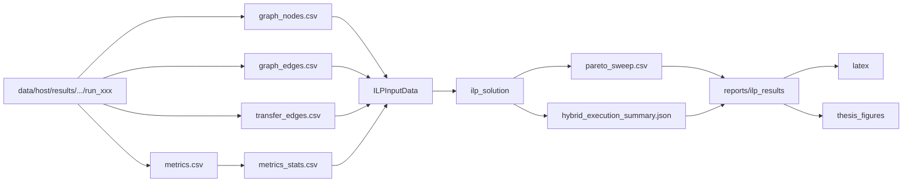

Y el ciclo de decisión del ILP puede leerse así:

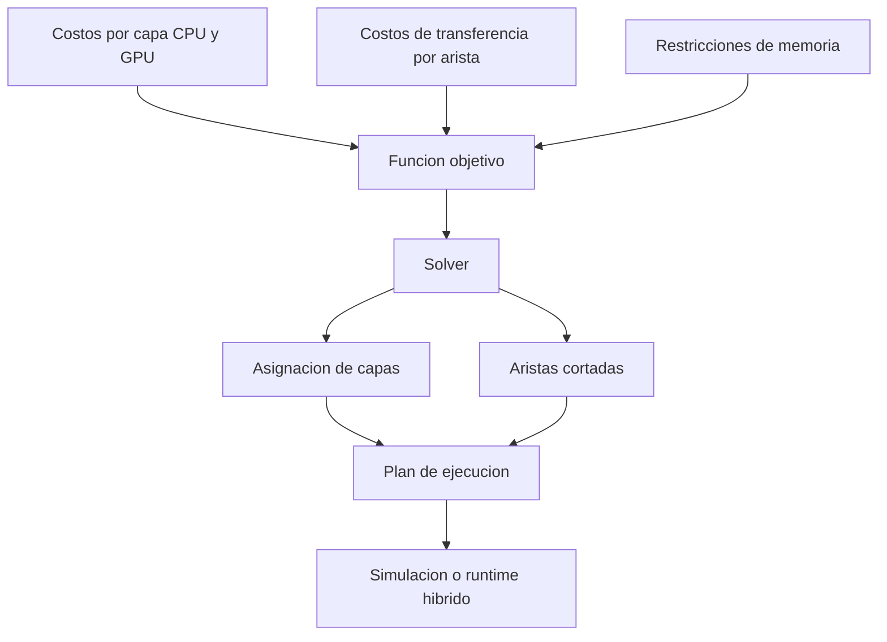

## 15. Orden recomendado para recuperar el contexto del proyecto

Si el lector está descontextualizado, la secuencia más eficiente es esta:

1. leer `README.md`
2. leer `docs/PROJECT_STRUCTURE.md`
3. leer este tutorial
4. ejecutar `bash validation/comprehensive_check.sh`
5. revisar una sola carpeta real de resultados en `data/<host>/results/.../batch_<N>`
6. revisar `src/profiler.py` y `src/runner/training_profiler.py`
7. revisar `src/core/graph_extractor.py` y `src/core/stats_aggregator.py`
8. revisar `src/ilp/data_loader.py`, `src/ilp/model_builder.py` y `src/ilp/solve.py`
9. ejecutar un `run_ilp_partition.sh` sobre una configuración pequeña
10. ejecutar `validation/run_hybrid_execution.py` sobre `simple_mlp`

Con esa ruta, el proyecto vuelve a aparecer como un sistema comprensible: primero se mide, luego se estructura, después se optimiza, más tarde se compara y finalmente se ejecuta.

## 16. Síntesis final

PRISM es un sistema de optimización del entrenamiento profundo en arquitecturas heterogéneas CPU-GPU. La pieza fundacional es el profiling empírico por capa. El DAG aporta estructura y costos de corte. La agregación estadística robustece los coeficientes. El ILP transforma esa evidencia en una decisión formal. La frontera de Pareto permite explorar compromisos entre memoria y costo objetivo. La simulación valida factibilidad. El runtime híbrido verifica si la decisión es realmente ejecutable.

Si se pierde el contexto del proyecto, la idea central que nunca debe perderse es esta: PRISM existe para convertir medición empírica en decisiones de partición CPU-GPU defendibles, reproducibles y ejecutables. Y para operar correctamente el sistema no basta con conocer la teoría; hay que entender también qué comando produce cada artefacto y cómo ese artefacto alimenta la siguiente etapa.

## 13. Orden recomendado para recuperar el contexto del proyecto

Si el lector está descontextualizado, la secuencia más eficiente es esta:

1. leer `README.md`
2. leer `docs/PROJECT_STRUCTURE.md`
3. leer este tutorial
4. revisar `src/profiler.py` y `src/runner/training_profiler.py`
5. revisar `src/core/graph_extractor.py` y `src/core/stats_aggregator.py`
6. revisar `src/ilp/data_loader.py`, `src/ilp/model_builder.py` y `src/ilp/solve.py`
7. revisar `validation/sweep_ilp_pareto.py`
8. revisar `src/runtime/hybrid_executor.py` y `validation/run_hybrid_execution.py`

Con esa ruta, el proyecto vuelve a aparecer como un sistema comprensible: primero se mide, luego se estructura, después se optimiza, más tarde se compara y finalmente se ejecuta.

## 14. Síntesis final

PRISM es un sistema de optimización del entrenamiento profundo en arquitecturas heterogéneas CPU-GPU. La pieza fundacional es el profiling empírico por capa. El DAG aporta estructura y costos de corte. La agregación estadística robustece los coeficientes. El ILP transforma esa evidencia en una decisión formal. La frontera de Pareto permite explorar compromisos entre memoria y costo objetivo. La simulación valida factibilidad. El runtime híbrido verifica si la decisión es realmente ejecutable.

Si se pierde el contexto del proyecto, la idea central que nunca debe perderse es esta: PRISM existe para convertir medición empírica en decisiones de partición CPU-GPU defendibles, reproducibles y ejecutables.