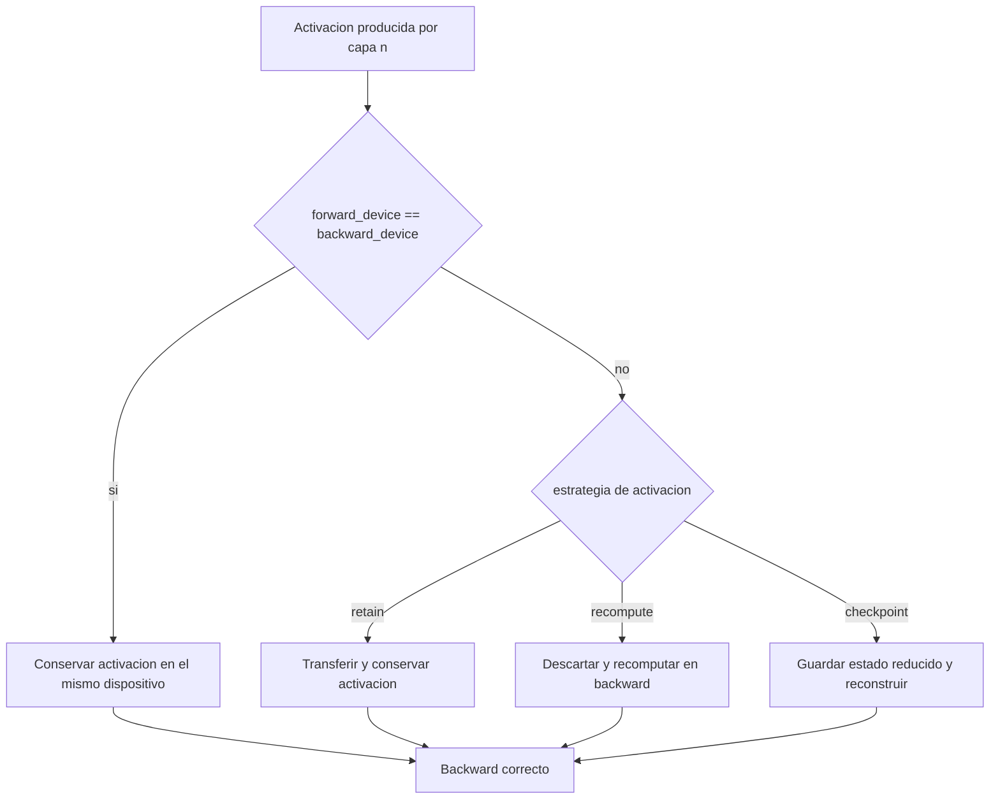
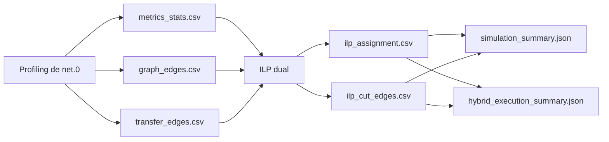
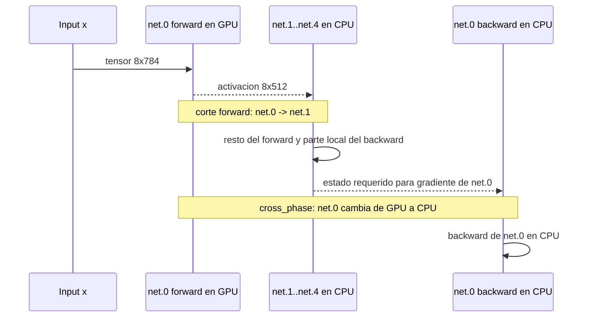
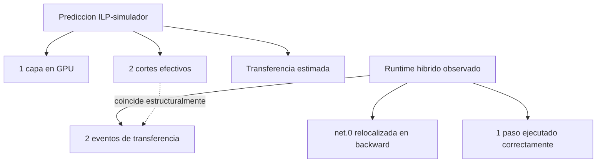

# Documentacion Global de PRISM

## 1. Alcance y objetivo del documento

Este documento constituye la referencia tecnica integral de PRISM, sigla de Partitioning and Routing via ILP for Scalable Memory.

Su funcion debe leerse en complementariedad con [PROJECT_STRUCTURE.md](PROJECT_STRUCTURE.md). Mientras ese documento fija la cartografia actual del repositorio y la responsabilidad de cada bloque, el presente texto desarrolla la semantica tecnica del pipeline, las decisiones metodologicas, los contratos de artefactos y la trazabilidad directa con el codigo de implementacion.

En su estado consolidado, el alcance metodologico del proyecto queda fijado sin bifurcaciones: asignacion independiente forward/backward, persistencia de activaciones como decision binaria ILP, transferencia asincrona de tensores CPU<->GPU mediante CUDA streams y prefetching explicito en el ejecutor hibrido.

Explica, con trazabilidad directa al codigo:

- como se capturan datos de profiling (tiempo, energia, memoria, FLOPs, transferencia)
- como se extraen y persisten grafos de modelo
- como se almacenan y agregan salidas
- como se construye y resuelve el modelo ILP
- como se fusionan datos multi-hardware
- como se ejecutan scripts end-to-end
- como se generan graficas de reporte y tablas LaTeX
- como se implementa validacion

Referencias principales de implementacion:

- `src/profiler.py`
- `src/runner/training_profiler.py`
- `src/core/graph_extractor.py`
- `src/core/metrics.py`
- `src/core/precision_policy.py`
- `src/core/energy.py`
- `src/core/stats_aggregator.py`
- `src/ilp/data_loader.py`
- `src/ilp/model_builder.py`
- `src/ilp/solve.py`
- `src/ilp/export_solution.py`

Referencias de soporte para ejecucion y orquestacion:

- `scripts/run_experiments.sh`
- `scripts/run_thesis_smoke_workflow.sh`
- `scripts/run_ilp_partition.sh`
- `scripts/run_ilp_pareto_sweep.sh`
- `scripts/discover_ilp_config_dirs.sh`
- `scripts/generate_ilp_report_assets.sh`
- `scripts/export_ilp_tables_latex.sh`
- `validation/*.py`

---

## 2. Que construye este proyecto

El proyecto implementa un pipeline completo que conecta la medicion empirica con la optimizacion:

1. Perfilar el entrenamiento capa a capa en CPU y GPU.
2. Exportar artefactos de metricas y metadatos.
3. Exportar grafo DAG y costos de transferencia en aristas.
4. Agregar corridas repetidas en estadistica robusta.
5. Construir y resolver modelo ILP robusto de particion (asignacion CPU/GPU por capa), con semantica de memoria seleccionable via `memory_model` (`nodal_sum` conservador o `peak_approx` con solapamiento de activaciones controlado por `peak_activation_overlap`).
6. Ejecutar barridos Pareto bajo presupuestos de memoria GPU.
7. Generar graficas consolidadas y tablas LaTeX para reporte.

Desde un punto de vista conceptual:

- lado de profiling = medicion + ingenieria de caracteristicas
- lado ILP = optimizacion de decisiones a partir de costos medidos y restricciones

---

## 3. Arquitectura end-to-end

### 3.1 Flujo de ejecucion

Punto de entrada principal de profiling:

- `main()` en `src/profiler.py`

Pasos principales de orquestacion:

1. Parsear argumentos CLI (`_build_parser`).
2. Normalizar directorio de salida bajo namespace de host (`normalize_output_dir_for_host` en `src/core/system.py`).
3. Configurar el entorno de ejecucion CPU y el determinismo (`configure_cpu_runtime`, `set_determinism`).
4. Evaluar politica de precision (`_configure_precision` en `src/profiler.py` + `src/core/precision_policy.py`).
5. Resolver y cargar el batch desde `datasets/` cuando el dataset requerido existe, preservando metadatos de procedencia (`src/data/dataset_registry.py` y `build_model_input_target` en `src/models/factory.py`).
6. Ejecutar profiling (`TrainingProfiler.run_profiling` en `src/runner/training_profiler.py`).

### 3.2 Pipeline de artefactos

Salidas por corrida del profiling:

- `<model>_metrics.csv`
- `<model>_meta.json`
- `<model>_graph_nodes.csv`
- `<model>_graph_edges.csv`
- `<model>_transfer_edges.csv`
- checkpoints tempranos de seguridad opcionales:
  - `<model>_metrics_gpu_partial.csv`
  - `<model>_meta_gpu_partial.json`

Salida de agregacion de replicas:

- `<model>_metrics_stats.csv` (o `metrics_stats.csv`)

Salidas ILP:

- `ilp_solution/ilp_assignment.csv`
- `ilp_solution/ilp_cut_edges.csv`
- `ilp_solution/ilp_solution_summary.json`

Salidas Pareto:

- `<model>_pareto_sweep.csv`
- `<model>_pareto_summary.json`

Salidas de reporte:

- `ilp_pareto_consolidated.csv`
- `ilp_best_per_model.csv`
- `hybrid_execution_consolidated.csv` (cuando existe ejecucion hibrida observada)
- `hybrid_execution_best_per_model.csv` (cuando existe ejecucion hibrida observada)
- `ILP_RESULTS_SUMMARY.md`
- `*_objective_vs_budget.png`
- `best_ilp_vs_all_cpu_improvement.png`
- Archivos LaTeX en `reports/.../latex/*.tex`

Metadatos adicionales introducidos por la capa de datasets persistentes:

- `dataset_name`
- `dataset_split`
- `dataset_path`
- `input_source`
- `target_source`

Estos campos aparecen en `*_meta.json` del profiling y en los protocolos del ejecutor hibrido, con el fin de alinear evidencia empirica, simulacion y reporte bajo una procedencia comun del dato.

En la ruta NLP, el proyecto ya no utiliza los encoders base sin semantica de tarea como aproximacion final de validacion. `bert_base` se instancia con cabeza explicita de clasificacion secuencial sobre AG News, lo que habilita logits de 4 clases y medicion de `accuracy` real. `gpt2_small` se instancia con cabeza de lenguaje causal, lo que habilita perdida autoregresiva real y medicion de `token_accuracy` sobre etiquetas desplazadas y enmascaradas. Este cambio es relevante porque desplaza la validacion desde una funcion objetivo generica de estabilidad hacia funciones objetivo y metricas semanticamente compatibles con la tarea instrumentalizada.

---

## 4. Internos del profiling: como se capturan exactamente los datos

### 4.1 Instrumentacion a nivel de capa

Implementado en `TrainingProfiler._register_hooks` (`src/runner/training_profiler.py`).

El profiler adjunta hooks solo a modulos hoja (`_get_leaf_modules`) para evitar el doble conteo de modulos anidados.

Para cada capa hoja:

- el pre-hook almacena el tiempo de inicio en pared (`time.perf_counter()`)
- para CUDA, el pre-hook registra un evento CUDA
- el post-hook calcula:
  - el tiempo de kernel (`kernel_ms`) a partir de eventos CUDA (GPU) o del delta temporal en pared (CPU)
  - overhead de dispatch:

$$
\text{dispatch\_ms} = \max(0, \text{wall\_ms} - \text{kernel\_ms})
$$

  - el tamano de salida en bytes (`get_tensor_size_recursive`)
  - el tamano de parametros en MB
  - la estimacion de FLOPs (`estimate_flops`)

### 4.2 Ejecucion de paso de entrenamiento

Implementado en `TrainingProfiler._run_epoch`:

- la entrada se mueve al dispositivo seleccionado
- el optimizador se construye a partir del optimizador seleccionado por el usuario
- el bucle ejecuta `steps` iteraciones:
  - `forward`
  - `loss.backward()`
  - cronometraje de `optimizer.step()`
- el monitor de energia corre en paralelo (`EnergyMonitor`)

La energia por fase se deriva de la siguiente expresion:

$$
E_{\text{total}} = P_{\text{avg}} \cdot T
$$

donde:

- $P_{\text{avg}}$ = potencia promedio medida (W)
- $T$ = duracion medida en tiempo de pared (s)

### 4.3 Formulas de FLOPs usadas

Implementado en `src/core/metrics.py` (`estimate_flops`).

El objetivo de esta subseccion es explicitar como se aproxima el trabajo computacional cuando no se dispone, de forma portable, de contadores de hardware directos. En este proyecto, los FLOPs no se usan como objetivo directo de optimizacion, pero si como referencia de normalizacion e interpretacion: permiten comparar capas con formas y operadores diferentes bajo una unidad comun de demanda computacional.

Convolucion 2D:

$$
\text{FLOPs}_{\text{conv}} = 2 \cdot C_{out} \cdot H_{out} \cdot W_{out} \cdot \left(\frac{C_{in}}{\text{groups}} \cdot K_x \cdot K_y\right)
$$

Lineal:

$$
\text{FLOPs}_{\text{linear}} = 2 \cdot P \cdot \text{in\_features} \cdot \text{out\_features}
$$

donde $P$ es el producto de todas las dimensiones posicionales antes del eje de caracteristicas.

Modulo de tipo atencion (aproximacion):

$$
\text{FLOPs}_{\text{attn}} \approx 4BSD^2 + 2BS^2D
$$

con:

- $B$: batch
- $S$: longitud de secuencia
- $D$: dimension oculta

Por que estas formulas son necesarias y como interpretarlas:

- La expresion de convolucion captura el esfuerzo de multiply-accumulate sobre posiciones espaciales y canales de salida. El factor `2` representa multiplicacion mas suma.
- La expresion lineal escala con las caracteristicas de entrada y salida, junto con cualquier dimension posicional previa (`P`), por eso bloques MLP y cabezas de clasificacion pueden compararse directamente.
- La formula de atencion es deliberadamente aproximada. Captura los terminos de complejidad dominantes ($D^2$ para proyecciones y $S^2D$ para mezcla de scores/valores) sin exigir internals especificos para cada implementacion.

Lectura practica:

- FLOPs altos con TFLOPS medidos bajos suelen indicar cuellos de botella de memoria o de dispatch.
- FLOPs similares con tiempos muy distintos suelen revelar overhead de transferencia, diferencias de eficiencia de kernels o efectos de precision.

### 4.4 Benchmark empirico de pico TFLOPS

Implementado en `TrainingProfiler._measure_peak_flops`.

Este benchmark existe para proporcionar una linea base relativa al hardware. Los TFLOPS crudos por capa son dificiles de interpretar en aislamiento porque dependen de la generacion del dispositivo y de la configuracion de ejecucion. Al medir un pico empirico en el mismo entorno, el proyecto deriva una razon de eficiencia comparable entre corridas y entre perfiles de hardware.

Para tamano de matriz $N$ y duracion promedio $\Delta t$ sobre iteraciones:

$$
\text{TFLOPS}_{\text{peak}} = \frac{2N^3}{10^{12} \cdot \Delta t}
$$

Proporcion de eficiencia por capa:

$$
\text{efficiency\_ratio}_{\ell} = \frac{\text{TFLOPS}_{\ell}}{\text{TFLOPS}_{\text{peak}}}
$$

Por que este benchmark es importante:

- Separa la carga algoritmica de la capa de los limites maximos de la plataforma.
- Mejora el poder diagnostico: una capa con baja razon de eficiencia puede investigarse por presion de memoria, bloqueos de transferencia o rutas de kernel suboptimas.
- Permite analisis multi-servidor mas justos, porque cada servidor se normaliza contra su propio pico empirico antes de la fusion robusta.

### 4.5 Heuristica forward/backward

`BACKWARD_FACTOR = 2.0` en `src/core/constants.py`.

Cuando no se dispone de una medicion directa del backward separada por capa, los tiempos y la energia de backward por capa se aproximan como:

$$
T_{\ell}^{bwd} = 2 \cdot T_{\ell}^{fwd}, \quad
E_{\ell}^{bwd} = 2 \cdot E_{\ell}^{fwd}
$$

Esta aproximacion se aplica durante la construccion de filas dentro de `TrainingProfiler.run_profiling`.

Por que se usa `BACKWARD_FACTOR = 2.0` y por que no es un valor arbitrario:

- En entrenamiento con gradientes, el computo backward suele ser del mismo orden que el forward, y frecuentemente mayor por propagacion y acumulacion de gradientes.
- Un factor cercano a `2` es una prior de ingenieria pragmatica y conservadora cuando no hay separacion backward por capa con precision completa.
- El valor fijo mantiene comparabilidad y determinismo entre corridas; cambiarlo ad hoc introduce sesgos en estadistica robusta y en coeficientes del ILP.

Rol metodologico:

- Es una aproximacion de respaldo, no una afirmacion de exactitud fisica.
- Preserva continuidad del pipeline y evita canales de costo faltantes al construir la entrada ILP.
- Su impacto se modera despues mediante agregacion de replicas (`mean`, `std`, cuantiles) y robustificacion (`mu + k*sigma`).

---

## 5. Politica de precision y control de ejecucion en runtime

Implementado en:

- `src/core/precision_policy.py`
- `_configure_precision` en `src/profiler.py`

### 5.1 Sondeo de ISA

`probe_cpu_precision_support()` inspecciona los flags de CPU a partir de `/proc/cpuinfo`.

Politica de aceleracion:

- `fp16` requiere `avx512_fp16`
- `bf16` requiere `avx512_bf16` O (`amx_bf16` y `amx_tile`)

### 5.2 Politica de ejecucion

`evaluate_precision_execution_policy(precision, isa_info)` devuelve:

- `allowed`
- `cpu_precision_executed`
- `reason`
- `status`

Significado de cada campo devuelto:

- `allowed`: compuerta booleana que indica si la precision solicitada puede ejecutarse bajo las restricciones detectadas de ISA/runtime.
- `cpu_precision_executed`: precision efectiva que realmente se ejecutara en CPU (`fp32`, `fp16`, `bf16` o vacio cuando se omite), necesaria para trazabilidad de artefactos.
- `reason`: justificacion legible de la decision de politica (por ejemplo ISA no soportada), util para auditoria y depuracion.
- `status`: etiqueta compacta y legible por maquina (por ejemplo `ready` o `skipped_unsupported_precision`) usada por wrappers y validaciones.

Si se solicita precision no soportada:

- con `--skip_cpu` y GPU disponible: continuar en modo solo GPU
- en otro caso: la corrida se omite y se generan artefactos con la razon explicita

### 5.3 Preflight de modelo CPU FP16 y matematica de timeout

Implementado en `run_cpu_fp16_model_preflight`.

Comportamiento de tres etapas:

1. timeout de join de fase forward fijo en 60s
2. timeout backward adaptativo computado como:

$$
\tau_{bwd} = \max\left(10,\; T_{fwd} \cdot \text{BACKWARD\_FACTOR} \cdot s\right)
$$

donde:

- $T_{fwd}$ = tiempo forward medido en segundos
- `BACKWARD_FACTOR = 2.0`
- $s$ = factor de seguridad de timeout (default 2.5)

3. join final usa $\tau_{bwd}$

Este mecanismo evita bloqueos prolongados y, al mismo tiempo, preserva la ejecucion valida cuando resulta factible.

Por que se adopta este comportamiento por etapas:

- El soporte de CPU FP16 puede estar presente de forma nominal, pero ser inestable operacionalmente en ciertas plataformas.
- Un timeout monolitico unico suele ser demasiado corto para modelos grandes o demasiado largo para detectar fallos tempranos.
- Separar en una compuerta forward fija y una compuerta backward adaptativa mejora seguridad y equidad.

Razon de diseno de cada fase:

- Etapa 1 (timeout fijo en forward): descarta rapidamente ejecuciones claramente inviables.
- Etapa 2 (timeout backward adaptativo): ajusta el presupuesto temporal al comportamiento forward observado y reduce falsos negativos en modelos grandes.
- Etapa 3 (join final acotado): evita que el proceso quede bloqueado indefinidamente.

En sintesis, es un mecanismo de confiabilidad que protege la integridad de la campana sin descartar ejecuciones potencialmente validas.

---

## 6. Extraccion de grafo: como se construyen nodos y aristas

Esta seccion explica como la informacion estructural del modelo se transforma en una representacion de grafo analizable. El grafo no cumple solo una funcion descriptiva; tambien constituye el sustrato estructural sobre el que se construyen los costos de transferencia y las penalizaciones de corte utilizadas por el ILP.

Implementado en `src/core/graph_extractor.py`.

### 6.1 Metodo principal: torch.fx

`_build_fx_graph(model, layer_stats, input_data)`:

- traza el modelo mediante `symbolic_trace`
- propaga opcionalmente metadatos de forma (`ShapeProp`) cuando los dispositivos son compatibles
- crea registros de nodo para los nodos FX que no son de salida
- crea registros de arista a partir de dependencias de entrada (`dst.all_input_nodes`)

Nombrado de nodos:

- `call_module`: nombre de target de modulo
- `call_function` / `call_method`: representacion de target
- `placeholder`: nombre de entrada

### 6.2 Metodo fallback

Si FX falla, el pipeline intenta primero una ruta estructural alternativa basada en `torch.export` para modelos decoder-only. Solo bajo habilitacion diagnostica explicita `_build_fallback_graph` crea una cadena lineal sobre modulos hoja.

Esta ruta degradada se conserva para depuracion y analisis exploratorio, pero no constituye una fuente estructural admisible para la cadena principal de evidencia doctoral.

Por que este fallback se restringe a diagnostico:

- Algunos modelos contienen flujo de control dinamico u operaciones incompatibles con trazado.
- La cadena lineal preserva disponibilidad de artefactos, pero no captura toda la estructura de ramificacion.
- Si se consumiera como entrada normal del ILP, subestimaria costos de corte asociados a conexiones no secuenciales.

### 6.3 Esquemas de nodo y arista

Columnas de nodo de grafo (escritas por `write_csv_rows`):

- `node_id`
- `node_name`
- `op_type`
- `topo_index`
- `params_mb`
- `activ_out_mb`
- `graph_trace_source`

Interpretacion de columnas de nodo:

- `node_id`: clave numerica estable para joins entre artefactos de grafo, transferencia e ILP.
- `node_name`: identificador legible de la operacion/modulo representado.
- `op_type`: categoria estructural (`call_module`, `call_function`, `call_method`, `placeholder`) usada para analisis semantico.
- `topo_index`: indice de orden topologico para preservar consistencia de dependencias.
- `params_mb`: huella de memoria de parametros atribuible al nodo.
- `activ_out_mb`: estimacion del tamano de activacion de salida; variable clave para costo de transferencia cuando hay cortes.
- `graph_trace_source`: procedencia (`torch_fx`, `torch_export_decoder_only` o `fallback_leaf_modules`) que indica nivel de fidelidad estructural.

Columnas de arista de grafo:

- `src_id`
- `dst_id`
- `tensor_mb`
- `tensor_shape`
- `producer_name`
- `consumer_name`
- `graph_trace_source`

Interpretacion de columnas de arista:

- `src_id`, `dst_id`: extremos dirigidos de dependencia en espacio de IDs de nodo.
- `tensor_mb`: tamano estimado del payload tensorial que cruza la dependencia.
- `tensor_shape`: metadato de forma para verificacion y reproducibilidad.
- `producer_name`, `consumer_name`: nombres legibles de extremos para diagnostico y reportes.
- `graph_trace_source`: marca de procedencia alineada con la del trazado de nodos.

Para modelos causales decoder-only tipo GPT-2 cuyo trazado `torch.fx` no es estable, el proyecto incorpora un backend separado basado en `torch.export`. Este backend no sustituye la ruta general: solo se activa cuando el trazado simbólico falla y el modelo cumple el perfil de compatibilidad de causal LM exportable. La salida estructural se reagrupa por modulo hoja usando `nn_module_stack`, de manera que los artefactos `*_graph_nodes.csv` y `*_graph_edges.csv` sigan siendo consistentes con `metrics.csv`, `metrics_stats.csv` y con la formulacion ILP sobre capas medidas.

La evidencia empirica de esta ruta ya cubre dos modelos de la misma familia. En `gpt2_small`, el backend `torch_export_decoder_only` produjo 113 nodos y 113 aristas agrupadas, y la ruta completa profiling -> agregacion -> ILP -> simulacion -> ejecucion hibrida quedo validada en lote reducido real. En `distilgpt2`, la misma ruta produjo 59 nodos y 59 aristas agrupadas, resolvio ILP con mapeo estricto y completo ejecucion hibrida real sobre Tiny Shakespeare. La diferencia observada fue de escala estructural, no de compatibilidad, lo que refuerza que el backend separado generaliza a modelos decoder-only causales exportables mas alla del caso original. Durante esta extension aparecio una asercion interna exportada (`aten._assert_tensor_metadata.default`) que no representa computo de capa ni transferencia material; el runtime DAG la trata como verificacion de metadata y no como operacion que deba fijar dispositivo.

Tras oficializar `distilgpt2` en parser, factorias y scripts, se ejecuto un smoke adicional por CLI completa el 2026-03-25. El profiler oficial (`src/profiler.py`) corrio con datos reales de Tiny Shakespeare y genero artefactos consistentes en `data/zephyr/test-distilgpt2-smoke/`, confirmando `input_source=dataset` y `graph_trace_source=torch_export_decoder_only` con 59 nodos/aristas. Sobre una solucion ILP ya validada, `validation/run_hybrid_execution.py --model distilgpt2` completo un smoke oficial con `status=ok` en `hybrid_execution_official_cli_smoke/`, lo que cierra no solo la validez experimental del backend sino tambien la validez operativa de su exposicion publica en CLI.

### 6.4 Como se representan y ven nodos

Los nodos se representan como entidades tabulares de grafo en `*_graph_nodes.csv`.

Puedes inspeccionar rapidamente con:

```bash
python - <<'PY'
import pandas as pd
p='data/<host>/results/<model>/<optimizer>/<precision>/batch_<N>/run_001/<model>_graph_nodes.csv'
df=pd.read_csv(p)
print(df[['node_id','node_name','op_type','topo_index']].head(20).to_string(index=False))
PY
```

Actualmente no se incluye un renderizador dedicado de visualizacion de grafos; los datos se exportan para herramientas posteriores de ILP y para visualizacion externa.

---

## 7. Calibracion de transferencia y modelo de costo de transferencia consciente de arista

Esta seccion formaliza el costo de comunicacion entre CPU y GPU. En la practica, la calidad de una particion depende tanto del comportamiento de transferencia como de la velocidad de computo, por lo que este modelo constituye un componente esencial de la validez de la optimizacion.

Implementado en `TrainingProfiler`:

- `_measure_pci_and_overlap`
- `_measure_pci_bandwidth_detailed`
- `_build_edge_transfer_costs`

### 7.1 Alpha-beta especifico por direccion

Para cada direccion (`h2d`, `d2h`), alpha y beta se estiman de transferencias medidas en dos tamanos de tensor (10MB y 100MB en calibracion detallada actual):

$$
t_{dir}(S) = \alpha_{dir} + \frac{S}{\beta_{dir}}
$$

donde:

- $S$: tamano de tensor en MB
- $\alpha_{dir}$: termino de latencia en ms
- $\beta_{dir}$: termino de throughput en MB/ms

### 7.2 Atenuacion de overlap

Se estima una proporcion de overlap $\sigma \in [0,1]$ y, a partir de ella, se atenúan las penalizaciones de transferencia:

$$
\text{overlap\_factor} = 1 - 0.5\sigma
$$

$$
t^{eff}_{h2d} = t^{raw}_{h2d} \cdot \text{overlap\_factor},
\quad
t^{eff}_{d2h} = t^{raw}_{d2h} \cdot \text{overlap\_factor}
$$

Por que se modela la atenuacion por overlap:

- En sistemas reales puede haber solapamiento entre comunicacion y computo; asumir transferencia totalmente serial sobreestima penalizaciones de corte.
- Asumir overlap total seria demasiado optimista y puede sub-penalizar particiones fragmentadas.
- Este modelo ofrece un compromiso: descuenta costo de transferencia segun overlap observado, manteniendo comportamiento conservador.

Interpretacion del factor:

- Cuando `sigma_overlap = 0`, no hay overlap y el costo efectivo coincide con el costo crudo.
- A medida que aumenta el overlap, disminuye el costo efectivo de transferencia.
- El coeficiente `0.5` limita el descuento maximo al 50%, evitando optimismo irrealista.

### 7.3 Esquema de artefacto de arista de transferencia

`<model>_transfer_edges.csv` contiene:

- `edge_id`
- `src_id`, `dst_id`
- `producer_name`, `consumer_name`
- `tensor_mb`
- `transfer_h2d_ms_raw`, `transfer_d2h_ms_raw`
- `transfer_h2d_ms`, `transfer_d2h_ms`
- `transfer_sym_ms`
- `alpha_h2d_ms`, `beta_h2d_mb_s`
- `alpha_d2h_ms`, `beta_d2h_mb_s`
- `sigma_overlap`

`transfer_sym_ms` es el escalar de transferencia de arista consumido por ILP.

---

## 8. Almacenamiento de metricas y modelo de metadatos

Esta seccion define el contrato de artefactos que hace reproducible el pipeline completo. Cada campo esta diseñado para ser interpretable tanto por personas (auditoria y reporte) como por etapas automatizadas (agregacion y carga ILP).

### 8.1 Conjunto de columna CSV completa por-capa

Las filas finales de metricas se construyen en `TrainingProfiler.run_profiling`.

Columnas:

- `layer`
- `model`
- `batch_size`
- `run_id`
- `seed`
- `type`
- `params_mb`
- `grads_mb`
- `optimizer_states_mb`
- `activations_mb`
- `theoretical_flops`
- `tflops`
- `efficiency_ratio`
- `gpu_fwd_time_ms`
- `gpu_bwd_time_ms`
- `gpu_fwd_energy_j`
- `gpu_bwd_energy_j`
- `gpu_mem_peak_mb`
- `layer_j_per_tflop_gpu`
- `dispatch_overhead_ratio`
- `cpu_fwd_time_ms`
- `cpu_bwd_time_ms`
- `cpu_fwd_energy_j`
- `cpu_bwd_energy_j`
- `cpu_mem_mb`
- `layer_j_per_tflop_cpu`
- `transfer_h2d_ms`
- `transfer_d2h_ms`
- `transfer_h2d_ms_legacy`
- `transfer_d2h_ms_legacy`
- `transfer_edge_aware_total_ms`
- `remat_penalty_ms`
- `precision_requested`
- `cpu_precision_executed`
- `gpu_precision_executed`
- `run_executed`
- `skip_unsupported_precision`
- `skip_reason`
- `optimizer`
- `opt_step_time_ms`

Interpretacion columna por columna y utilidad:

- `layer`: identificador de capa/modulo; unidad primaria de asignacion ILP.
- `model`: nombre de modelo; usado para particionado de campanas y reportes.
- `batch_size`: escala de carga; condiciona tiempos y energia observados.
- `run_id`: identificador de replica para agregacion robusta.
- `seed`: ancla de reproducibilidad para inicializacion y rutas de aleatoriedad.
- `type`: clase de operador/modulo; util en diagnostico estratificado.
- `params_mb`: huella de memoria de parametros de la capa.
- `grads_mb`: huella aproximada de gradientes en entrenamiento.
- `optimizer_states_mb`: componente de memoria de estado del optimizador.
- `activations_mb`: estimacion de huella de activaciones.
- `theoretical_flops`: estimacion de carga computacional independiente de la implementacion runtime.
- `tflops`: throughput computacional observado de la capa.
- `efficiency_ratio`: throughput de capa normalizado contra pico empirico.
- `gpu_fwd_time_ms`: termino de latencia forward en GPU.
- `gpu_bwd_time_ms`: termino de latencia backward en GPU.
- `gpu_fwd_energy_j`: termino de energia forward en GPU.
- `gpu_bwd_energy_j`: termino de energia backward en GPU.
- `gpu_mem_peak_mb`: pico de memoria GPU observado en el contexto de la capa.
- `layer_j_per_tflop_gpu`: indicador de intensidad energetica en GPU.
- `dispatch_overhead_ratio`: fraccion de overhead de framework no atribuible a kernel puro.
- `cpu_fwd_time_ms`: termino de latencia forward en CPU.
- `cpu_bwd_time_ms`: termino de latencia backward en CPU.
- `cpu_fwd_energy_j`: termino de energia forward en CPU.
- `cpu_bwd_energy_j`: termino de energia backward en CPU.
- `cpu_mem_mb`: estimacion de contribucion de memoria CPU.
- `layer_j_per_tflop_cpu`: indicador de intensidad energetica en CPU.
- `transfer_h2d_ms`: estimacion de transferencia host-a-dispositivo.
- `transfer_d2h_ms`: estimacion de transferencia dispositivo-a-host.
- `transfer_h2d_ms_legacy`: salida del estimador de transferencia heredado.
- `transfer_d2h_ms_legacy`: salida del estimador heredado en direccion inversa.
- `transfer_edge_aware_total_ms`: penalizacion agregada de transferencia con consciencia de aristas.
- `remat_penalty_ms`: termino opcional de penalizacion por recomputacion.
- `precision_requested`: precision solicitada desde CLI.
- `cpu_precision_executed`: precision efectiva ejecutada en CPU.
- `gpu_precision_executed`: precision efectiva ejecutada en GPU.
- `run_executed`: bandera booleana de ejecucion valida.
- `skip_unsupported_precision`: bandera explicita de omision por precision no soportada.
- `skip_reason`: razon legible por maquina/humano de la omision.
- `optimizer`: nombre de optimizador usado.
- `opt_step_time_ms`: latencia del paso de optimizador.

### 8.2 Grupos de clave JSON de metadatos

Estos metadatos se generan en `TrainingProfiler.run_profiling` y en las rutas de omision (`skip`).

Grupos principales:

1. Identidad de hardware
- host, version torch, OS, modelo CPU, identidad GPU

2. Artefactos de grafo y transferencia
- conteos y rutas de archivo para nodos/aristas/transferencias

3. Tiempo y overhead
- tiempos totales de capa y paso para CPU/GPU
- overhead de framework y vector dispatch por-capa

4. Energia
- energia por-paso y total CPU/GPU
- vector distribucion energetica por-capa

5. Memoria y totales de tamano de modelo
- pico global GPU
- totales para parametros, gradientes, activaciones

6. Calibracion de transferencia
- valores alpha/beta y diccionario calibracion PCIe crudo

7. Diagnosticos de precision y politica
- precision solicitada/ejecutada
- flags de sondeo ISA y diagnosticos preflight FP16
- estado de ejecucion y razon de skip si existe

8. Cronometraje de optimizador
- total y promedio de cronometraje de paso de optimizador

Como leer estos grupos y por que se agrupan asi:

- El JSON funciona como sobre de contexto a nivel corrida, mientras el CSV contiene el detalle de medicion a nivel capa.
- La agrupacion separa responsabilidades (identidad de hardware, rendimiento, energia, memoria, diagnosticos de precision) para que cada herramienta de post-procesamiento lea solo lo necesario.
- Tambien habilita trazabilidad: decisiones observadas en salidas ILP pueden rastrearse a contexto de dispositivo, politica de precision y calibracion capturados en metadatos.

### 8.3 Normalizacion de almacenamiento con scope de host

`normalize_output_dir_for_host` en `src/core/system.py` impone la insercion del namespace del host bajo `data/<host>/...` para evitar colisiones entre maquinas.

Por que esto importa operacionalmente:

- Las campanas multi-servidor generan artefactos con nombres similares.
- Sin scoping por host, corridas de distintas maquinas pueden sobrescribirse o volverse ambiguas.
- La normalizacion por host garantiza almacenamiento determinista y sin conflictos, y facilita fusiones robustas multi-hardware.

Patron tipico:

- raiz de entrada (definida por usuario): `data/results/...`
- salida normalizada: `data/<host>/results/...`

Esta convencion es clave para reproducibilidad y trazabilidad en flujos experimentales distribuidos.

---

## 9. Estadistica de replicado robusto

La agregacion no es un post-procesamiento cosmetico: es el mecanismo que transforma observaciones ruidosas de replicas en coeficientes robustos para la optimizacion. Sin esta etapa, las decisiones ILP serian altamente sensibles a valores atipicos y a condiciones transitorias del entorno de ejecucion.

Implementado en `src/core/stats_aggregator.py` y wrapper CLI `validation/aggregate_metrics_stats.py`.

### 9.1 Comportamiento de agregacion

Descubrimiento de entradas:

- lee recursivamente `*_metrics.csv`
- excluye `*_metrics_gpu_partial.csv`
- excluye `*_metrics_stats.csv` existente

Claves de agrupamiento (`GROUP_COLUMNS`):

- `model`
- `batch_size`
- `precision_requested`
- `optimizer`
- `layer`
- `type`
- `cpu_precision_executed`
- `gpu_precision_executed`

Por metrica, calcula:

- media
- desviacion estandar muestral
- p50
- p90
- p95

para cada metrica en `DEFAULT_METRIC_COLUMNS`.

Que representan estas metricas y por que se agregan:

- Metricas de tiempo (`*_time_ms`) capturan canales de latencia usados en la funcion objetivo del ILP.
- Metricas de energia (`*_energy_j`) capturan canales energeticos usados cuando `w_energy > 0`.
- Metricas de memoria (`*_mem_*`, `*_mb`) sostienen restricciones de factibilidad y diagnostico.
- Metricas de transferencia capturan penalizaciones de comunicacion que afectan la calidad de particion.

Por que la agregacion es util:

- Los valores de corrida unica contienen ruido.
- La agregacion produce tendencias centrales estables y colas de riesgo.
- Los coeficientes ILP construidos desde estadistica agregada son mas robustos que los obtenidos desde una sola corrida.

### 9.2 Ecuaciones de estadistica

Para valores $x_1,\dots,x_n$:

$$
\mu = \frac{1}{n}\sum_{i=1}^{n}x_i
$$

$$
\sigma = \sqrt{\frac{1}{n-1}\sum_{i=1}^{n}(x_i-\mu)^2}
$$

Los cuantiles $Q_{0.50}, Q_{0.90}, Q_{0.95}$ son cuantiles empiricos sobre muestras de corrida.

Por que estas ecuaciones se explicitan:

- Definen la semantica estadistica exacta de campos consumidos por los cargadores ILP.
- Hacen auditable y reproducible la robustificacion en el contexto de tesis.
- Aclaran como la incertidumbre se propaga desde datos crudos de profiling hacia coeficientes de optimizacion.

### 9.3 Patron de esquema de salida

Cada metrica agregada `m` produce:

- `m_mean`
- `m_std`
- `m_p50`
- `m_p90`
- `m_p95`

Tambien se incluyen:

- `n_samples`
- `n_runs`

Como usar este esquema en la practica:

- Los campos `_mean` aportan valores nominales de coeficientes.
- Los campos `_std` cuantifican incertidumbre y alimentan robustificacion (`mu + k*sigma`).
- Los campos `_p90`/`_p95` soportan analisis de riesgo de cola y reportes.
- `n_samples`/`n_runs` aportan contexto de confianza; conteos bajos deben interpretarse con mayor cautela.

---

## 10. Modelo ILP: concepto, matematica, implementacion

### 10.1 Que es un ILP

Un ILP (Integer Linear Programming) optimiza una funcion objetivo lineal bajo restricciones lineales y variables de decision enteras, a menudo binarias.

En este proyecto, cada capa se asigna a CPU o GPU con decisiones binarias.

Intuicion ampliada:

- Se usa ILP porque el espacio de decisiones es combinatorio: cada capa puede ir a uno de dos dispositivos y los cortes de arista introducen costos de interaccion.
- La forma lineal permite resolver con herramientas MILP maduras.
- Las decisiones binarias mapean de forma natural a acciones ejecutables de despliegue (ubicar capa en CPU o GPU), lo cual es clave para aplicabilidad practica.

### 10.2 Conjuntos y parametros

Sea:

- $V$: nodos de capa
- $E \subseteq V \times V$: aristas del grafo dirigido
- para cada nodo $v$:
  - $T_{gpu}(v), T_{cpu}(v)$: costo de tiempo robusto
  - $E_{gpu}(v), E_{cpu}(v)$: costo de energia robusto
  - $M_{gpu}(v), M_{cpu}(v)$: contribuciones de memoria
- para cada arista $e$:
  - $C_{tr}(e)$: costo de corte de transferencia (`transfer_sym_ms`-basado)

Por que estos parametros estan en el modelo:

- Parametros de tiempo y energia codifican trade-offs de costo de ejecucion.
- Parametros de memoria codifican factibilidad fisica.
- Parametros de transferencia codifican penalizaciones de comunicacion inducidas por cortes de particion.

En conjunto, representan el estado minimo suficiente para expresar una particion heterogenea realista bajo restricciones.

### 10.3 Variables de decision

Asignacion binaria:

$$
x_v \in \{0,1\}, \quad
x_v=1 \Rightarrow \text{GPU},\; x_v=0 \Rightarrow \text{CPU}
$$

Variable de corte binaria por arista:

$$
y_{uv} \in \{0,1\}, \quad (u,v) \in E
$$

Restricciones de linealizacion usadas en `src/ilp/solve.py`:

$$
y_{uv} \ge x_u - x_v
$$

$$
y_{uv} \ge x_v - x_u
$$

$$
y_{uv} \le x_u + x_v
$$

$$
y_{uv} \le 2 - x_u - x_v
$$

Estos fuerzan $y_{uv}=1$ si las asignaciones difieren.

Nota interpretativa:

- `x_v` modela decisiones de ubicacion.
- `y_uv` modela efectos de interaccion entre ubicaciones a lo largo de dependencias.
- Esta separacion permite mantener linealidad sin perder la representacion de costo de corte.

### 10.4 Funcion objetivo en implementacion

`build_problem_data` en `src/ilp/model_builder.py` construye:

$$
\text{node\_gpu}(v) = w_t T_{gpu}(v) + w_e E_{gpu}(v)
$$

$$
\text{node\_cpu}(v) = w_t T_{cpu}(v) + w_e E_{cpu}(v)
$$

$$
\text{edge\_cut}(u,v) = w_{tr} C_{tr}(u,v)
$$

Objetivo optimizado:

$$
\min Z = \sum_{v \in V}\left[x_v\,\text{node\_gpu}(v) + (1-x_v)\,\text{node\_cpu}(v)\right]
+ \sum_{(u,v)\in E} y_{uv}\,\text{edge\_cut}(u,v)
$$

Por que esta construccion es la elegida:

- El termino nodal selecciona costo CPU o GPU por capa segun `x_v`.
- El termino de arista se activa solo cuando hay cambio de dispositivo (via `y_uv`), capturando overhead de comunicacion.
- Las ponderaciones (`w_t`, `w_e`, `w_tr`) hacen explicitas las preferencias del experimento y permiten ajuste controlado.

### 10.5 Restricciones de memoria

Implementadas en `src/ilp/solve.py`:

$$
\sum_{v\in V} M_{gpu}(v)\,x_v \le B_{gpu}
$$

$$
\sum_{v\in V} M_{cpu}(v)\,(1-x_v) \le B_{cpu}
$$

donde:

- $B_{gpu}$ = `gpu_mem_budget_mb`
- $B_{cpu}$ = `cpu_mem_budget_mb`

Por que estas restricciones son esenciales:

- Evitan asignaciones formalmente optimas pero fisicamente imposibles.
- Proveen control directo para analisis Pareto bajo distintos presupuestos de memoria GPU.
- Codifican realismo de despliegue, indispensable para validez aplicada en tesis.

### 10.6 Parametrizacion robusta desde estadistica

`load_ilp_inputs` en `src/ilp/data_loader.py` calcula valores robustos usando:

$$
\hat{m} = \mu_m + k_\sigma \sigma_m
$$

para canales de tiempo y energia, donde `k_sigma` es configurable.

Especificamente:

$$
T_{gpu}(v)=\widehat{gpu\_fwd\_time}(v)+\widehat{gpu\_bwd\_time}(v)
$$

$$
T_{cpu}(v)=\widehat{cpu\_fwd\_time}(v)+\widehat{cpu\_bwd\_time}(v)
$$

$$
E_{gpu}(v)=\widehat{gpu\_fwd\_energy}(v)+\widehat{gpu\_bwd\_energy}(v)
$$

$$
E_{cpu}(v)=\widehat{cpu\_fwd\_energy}(v)+\widehat{cpu\_bwd\_energy}(v)
$$

Por que se usa esta robustificacion:

- Las mediciones runtime contienen variabilidad estocastica.
- Usar `mu + k*sigma` produce coeficientes conscientes de incertidumbre.
- El parametro `k_sigma` controla conservadurismo y puede ajustarse al objetivo experimental.

### 10.7 Agregacion multi-hardware

`merge_ilp_inputs_multi_hardware` soporta dos estrategias:

1. Max conservador:

$$
\bar{c} = \max_i c_i
$$

2. Media con margen de dispersion:

$$
\bar{c} = \mu(c) + k_d\sigma(c)
$$

donde $k_d$ es `hw_dispersion_k`.

Esto se aplica a costos de nodo, energias, memorias, y costos de transferencia de arista a traves de perfiles de hardware.

Por que se necesita agregacion multi-hardware:

- Optimizar sobre una sola maquina puede sobreajustar la politica.
- La agregacion construye politicas que se mantienen validas en pools heterogeneos de servidores.
- `max` favorece robustez de peor caso; `mean + k_d*sigma` favorece compromiso entre robustez y rendimiento medio.

### 10.8 Por que se eligio esta formulacion ILP

Razones practicas alineadas con restricciones de tesis:

- Asignacion binaria de capa es interpretable y auditable.
- Objetivo lineal y restricciones soportan solvers MILP maduros.
- Costos de transferencia mapean naturalmente a variables de corte de arista.
- Restricciones de memoria son directamente representables.
- Terminos robustos de variabilidad medida son faciles de inyectar como coeficientes lineales.

### 10.9 Backends de solver

`solve_partition_ilp` en `src/ilp/solve.py`:

- `auto`: PuLP CBC si esta disponible; en caso contrario, busqueda exhaustiva
- `pulp`: ruta solver MILP
- `exhaustive`: fuerza bruta (guardado: max 22 nodos)

Razon de seleccion de backend:

- `pulp` es preferido para tamanos de grafo realistas por escalabilidad.
- `exhaustive` se mantiene como oraculo de correccion en instancias pequenas.
- `auto` maximiza portabilidad al degradar de forma controlada cuando faltan dependencias del solver.

---

## 11. Como se usan datos medidos por ILP, end-to-end

El objetivo de esta seccion es cierre metodologico: muestra la ruta causal completa de mediciones empiricas a decisiones de optimizacion, asi decisiones finales pueden rastrearse a comportamiento runtime observable.

1. Profiling escribe metricas por-corrida y artefactos de grafo.
2. Estadistica de replica calcula momentos robustos por `(model,batch,precision,optimizer,layer,...)`.
3. Cargador ILP mapea:
   - tiempo y energia de nodo robusto de `*_metrics_stats.csv`
   - aristas de grafo de `*_graph_edges.csv`
   - costos de transferencia de `*_transfer_edges.csv`
4. Constructor ILP crea terminos de objetivo ponderado y vectores de memoria.
5. Solver retorna asignacion y aristas cortadas.
6. Barrido Pareto repite optimizacion bajo multiples presupuestos GPU.

Para multiples configuraciones de hardware:

- cada perfil de hardware contribuye una entrada ILP
- perfiles se fusionan con `max` o `mean + k*std`
- una instancia ILP unica robusta se resuelve

---


## 11.5 Ejecución Híbrida y Casos de Estudio Reales

## 9. Cómo se simula el plan

### 9.1 Representación del plan

La representación canónica del plan vive en `src/runtime/plan_representation.py` y `src/runtime/device_plan.py`.

Un plan contiene, como mínimo:

- asignación de capas a dispositivos
- aristas cortadas
- en el caso dual, asignaciones separadas de forward y backward
- estrategias de activación, cuando aplica

### 9.2 Simulador

El simulador está en `src/runtime/simulator.py` y se usa desde `validation/validate_ilp_pipeline.py`.

La idea del simulador es evaluar la solución sin ejecutar entrenamiento real. Toma el plan, el DAG y los costos asociados y calcula:

- costo total previsto
- consumo de memoria
- violaciones de factibilidad, si existen

Conceptualmente, recorre nodos y aristas y suma:

1. costo nodal según dispositivo asignado
2. costo de transferencia por aristas cortadas

Si la memoria usada supera el presupuesto, el plan se declara inviable.

La simulación es importante porque permite detectar errores conceptuales antes de pasar a ejecución real, donde el costo experimental es mayor.

## 10. Cómo se hace la ejecución híbrida real

### 10.1 Punto de entrada

La ejecución real se lanza desde `validation/run_hybrid_execution.py`, que usa:

- `load_execution_plan`
- `DevicePlan`
- `run_hybrid_training` en `src/runtime/hybrid_executor.py`

### 10.2 Idea general

La ejecución híbrida real toma un plan ILP y reconstruye un modelo cuyo flujo de capas y tensores puede atravesar CPU y GPU según la asignación definida.

Aquí es importante aclarar una cosa: la decisión de asignación no se calcula de manera online durante el entrenamiento a partir de una política adaptativa que se reoptimiza a cada paso. La decisión principal es offline y viene del ILP. Lo que sí ocurre dinámicamente durante la ejecución es el movimiento de módulos, tensores y activaciones siguiendo esa política ya calculada.

### 10.3 Cómo se distribuyen las capas

`DevicePlan` actúa como traductor entre el archivo de solución y la ejecución real. Para cada capa, conoce:

- dispositivo de forward
- dispositivo de backward
- cortes relevantes
- estrategias de activación

Con esa información, el ejecutor resuelve el dispositivo efectivo de cada capa en cada fase del paso de entrenamiento.

### 10.4 Cómo se usa el DAG en la ejecución real

El DAG no se usa solo para construir el ILP. También informa la interpretación del plan. Las aristas cortadas señalan dónde deben ocurrir transferencias de activaciones. El plan conserva esa semántica estructural para que el runtime sepa cuándo mover datos entre CPU y GPU.

### 10.5 Cómo se mueve la información entre dispositivos

`hybrid_executor.py` implementa utilidades como:

- `_to_device()`
- `_to_device_non_blocking()`
- `_current_device()`
- `_all_tensor_devices()`

Además define estructuras como:

- `TransferEvent`
- `StepTrace`
- `HybridExecutionResult`

Estas clases permiten registrar, por paso:

- tiempo total
- tiempo de forward
- tiempo de backward
- tiempo de optimizador
- cantidad total de transferencia
- número de eventos de transferencia
- memoria pico GPU
- cantidad de recomputaciones y checkpoints

### 10.6 Ejecución por capas y estrategia dual

Cuando una capa requiere dispositivos distintos en forward y backward, el ejecutor puede recurrir a mecanismos específicos como `_run_layer_with_dual_placement()`. Esa función encapsula una estrategia en la que:

1. el forward se ejecuta en el dispositivo de forward
2. el backward se fuerza en el dispositivo de backward
3. la información necesaria se guarda o reconstruye para mantener coherencia de gradientes

Esto es uno de los puntos más importantes del proyecto, porque conecta directamente el modelo dual del ILP con una posibilidad real de ejecución física.

El flujo operativo de una capa con colocación dual puede visualizarse así:

```mermaid
sequenceDiagram
	participant Host as CPU Host
	participant GF as GPU forward
	participant GB as GPU backward
	participant C as Capa n
	participant Opt as Optimizer

	alt forward en CPU
		Host->>C: entrada en CPU
		C-->>Host: activacion forward
	else forward en GPU
		Host->>GF: mover entrada
		GF->>C: ejecutar forward
		C-->>GF: activacion forward
	end

	alt cambio de dispositivo entre fases
		GF->>Host: transferir activacion o estado intermedio
		Host->>GB: recolocar para backward
	else mismo dispositivo entre fases
		GF->>GB: conservar localidad
	end

	alt backward en CPU
		Host->>C: ejecutar backward
		C-->>Host: gradientes
	else backward en GPU
		GB->>C: ejecutar backward
		C-->>GB: gradientes
	end

	Host->>Opt: actualizar pesos o sincronizar estado
	GB->>Opt: actualizar pesos o sincronizar estado
```

La lógica de ese diagrama es la siguiente. Primero se ejecuta la fase forward en el dispositivo indicado por `assignment_forward`. Después el runtime inspecciona si `assignment_backward` coincide o no. Si coincide, puede reutilizar localidad y reducir movimiento de datos. Si no coincide, aparecen transferencias adicionales, y el ejecutor debe preservar la información necesaria para que el backward siga siendo correcto.

Otra forma útil de leer la ejecución dual es como decisión por frontera entre capas:



Este segundo diagrama conecta directamente el plan dual con las estrategias de activación avanzadas. No toda diferencia entre forward y backward implica la misma política de memoria. El runtime todavía debe decidir si retiene, transfiere, recomputa o checkpointa, y esa decisión modifica tanto el costo real como la presión de memoria.

### 10.7 Prefetching, transferencia asíncrona y activaciones

El ejecutor puede operar con:

- transferencia asíncrona
- prefetching
- estrategias de retención, recomputación o checkpointing

Estas decisiones se reflejan en campos del resultado final y permiten analizar cuánto del comportamiento previsto por el ILP se materializa de verdad en ejecución observada.

### 10.8 Qué devuelve la ejecución real

`HybridExecutionResult` resume:

- estado de la corrida
- energía total
- potencia media
- memoria pico GPU
- pérdida inicial y final
- métricas de calidad, cuando aplica
- trazas por paso
- advertencias y limitaciones

## 11. Cómo se usa el resultado ILP para entrenar el modelo seleccionado

El proceso completo es este:

1. Se perfila el modelo deseado para obtener métricas por capa y artefactos estructurales.
2. Esas métricas se agregan en `metrics_stats.csv`.
3. El cargador ILP valida y transforma esos artefactos en `ILPInputData`.
4. El solver produce `ilp_assignment.csv`, `ilp_cut_edges.csv` y `ilp_solution_summary.json`.
5. El runtime lee esos archivos, reconstruye un `DevicePlan` y ejecuta el modelo siguiendo esa política.

La decisión de asignación, por tanto, nace de una optimización offline basada en evidencia medida. La dinámica del runtime consiste en hacer cumplir esa asignación durante cada paso del entrenamiento.

### 11.1 Ejemplo visual completo: una capa real de `simple_mlp` desde profiling hasta ejecución híbrida

El caso más pedagógico del repositorio es el escenario controlado `simple_mlp_dual_runtime_evidence`, porque conserva artefactos del solver, de la simulación y del runtime real en un mismo bloque. En ese caso, la solución dual asigna:

- `net.0`: GPU en forward, CPU en backward
- `net.1`, `net.2`, `net.3`, `net.4`: CPU en ambas fases

La cadena base de capas es:

```text
net.0 (Linear 784->512) -> net.1 (ReLU) -> net.2 (Linear 512->256) -> net.3 (ReLU) -> net.4 (Linear 256->10)
```

El rastro extremo a extremo de `net.0` puede visualizarse así:



La lectura concreta del ejemplo es la siguiente.

En `simple_mlp_metrics_stats.csv`, `net.0` aparece como una capa `Linear` con alta dispersión en CPU y con tiempos robustos significativamente distintos entre CPU y GPU. Para `net.0`, los promedios observados del caso son aproximadamente:

- GPU forward: `0.220 ms`
- GPU backward: `0.441 ms`
- CPU forward: `3.448 ms`
- CPU backward: `6.895 ms`
- memoria de parámetros: `1.533 MB`
- activación de salida: `0.015625 MB`

Si se compara `net.0` con las otras dos capas lineales del mismo modelo, la razón de la frontera elegida por el solver se vuelve más visible:

| Capa | Tipo | GPU fwd ms | GPU bwd ms | CPU fwd ms | CPU bwd ms | Params MB | Activación MB | Transfer edge-aware ms | Asignación dual final |
| --- | --- | ---: | ---: | ---: | ---: | ---: | ---: | ---: | --- |
| `net.0` | Linear | 0.2204 | 0.4408 | 3.4475 | 6.8950 | 1.5332 | 0.015625 | 0.6217 | GPU en forward, CPU en backward |
| `net.2` | Linear | 0.1098 | 0.2197 | 3.9178 | 7.8356 | 0.5010 | 0.0078125 | 0.6212 | CPU en forward y backward |
| `net.4` | Linear | 0.0879 | 0.1758 | 0.0219 | 0.0437 | 0.0098 | 0.0003052 | 1.2354 | CPU en forward y backward |

La interpretación de esa tabla es la clave de la frontera:

1. `net.0` tiene una ventaja muy fuerte de GPU frente a CPU en forward y backward, y además es la capa con mayor peso paramétrico del modelo. Aunque cortar después de `net.0` introduce transferencia, el ahorro de cómputo en GPU compensa ese corte.
2. `net.2` también es mucho más rápida en GPU que en CPU, pero su activación es más pequeña, su peso paramétrico es menor y, en esta solución concreta, el solver prefiere no abrir un segundo frente de corte adicional río abajo. Mantener `net.2` en CPU evita más complejidad topológica después de haber explotado ya la mayor oportunidad en `net.0`.
3. `net.4` es el caso más claro de permanencia en CPU: aunque GPU sigue siendo más rápida en términos brutos, el costo CPU ya es muy bajo en valor absoluto y su término de transferencia edge-aware es proporcionalmente mucho menos atractivo. Llevar `net.4` a GPU produciría una ganancia marginal muy pequeña a cambio de introducir o sostener más movimiento de datos.

Dicho de otra manera, la solución no selecciona solo la capa con mejor aceleración relativa. Selecciona la frontera con mejor balance global entre beneficio de cómputo, costo de transferencia y estructura del grafo. En este ejemplo, esa frontera óptima aparece justo después de `net.0`.

En `simple_mlp_graph_edges.csv`, la salida de `net.0` alimenta a `net.1` con un tensor `8x512`, equivalente a `0.015625 MB`. En `simple_mlp_transfer_edges.csv`, esa dependencia recibe un costo de transferencia simétrico cercano a `0.224 ms`.

Con esa evidencia, el solver dual decide que `net.0` vale la pena en GPU durante forward, pero no durante backward. El resultado queda materializado en:

- `ilp_assignment.csv`: `net.0,GPU,GPU,CPU`
- `ilp_cut_edges.csv`: `net.0 -> net.1` en `forward` y `net.0 -> net.0` en `cross_phase`

Ese comportamiento puede visualizarse en un diagrama específico de capa:



La simulación del mismo caso predice:

- `objective_value`: `19.8848`
- `total_time_ms`: `19.5474`
- `total_transfer_ms`: `0.3374`
- `gpu_mem_used_mb`: `19.3350`
- `layers_gpu`: `1`
- `layers_cpu`: `4`
- `cut_edges_count`: `2`

La ejecución híbrida real del mismo plan reporta:

- `avg_step_ms`: `147.6381`
- `forward_ms`: `146.1050`
- `backward_ms`: `0.7704`
- `optimizer_ms`: `0.6032`
- `total_transfer_mb`: `0.03955`
- `total_transfer_events`: `2`
- `peak_gpu_mem_mb`: `10.6978`
- `backward_relocation_layers`: `net.0`

La comparación visual entre predicción y observación puede resumirse así:



Lo importante de este ejemplo no es que la simulación y el runtime tengan exactamente la misma latencia absoluta, porque no miden la misma cosa con el mismo nivel de detalle operacional. Lo importante es que ambos coinciden en la estructura de la solución: una sola capa usa GPU, existen dos cortes relevantes y la relocalización backward ocurre precisamente en `net.0`, como anticipaba el plan dual.

### 11.2 Segunda tabla real: caso `resnet50` y lectura de frontera a escala grande

El repositorio contiene un caso real de `resnet50` con profiling agregado y barrido de Pareto en `data/zephyr/results_smoke/resnet50/SGD/fp32/batch_8`. Ese caso fue regenerado para este tutorial con el solver CBC operativo, de modo que la solución persistida ahora sí coincide con el estado real del ILP dual.

La solución regenerada para `gpu_budget_mb = 2000` tiene la siguiente forma estructural:

- `layers_gpu_forward = 0`
- `layers_gpu_backward = 9`
- `cut_edges_backward = 11`
- `cross_phase_edges = 9`

Es decir, el solver no empuja ninguna capa a GPU durante forward, pero sí considera rentable desplazar un subconjunto pequeño del backward temprano a GPU. Las capas elegidas por el solver en ese subconjunto incluyen:

- `bn1`
- `conv1`
- `layer1.0.bn2`
- `layer1.0.bn3`
- `layer1.0.conv1`
- `layer1.0.conv2`
- `layer1.0.conv3`
- `layer1.0.downsample.0`
- `layer1.1.conv1`

La tabla siguiente usa tres de esas capas realmente elegidas por el solver y una capa de contraste que permaneció completamente en CPU:

| Capa | Tipo | GPU fwd ms | GPU bwd ms | CPU fwd ms | CPU bwd ms | Params MB | Activación MB | Transfer edge-aware ms | Asignación dual final |
| --- | --- | ---: | ---: | ---: | ---: | ---: | ---: | ---: | --- |
| `bn1` | BatchNorm2d | 0.3028 | 0.6057 | 10.7249 | 21.4499 | 0.0005 | 24.5 | 5.4001 | CPU en forward, GPU en backward |
| `conv1` | Conv2d | 0.4177 | 0.8355 | 14.7308 | 29.4617 | 0.0359 | 24.5 | 4.3878 | CPU en forward, GPU en backward |
| `layer1.0.conv2` | Conv2d | 0.2266 | 0.4531 | 14.8536 | 29.7071 | 0.1406 | 6.1250 | 1.6958 | CPU en forward, GPU en backward |
| `fc` | Linear | 0.1133 | 0.2265 | 3.9675 | 7.9350 | 7.8163 | 0.0305 | 0.9294 | CPU en forward y backward |

La lectura exacta de esta tabla ya no es hipotética, sino consistente con la solución guardada.

1. `bn1` y `conv1` muestran un patrón claro: el backward en CPU es muy costoso y el ahorro al moverlo a GPU sigue siendo grande incluso pagando una transferencia elevada. El solver acepta ese precio porque se trata de capas tempranas cuyo backward concentra trabajo significativo.
2. `layer1.0.conv2` confirma la misma lógica en una zona más profunda del bloque residual. Su activación es bastante menor que la de `conv1`, lo que reduce el peaje estructural de la frontera y hace todavía más defendible su uso en GPU durante backward.
3. `fc` actúa como contraste útil. Aunque GPU sigue siendo más rápida en términos absolutos, el costo CPU de esa capa es mucho menor que el de las capas tempranas seleccionadas. Además, el solver ya está usando gran parte del presupuesto disponible para un conjunto de capas backward que ofrece más retorno global. Por eso `fc` permanece en CPU en ambas fases.

Este caso deja una lección importante: en modelos grandes, la frontera óptima puede ser asimétrica entre fases. Aquí el ILP dual no decide “estas capas van a GPU” de forma uniforme, sino “estas capas justifican GPU solo en backward”. Esa asimetría es precisamente una de las razones por las que el modelo dual existe.

### 11.3 Criterio práctico de selección de frontera

La experiencia de los casos `simple_mlp` y `resnet50` permite formular un criterio operativo simple para leer una frontera buena sin depender únicamente de la intuición visual.

Una frontera es atractiva cuando se cumplen simultáneamente cuatro condiciones:

1. La diferencia entre costo CPU y costo GPU de la capa o bloque es material, no marginal.
2. El tensor que cruza la frontera no es tan grande como para absorber toda la ganancia en transferencia.
3. La memoria liberada o la estructura preservada justifican el corte en el contexto del presupuesto total.
4. La frontera no obliga a abrir demasiados cortes adicionales río abajo.

En forma conceptual, el solver está buscando maximizar una ganancia neta aproximada:

$$
	ext{ganancia neta de frontera} \approx (C^{cpu}_{bloque} - C^{gpu}_{bloque}) - C^{transfer}_{frontera} - C^{complejidad}_{topologia}
$$

donde:

- $C^{cpu}_{bloque} - C^{gpu}_{bloque}$ resume la mejora de cómputo al mover el bloque a GPU
- $C^{transfer}_{frontera}$ resume el precio de cortar dependencias entre dispositivos
- $C^{complejidad}_{topologia}$ representa el costo inducido por abrir más cortes, más relocalizaciones o más presión de memoria en el resto del grafo

Esta expresión no es la función objetivo exacta del ILP, pero sí es una regla de lectura muy útil para entender las soluciones obtenidas. En `simple_mlp`, esa ganancia neta es claramente positiva justo después de `net.0`. En `resnet50`, la comparación entre `conv1`, `layer2.0.conv2` y `fc` muestra por qué la mejor frontera de una red grande rara vez coincide con la capa más rápida o con la primera capa disponible: la mejor frontera es la que mantiene positiva esa ganancia neta después de considerar la transferencia y la topología completa.

### 11.4 Cómo auditar una solución ILP inconsistente

El caso `resnet50` sirve además para fijar un procedimiento de auditoría cuando los artefactos de una solución no parecen coincidir entre sí. La inconsistencia original de este mismo caso era: el `pareto_summary` reportaba una solución mixta, mientras que `ilp_assignment.csv` mostraba una asignación enteramente en GPU.

La forma correcta de auditar un caso así es secuencial:

1. comparar `resnet50_pareto_summary.json` con `resnet50_pareto_sweep.csv` para identificar cuál presupuesto y cuál backend produjeron la fila sospechosa
2. abrir `ilp_solution_summary.json` y comprobar si sus contadores de capas y cortes coinciden con la fila de Pareto que se considera canónica
3. abrir `ilp_assignment.csv` e `ilp_cut_edges.csv` para verificar si la solución persistida representa realmente esos contadores
4. si no coinciden, regenerar `run_ilp_partition.py` y `sweep_ilp_pareto.py` con el mismo `config_dir`, el mismo presupuesto y el mismo backend
5. volver a validar la coherencia entre `summary`, `assignment`, `cut_edges` y `simulation_summary.json`

En este repositorio, la causa raíz del caso `resnet50` fue doble:

- el entorno activo del workspace no era inicialmente `prism_env`
- el solver CBC no estaba accesible para PuLP aunque sí podía instalarse en el entorno

Una vez corregidos esos dos problemas, la solución persistida pasó a ser coherente y el caso dejó de ser ambiguo. Esta lección es importante metodológicamente: cuando una solución ILP parece extraña, antes de concluir que el modelo está mal formulado conviene verificar si el problema está en el solver, en el entorno o en la persistencia de artefactos.


## 12. Catalogo de ejecucion de scripts (como correr todo)

Esta seccion es operacional por diseno. Documenta no solo sintaxis de comando, sino tambien dimensiones experimentales controladas por cada parametro, esencial para reproducibilidad entre clases de hardware.

### 12.1 Campana principal de profiling

Script: `scripts/run_experiments.sh`

Comando canonico:

```bash
bash scripts/run_experiments.sh
```

Controles de entorno comunes:

- override de grilla:
  - `MODELS_CSV`
  - `BATCH_SIZES_CSV`
  - `PRECISIONS_CSV`
  - `OPTIMIZERS_CSV`
- runtime:
  - `USE_SKIP_CPU=true|false`
  - `ENABLE_RAPL=true|false`
  - `FORCE_THREADS=N`
  - `REPEATS=N`
  - `WARMUP=N`
  - `MEASURE=N`
  - `FAIL_FAST=true|false`
  - `DRY_RUN=true|false`

Ejemplo:

```bash
MODELS_CSV=simple_mlp,resnet50 \
BATCH_SIZES_CSV=8,16 \
PRECISIONS_CSV=fp32 \
OPTIMIZERS_CSV=SGD,AdamW \
REPEATS=3 \
USE_SKIP_CPU=true \
conda activate prism_env && \
bash scripts/run_experiments.sh
```

### 12.2 Workflow smoke tesis end-to-end

Script: `scripts/run_thesis_smoke_workflow.sh`

Corre pipeline reducido completo:

1. perfilar grilla reducida
2. agregar estadistica
3. particion ILP
4. barrido Pareto
5. generar artefactos de reporte
6. exportar tablas LaTeX

Comando:

```bash
bash scripts/run_thesis_smoke_workflow.sh
```

### 12.3 Particion ILP individual

Wrapper: `scripts/run_ilp_partition.sh`

```bash
MODEL=simple_mlp \
CONFIG_DIR=data/<host>/results/simple_mlp/SGD/fp32/batch_8 \
K_SIGMA=1.0 W_TIME=1.0 W_ENERGY=0.0 W_TRANSFER=1.0 \
GPU_MEM_BUDGET_MB=1e18 CPU_MEM_BUDGET_MB=1e18 \
BACKEND=auto \
bash scripts/run_ilp_partition.sh
```

### 12.4 Barrido Pareto ILP

Wrapper: `scripts/run_ilp_pareto_sweep.sh`

```bash
MODEL=resnet50 \
CONFIG_DIR=data/<host>/results/resnet50/SGD/fp32/batch_8 \
GPU_BUDGETS_MB=400,600,800,1000 \
CPU_MEM_BUDGET_MB=1e18 \
BACKEND=auto \
bash scripts/run_ilp_pareto_sweep.sh
```

### 12.5 Descubrimiento de config multi-nodo

Script: `scripts/discover_ilp_config_dirs.sh`

```bash
MODEL=simple_mlp OPTIMIZER=SGD PRECISION=fp32 BATCH=8 \
MODE=print \
bash scripts/discover_ilp_config_dirs.sh
```

`MODE=partition` y `MODE=pareto` pueden lanzar wrappers directamente.

### 12.6 Artefactos de reporte consolidado y graficas

Wrapper: `scripts/generate_ilp_report_assets.sh`

```bash
INPUT_ROOT=data/<host>/results_smoke \
OUTPUT_DIR=reports/ilp_results/<host>_smoke \
bash scripts/generate_ilp_report_assets.sh
```

Implementacion de la generacion de graficas: `validation/generate_ilp_report_assets.py`

Graficas generadas:

- `<model>_objective_vs_budget.png`
- `best_ilp_vs_all_cpu_improvement.png`

### 12.7 Exportacion de tabla LaTeX

Wrapper: `scripts/export_ilp_tables_latex.sh`

```bash
BEST_CSV=reports/ilp_results/ilp_best_per_model.csv \
CONSOLIDATED_CSV=reports/ilp_results/ilp_pareto_consolidated.csv \
OUT_DIR=reports/ilp_results/latex \
bash scripts/export_ilp_tables_latex.sh
```

Implementacion: `validation/export_ilp_tables_latex.py`

### 12.8 Modo tesis integral

Script: `scripts/run_thesis_mode.sh`

Este script consolida en una sola orquestacion la preparacion de datasets, la campana de profiling, la resolucion ILP por configuracion, el barrido Pareto, la ejecucion hibrida opcional y la generacion de activos finales de reporte.

Perfiles soportados:

- `quick_smoke`
- `doctoral_minimal`
- `doctoral_full`
- `doctoral_diagnostic`
- `custom`

Ejemplos:

```bash
conda activate prism_env
PYTHON_CMD=$(which python) \
PROFILE=quick_smoke bash scripts/run_thesis_mode.sh
```

```bash
conda activate prism_env
PYTHON_CMD=$(which python) \
PROFILE=doctoral_minimal RUN_HYBRID=true bash scripts/run_thesis_mode.sh
```

```bash
conda activate prism_env
PYTHON_CMD=$(which python) \
PROFILE=doctoral_diagnostic RUN_HYBRID=true bash scripts/run_thesis_mode.sh
```

`doctoral_minimal` y `doctoral_full` constituyen perfiles oficiales en regimen estricto para evidencia troncal de tesis. `doctoral_diagnostic` habilita una ruta de depuracion con `fallbacks` explicitos y sus resultados deben tratarse como evidencia auxiliar, no principal.

Controles relevantes:

- `DATASETS_DIR`
- `DOWNLOAD_DATASETS`
- `BASE_OUTPUT_DIR`
- `REPORTS_DIR`
- `RUN_PROFILING`, `RUN_ILP`, `RUN_HYBRID`, `RUN_REPORTS`
- `DRY_RUN`

Salidas consolidadas esperadas:

- `DATASETS_DIR/dataset_manifest.json`
- artefactos por configuracion bajo `BASE_OUTPUT_DIR`
- consolidado final bajo `REPORTS_DIR`
- tablas LaTeX bajo `REPORTS_DIR/latex`
- checklist metodologico en `REPORTS_DIR/THESIS_MODE_PROTOCOL_CHECKLIST.md`

Nota metodologica: el modo tesis opera con datasets reales por defecto, exige procedencia estructural admisible del grafo y presupone calibracion de transferencia medida. Las anulaciones diagnosticas deben tratarse como fuera del protocolo doctoral principal.

### 12.9 Lanzador HPC legacy

Script: `scripts/launch_grid5k.sh`

Nota importante:

- este script utiliza actualmente nombres de argumentos CLI que no coinciden con el parser vigente de `src/profiler.py` (por ejemplo `--batch-size`, `--gpu-id` con estilo de guion y nombres de modelo como `bert`, `vit`), por lo que debe tratarse como legado y actualizarse antes de su uso en produccion.

---

### 12.10 Busqueda de recursos en Grid5000
Script: `scripts/find_free_gpus.py`
Utilidad vital para conectarse via SSH a los multiples sitios de Grid5000 y usar OAR para descubrir en tiempo real nodos GPU libres y disponibles.

### 12.11 Orquestador Multi-servidor y Significancia
Scripts:
- `scripts/generate_multiserver_summary.py`: Agrega y genera plots globales de los resultados consolidados a traves de multiples servidores.
- `scripts/audit_experimental_grid.sh`: Valida que la grilla experimental completa (modelos, batches) se haya ejecutado sin fallas.
- `scripts/run_statistical_significance.sh`: Corre las pruebas de significancia (p-values) de las mejoras del modelo ILP frente al modelo all-CPU base.

### 12.12 Orquestador Principal Grid5000
Script: `scripts/run_thesis.sh`
Este es el lanzador oficial de campañas para los clústeres reales en Grid5000. Reemplaza el enfoque manual antiguo o de HPC legacy.

### 12.13 Generadores de Evidencia Grafica Auxiliar (Testeados)
Adicionalmente a los artefactos generados por el pipeline principal, existen scripts oficiales y testeados por CI para extraccion de figuras especificas:
- `scripts/generate_methodological_plots.py`: Extrae las figuras para los diagramas de metodo de la tesis.
- `scripts/plot_all_energy_tradeoff.py`: Genera las curvas de Pareto de tiempo de ejecucion vs presupuesto y vs consumo energetico.
- `scripts/plot_all_oom_vs_ilp.py`: Analiza los limites de viabilidad entre esquemas y los umbrales VRAM.
- `scripts/organize_plots.py`: Organiza automaticamente todas las figuras de los reportes en carpetas tematicas.
- `scripts/plot_custom_user_figures.py`: API en Python para generar visiones y graficas cortadas a medida (slices) del conjunto de resultados.

(Nota: Cualquier script que resida en `scripts/archive/` constituye implementaciones depreciadas o parches manuales sucios y no forman parte del pipeline oficial)

## 13. Marco de validacion y prueba

Esta seccion aborda el rigor cientifico a nivel de flujo de trabajo: generar salidas no es suficiente si las politicas de ejecucion, los supuestos estructurales y las guardas frente a fallos no se verifican de manera sistematica.

### 13.1 Pruebas unitarias

Corre:

```bash
bash validation/run_unit_tests.sh
```

Pruebas en `tests/` incluyen:

- `test_precision_policy_unit.py`
- `test_profiler_gpu_only_precision_policy.py`
- `test_timeout_validation.py`

### 13.2 Guardas estructurales y de comportamiento

- `validation/validate_code.py`: verificaciones de timeout e integridad de integracion
- `validation/validate_zombie_fix.py`: verifica integracion de `--skip_cpu` y `--num_threads`
- `validation/validate_all_models.py`: validacion amplia de modelo y preflight
- `validation/comprehensive_check.sh`: verificaciones de arquitectura basadas en grep

### 13.3 Validacion del pipeline ILP y ejecucion hibrida

- `validation/validate_ilp_pipeline.py`: valida factibilidad topologica, costos de corte, presupuestos y resumen de simulacion.
- `validation/run_hybrid_execution.py`: ejecuta un plan ILP sobre el ejecutor hibrido real y exporta trazas y metricas observadas.
- `validation/run_ilp_ablation_suite.py`: consolida variantes de ablacion metodologica.
- `validation/run_ilp_sensitivity.py`: ejecuta barridos controlados de sensibilidad parametricos.

### 13.4 Orden recomendado de validacion

Secuencia recomendada de menor a mayor costo:

1. `bash validation/run_unit_tests.sh`
2. `python validation/validate_code.py`
3. `python validation/validate_all_models.py --preflight-scope fast`
4. `python validation/validate_zombie_fix.py`
5. `bash validation/comprehensive_check.sh`
6. `python validation/validate_ilp_pipeline.py --config_dir <config_dir> --model <model>`
7. `python validation/run_hybrid_execution.py --config_dir <config_dir> --model <model> --require_datasets`

---

## 14. Utilidad a nivel de columna para ILP (por que cada bloque de datos importa)

El enfoque de esta seccion es la interpretabilidad de los coeficientes. Explica por que existe cada familia de columnas y de que manera influye en los terminos del objetivo, en las restricciones o en los filtros de calidad de datos durante la etapa de optimizacion.

### 14.1 Bloque de costo de computo

Usado para terminos de objetivo nodal:

- `gpu_fwd_time_ms`, `gpu_bwd_time_ms`
- `cpu_fwd_time_ms`, `cpu_bwd_time_ms`

Estos valores se convierten en costos robustos de tiempo a nivel nodal dentro del ILP.

### 14.2 Bloque de energia

Usado para objetivo ponderado por energia opcional:

- `gpu_fwd_energy_j`, `gpu_bwd_energy_j`
- `cpu_fwd_energy_j`, `cpu_bwd_energy_j`

Estos terminos se ponderan mediante `w_energy` en la funcion objetivo del ILP.

### 14.3 Bloque de memoria

Usado en restricciones duras de memoria:

- `gpu_mem_peak_mb` -> contribucion de memoria GPU del nodo
- `cpu_mem_mb` -> contribucion de memoria CPU del nodo

### 14.4 Bloque de transferencia

Usado en penalizacion de corte de arista:

- de artefacto de transferencia: `transfer_sym_ms`

Se mapea al coeficiente de objetivo de la arista y se multiplica por la variable de corte $y_{uv}$.

### 14.5 Bloque de diagnosticos de precision

Util para el filtrado y el control de calidad de cada corrida:

- `precision_requested`
- `cpu_precision_executed`
- `gpu_precision_executed`
- `run_executed`
- `skip_unsupported_precision`
- `skip_reason`

Estos campos evitan que filas invalidas contaminen la entrada de agregacion y del ILP.

---

## 15. Limitaciones conocidas y precauciones operacionales

Cualquier pipeline de optimizacion aplicada tiene limites de validez. Hacer explicitos esos limites evita la sobreinterpretacion de resultados y crea una hoja de ruta concreta para futuras mejoras metodologicas.

1. `launch_grid5k.sh` es legacy y no alineado con nombres CLI vigentes.
2. Fallback de grafo es linearizado y menos expresivo que grafo FX.
3. Calidad de energia depende de disponibilidad de sensor (NVML/pyRAPL).
4. Backend exhaustivo de ILP es solo para conteos pequenos de nodos.
5. Modelo de transferencia es alpha-beta de primer orden con aproximacion de overlap.

---

## 16. Flujo reproducible recomendado para corridas nivel-tesis

La secuencia recomendada prioriza el control del riesgo experimental: primero se verifica el entorno y la politica de ejecucion, despues se escala hacia campanas completas y, finalmente, se consolidan los artefactos de optimizacion y reporte.

1. Configuracion de entorno y validacion.
2. Correr preflight canonico (`SMOKE_MODE=true`, `DRY_RUN=true`).
3. Correr smoke real (pequena ejecucion verdadera) en cada clase de hardware.
4. Correr campana completa o especifica de perfil con `run_experiments.sh`.
5. Confirmar completitud de artefactos y generacion de estadistica agregada.
6. Ejecutar particion ILP y barridos Pareto.
7. Generar graficas de reporte y tablas LaTeX.
8. Para analisis multi-hardware, fusionar perfiles con `hw_aggregate=max` o `mean` + `hw_dispersion_k`.

---

## 17. Indice rapido de comando

Este indice esta pensado como una referencia operacional rapida. Facilita la repeticion de experimentos, mientras que la justificacion metodologica mas profunda permanece desarrollada en las secciones anteriores.

Correr campana completa:

```bash
bash scripts/run_experiments.sh
```

Correr workflow smoke tesis end-to-end:

```bash
bash scripts/run_thesis_smoke_workflow.sh
```

Agregar carpeta de configuracion manualmente:

```bash
python validation/aggregate_metrics_stats.py --input_dir <config_dir> --output_csv <config_dir>/<model>_metrics_stats.csv
```

Correr particion ILP:

```bash
python validation/run_ilp_partition.py --config_dir <config_dir> --model <model>
```

Correr barrido Pareto ILP:

```bash
python validation/sweep_ilp_pareto.py --config_dir <config_dir> --model <model> --gpu_budgets_mb 400,600,800
```

Generar artefactos de reporte:

```bash
python validation/generate_ilp_report_assets.py --input_root <root> --output_dir <reports_dir>
```

Exportar tablas LaTeX:

```bash
python validation/export_ilp_tables_latex.py --best_csv <best.csv> --consolidated_csv <consolidated.csv> --output_dir <latex_dir>
```

---

## 18. Referencias adicionales del proyecto

- `README.md`
- `docs/README.md`
- `docs/architecture/PROJECT_STRUCTURE.md`
- `docs/operations/MULTI_NODE_ILP_RUNBOOK.md`
- `docs/operations/SERVER_LAUNCH_PROFILES.md`
- `docs/operations/PROTOCOLO_VALIDACION_MULTISERVIDOR_ES.md`

---

## 19. Narrativa academica extendida

### 19.1 Introduccion pedagogica: del problema practico al modelo cientifico

En un entorno heterogeneo (CPU + GPU), entrenar un modelo de aprendizaje profundo requiere decidir donde debe ejecutarse cada bloque computacional. Esta decision no es trivial: mover mas capas a GPU a menudo reduce tiempo bruto de computo, pero tambien puede aumentar presion de memoria y overhead de transferencia inter-dispositivo. Mantener capas en CPU puede reducir presion de memoria GPU, pero usualmente al costo de latencia mayor.

Este proyecto transforma ese dilema practico en un flujo de optimizacion cientifica reproducible. Primero, mide el comportamiento real por capa (tiempo, energia, memoria, FLOPs y costos de transferencia). Luego, convierte esas mediciones en coeficientes de un problema de Integer Linear Programming (ILP) que decide una asignacion optima CPU/GPU bajo restricciones fisicas (presupuestos de memoria) y criterios de rendimiento (tiempo, energia y transferencia).

Esta metodologia es apropiada para una exposicion a nivel doctoral por dos razones. Primero, cada decision de optimizacion se fundamenta en datos observados, en lugar de apoyarse en supuestos abstractos. Segundo, el pipeline completo es auditable de extremo a extremo, de modo que cada resultado numerico final puede rastrearse hasta las mediciones y transformaciones que lo produjeron.

### 19.2 Lectura guiada para audiencias mixtas (no especialista y especialista)

Para personas no especialistas, cada capa puede entenderse como una tarea dentro de una cadena de produccion. Algunas tareas se ejecutan mas rapido en una maquina especializada (GPU), mientras que otras pueden permanecer en una maquina de proposito general (CPU). Mover salidas entre maquinas introduce un costo adicional (transferencia). El problema consiste en distribuir las tareas para minimizar el costo total sin exceder los limites de almacenamiento temporal (memoria).

Para personas especialistas, la formulacion corresponde a una particion binaria de un DAG con penalizaciones de corte de arista y restricciones de recursos. Los costos nodales son combinaciones afines de terminos de tiempo y energia robustificados estadisticamente, y los costos de arista se derivan de un modelo de transferencia alpha-beta atenuado por overlap. La instancia MILP resultante se resuelve con un backend exacto (CBC via PuLP) o con un respaldo exhaustivo para instancias pequenas.

### 19.3 Por que el pipeline comienza con profiling en lugar de ILP directo

Un ILP requiere coeficientes numericos. Si esos coeficientes no representan el comportamiento real del hardware y del modelo, la solucion puede ser formalmente optima pero practicamente invalida. Por lo tanto, el profiling no es un paso accesorio; constituye la base empirica de validez del modelo.

El profiling captura la variabilidad entre corridas (ruido del sistema, jitter del scheduler, efectos termicos, estados de cache y carga de fondo). Esa variabilidad se incorpora mediante estadistica robusta, de modo que la optimizacion ILP se enfoca en un regimen operacional conservador y defendible, en lugar de un escenario idealizado.

---

## 20. Analisis profundo del ILP: explicacion conceptual y matematica detallada

### 20.1 Definicion rigurosa y mapeo a este caso de uso

Un problema ILP (Integer Linear Programming) minimiza o maximiza una funcion objetivo lineal bajo restricciones lineales, con parte de las variables restringidas a valores enteros. En este proyecto, las variables de decision son binarias, lo que produce una formulacion ILP 0-1.

El mapeo es directo:

- cada nodo del grafo (capa) obtiene variable binaria `x_v`
- `x_v = 1` significa ejecutar en GPU
- `x_v = 0` significa ejecutar en CPU

Dado que las capas estan conectadas por dependencias (aristas), asignar nodos adyacentes a dispositivos diferentes introduce overhead de transferencia. Ese overhead se modela con una segunda variable binaria `y_uv` por arista `(u,v)`, que se activa cuando ocurre un corte, es decir, cuando los extremos de la arista quedan en dispositivos distintos.

### 20.2 Significado fisico de la funcion objetivo

El objetivo combina tres componentes:

1. costo de tiempo a nivel de nodo
2. costo de energia a nivel de nodo
3. costo de transferencia para aristas cortadas

Interpretacion:

- termino de tiempo aproxima latencia de computo total
- termino de energia captura eficiencia y sostenibilidad operacional
- termino de transferencia penaliza particiones demasiado fragmentadas

Compactamente:

$$
\min Z = \underbrace{\sum_{v\in V}\left[x_v C_{gpu}(v) + (1-x_v)C_{cpu}(v)\right]}_{\text{costo nodal}}
+ \underbrace{\sum_{(u,v)\in E} y_{uv} C_{cut}(u,v)}_{\text{costo corte arista}}
$$

con:

$$
C_{gpu}(v)=w_t T_{gpu}(v)+w_e E_{gpu}(v),
\quad
C_{cpu}(v)=w_t T_{cpu}(v)+w_e E_{cpu}(v)
$$

$$
C_{cut}(u,v)=w_{tr}C_{tr}(u,v)
$$

Los pesos $w_t$, $w_e$ y $w_{tr}$ no son constantes universales; codifican un perfil de preferencia experimental. Si el objetivo primario es la latencia, se incrementa $w_t$. Si la eficiencia energetica es critica, se incrementa $w_e$. Si el ancho de banda de interconexion es el cuello de botella, se incrementa $w_{tr}$.

### 20.3 Por que linealizacion de corte de arista es correcta

Conceptualmente, el termino de corte deseado es $|x_u - x_v|$. Como el valor absoluto no se usa directamente en esta formulacion lineal binaria, `y_uv` se introduce mediante desigualdades que fuerzan:

- `y_uv = 0` cuando `x_u = x_v`
- `y_uv = 1` cuando `x_u != x_v`

Las cuatro restricciones:

$$
y_{uv}\ge x_u-x_v,
\quad
y_{uv}\ge x_v-x_u,
\quad
y_{uv}\le x_u+x_v,
\quad
y_{uv}\le 2-x_u-x_v
$$

codifican exactamente esta logica para variables binarias. Esta es una tecnica canonica de optimizacion combinatoria para modelar comportamientos de tipo XOR o corte sin perder linealidad.

### 20.4 Restricciones de memoria como guardas de viabilidad fisica

Sin restricciones de memoria, el optimizador podria colocar demasiadas capas en GPU para reducir la latencia, generando una solucion inviable por falta de memoria. Por lo tanto, se imponen limites duros:

$$
\sum_{v\in V} M_{gpu}(v)x_v \le B_{gpu},
\quad
\sum_{v\in V} M_{cpu}(v)(1-x_v) \le B_{cpu}
$$

Estas restricciones son la traduccion matematica de la capacidad fisica del dispositivo. En terminos de tesis, conectan la elegancia formal con la realidad ejecutable.

### 20.5 Robustez estadistica: por que no usar solo media

En sistemas reales, dos corridas identicas pueden producir cronometrajes diferentes. Un modelo basado solo en la media puede subestimar el riesgo operacional. Por lo tanto, el proyecto usa:

$$
\hat{m}=\mu_m + k_\sigma \sigma_m
$$

La constante $k_\sigma$ controla conservadurismo:

- $k_\sigma=0$: optimizacion nominal (agresiva)
- $k_\sigma>0$: optimizacion robusta (mas conservadora)

Conceptualmente, esto supone aceptar un pequeno sobrecosto esperado para reducir el riesgo de degradacion en produccion.

### 20.6 Integracion multi-hardware: interpretacion cientifica

Cuando se requiere una politica unica para multiples servidores, existen dos opciones de agregacion:

1. `max`: adopta peor caso por coeficiente
2. `mean + k*std`: adopta tendencia central con margen de dispersion

La opcion `max` prioriza la seguridad operacional (robustez frente al peor nodo), mientras que `mean + k*std` ofrece un compromiso entre rendimiento promedio y tolerancia a la variabilidad entre maquinas.

---

## 21. Diccionario narrativo de datos (con significado, rol e interpretacion)

### 21.1 Campos de nodo de grafo (`*_graph_nodes.csv`)

Esta tabla describe las unidades computacionales que el ILP asigna a CPU o GPU. Cada fila representa un nodo del grafo de ejecucion.

`node_id`:
Identificador entero unico dentro del grafo. Es la clave tecnica usada para enlazar nodos con aristas y asignaciones ILP. Su significado es referencial, no semantico.

`node_name`:
Nombre legible de nodo (por ejemplo, nombre de modulo o funcion). Es central para interpretabilidad y trazabilidad en analisis de resultados.

`op_type`:
Tipo de operacion (por ejemplo, `call_module`, `call_function`, `call_method`, `placeholder`). Distingue semantica operacional entre capas parametrizadas, operadores funcionales, y placeholders de entrada.

`topo_index`:
Indice topologico (orden consistente con dependencia). Ayuda reconstruir flujo de datos y verificar consistencia de grafo aciclico.

`params_mb`:
Tamano de parametro en MB. Aproxima estado de modelo persistente asociado con nodo.

`activ_out_mb`:
Tamano de activacion de salida en MB. Es clave para estimar costo de transferencia cuando cortes CPU/GPU ocurren.

`graph_trace_source`:
Procedencia de trazado (`torch_fx`, `torch_export_decoder_only` o `fallback_leaf_modules`). Este campo comunica fidelidad estructural: las rutas estructurales admisibles preservan dependencias de ejecucion relevantes, mientras `fallback_leaf_modules` garantiza solo disponibilidad diagnostica de artefacto con detalle topologico reducido.

### 21.2 Campos de arista de grafo (`*_graph_edges.csv`)

Las aristas representan dependencias de datos entre nodos; en el ILP se convierten en candidatas a penalizacion de transferencia cuando se cortan entre dispositivos.

`src_id` y `dst_id`:
Identificadores de nodo origen y destino, definiendo direccion de dependencia (productor a consumidor).

`tensor_mb`:
Tamano aproximado de tensor transferido. Esta es variable fisica primaria para estimacion de latencia de transferencia.

`tensor_shape`:
Forma de tensor (cuando disponible), util para auditoria tecnica y verificaciones de consistencia dimensional.

`producer_name` y `consumer_name`:
Nombres legibles de punto final, mejorando interpretacion de aristas cortadas en reportes.

`graph_trace_source`:
Misma semantica que nodos: indica si la arista provino de una ruta estructural admisible o de reconstruccion fallback solo diagnostica.

### 21.3 Campos de arista de transferencia (`*_transfer_edges.csv`)

Esta tabla cuantifica el costo esperado del movimiento de datos entre CPU y GPU para cada arista candidata.

`edge_id`:
Identificador unico de arista de transferencia.

`transfer_h2d_ms_raw` y `transfer_d2h_ms_raw`:
Tiempos direccionales base antes de atenuacion de overlap, derivados de modelos de transferencia alpha-beta calibrados.

`transfer_h2d_ms` y `transfer_d2h_ms`:
Tiempos direccionales efectivos despues de ajuste de overlap, ofreciendo aproximacion mas realista bajo potencial overlap computo-comunicacion.

`transfer_sym_ms`:
Costo escalar simetrico de transferencia consumido por ILP para penalizaciones de corte de arista. Esta es columna clave de transferencia para construccion de objetivo.

`alpha_*`, `beta_*`, `sigma_overlap`:
Parametros de calibracion y overlap documentando origen fisico de costos de transferencia, soportando reproducibilidad y auditabilidad experimental.

### 21.4 Campos de metricas de capa (`*_metrics.csv`)

Esta tabla contiene observaciones empiricas por capa y por corrida. No es solo un registro; constituye la materia prima de las entradas de optimizacion robusta.

Campos de identidad (`layer`, `model`, `batch_size`, `run_id`, `seed`, `type`):
Estos campos aseguran que solo replicas comparables se agrupen. Sin ellos, agregacion puede mezclar escenarios no-equivalentes.

Campos de memoria (`params_mb`, `grads_mb`, `optimizer_states_mb`, `activations_mb`, `gpu_mem_peak_mb`, `cpu_mem_mb`):
Estos cuantifican huella de memoria desde perspectivas multiples (estado de modelo persistente, estado de entrenamiento, y picos observados), y son esenciales para restricciones de viabilidad.

Campos de computo (`theoretical_flops`, `tflops`, `efficiency_ratio`):
Estos conectan carga teorica a rendimiento medido. `efficiency_ratio` indica proximidad a pico de dispositivo empiricamente medido.

Campos de tiempo y energia (`*_time_ms`, `*_energy_j`):
Estos son canales de costo de nodo primarios. Combinados con pesos de objetivo, impulsan preferencia de dispositivo a nivel de nodo.

Campos de transferencia y overhead (`dispatch_overhead_ratio`, `transfer_*`, `remat_penalty_ms`):
Estos campos capturan efectos no asociados directamente a FLOPs que impactan de forma material el comportamiento en runtime. Ignorarlos suele producir modelos excesivamente optimistas.

Campos de politica/estado (`precision_requested`, `cpu_precision_executed`, `gpu_precision_executed`, `run_executed`, `skip_unsupported_precision`, `skip_reason`):
Estos refuerzan higiene experimental permitiendo exclusion de ejecuciones omitidas o invalidas.

`opt_step_time_ms`:
Cronometraje de paso de optimizador, relevante para analisis de entrenamiento end-to-end mas alla de costo puro forward/backward.

### 21.5 Campos de metricas agregadas (`*_metrics_stats.csv`)

Cada metrica base produce columnas derivadas (`_mean`, `_std`, `_p50`, `_p90`, `_p95`).

Interpretacion metodologica:

- `_mean`: comportamiento central esperado
- `_std`: volatilidad run-to-run
- `_p50`: comportamiento mediano robusto a outliers
- `_p90`/`_p95`: comportamiento de cola superior (riesgo operacional)

`n_samples` y `n_runs`:
Estos campos proporcionan contexto de confianza estadistica; las medias calculadas con pocas muestras ofrecen una robustez inferencial menor.

### 21.6 Campos de solucion ILP (salidas)

`ilp_assignment.csv`:
Decisiones CPU/GPU a nivel de nodo y costos asociados.

`ilp_cut_edges.csv`:
Aristas efectivamente cortadas por asignacion final, exponiendo donde se pagan penalizaciones de transferencia.

`ilp_solution_summary.json`:
Objetivo total, descomposicion de objetivo, y metadatos de ejecucion de solver.

En conjunto, estas salidas habilitan un analisis causal: no solo que valor de objetivo se alcanzo, sino tambien por que se selecciono esa asignacion.

---

## 22. Justificacion de decisiones de diseno para discusion a nivel doctoral

### 22.1 Granularidad de decision a nivel de capa

La granularidad a nivel de capa fue seleccionada porque equilibra expresividad y tractabilidad. Una granularidad mas fina (kernel u operacion primitiva) aumenta el tamano del problema y el ruido de medicion; una granularidad mas gruesa (bloques grandes) puede ocultar oportunidades significativas de particion.

### 22.2 Asignacion binaria versus asignacion fraccional

La formulacion binaria concuerda mejor con la realidad de ejecucion en runtime: cada capa corre en CPU o en GPU en una instancia concreta de ejecucion. Los modelos fraccionales (relajaciones continuas) pueden ser informativos como cota teorica, pero requieren post-procesamiento para recuperar decisiones ejecutables.

### 22.3 Objetivo lineal y restricciones

Mantener la linealidad habilita el uso de solvers robustos y maduros, con comportamiento estable y explicaciones reproducibles. En el contexto de una tesis aplicada, esto mejora la comparabilidad entre experimentos y la transparencia metodologica.

### 22.4 Estadistica robusta y validez cientifica

Incluir la varianza observada mediante $\mu + k\sigma$ reduce el riesgo de extraer conclusiones ligadas a condiciones idealizadas y no repetibles. Esto fortalece la validez externa al hacer que la politica resultante sea menos sensible al ruido de la plataforma.

### 22.5 Agregacion multi-hardware como mecanismo de transferibilidad

Fusionar perfiles de multiples hardwares permite construir politicas de particion transferibles entre servidores. En lugar de optimizar para una maquina unica, con el riesgo de sobreajuste a la infraestructura, el metodo construye una politica mas generalizable.

---

## 23. Mapa de lectura para integracion de capitulo de tesis

Para integrar este material en un capitulo de tesis, se recomienda la siguiente secuencia narrativa:

1. motivacion practica: problema de asignacion heterogenea
2. metodologia de medicion empirica (profiling)
3. representacion estructural (grafo)
4. robustificacion estadistica (replicas y dispersion)
5. formulacion ILP (variables, objetivo, restricciones)
6. resultados (particionamiento, Pareto, reportes)
7. limitaciones y trabajo futuro

Esta secuencia favorece una lectura progresiva: las personas no especialistas pueden seguir la intuicion fisica, mientras que las especialistas pueden profundizar en las ecuaciones y en las decisiones de modelado.

---

## 24. Enriquecimientos futuros sugeridos (opcional)

Para una version aun mas completa de la tesis, pueden agregarse las siguientes extensiones:

1. ejemplo numerico completo en DAG pequeno (3-5 nodos) con resolucion manual de ILP
2. analisis de sensibilidad sistematico sobre `w_time`, `w_energy`, `w_transfer`, y `k_sigma`
3. comparacion formal contra baselines (`all_cpu`, `all_gpu`, politicas heuristicas)
4. analisis de estabilidad temporal (drift por dia, variacion termica, efectos de carga compartida)
5. apendice de complejidad computacional por backend de solver

Estas extensiones no modifican el pipeline actual, pero fortalecen la argumentacion cientifica y la transferibilidad de las conclusiones.

Referencias internas:

- `README.md`
- `docs/README.md`
- `docs/architecture/GLOBAL_PROJECT_DOCUMENTATION.md`
- `docs/architecture/GLOBAL_PROJECT_DOCUMENTATION_ES.md`
- `docs/architecture/PROJECT_STRUCTURE.md`
- `docs/operations/MULTI_NODE_ILP_RUNBOOK.md`
- `docs/operations/SERVER_LAUNCH_PROFILES.md`
- `docs/operations/PROTOCOLO_VALIDACION_MULTISERVIDOR_ES.md`

---

Ultima actualizacion: March 14, 2026.
