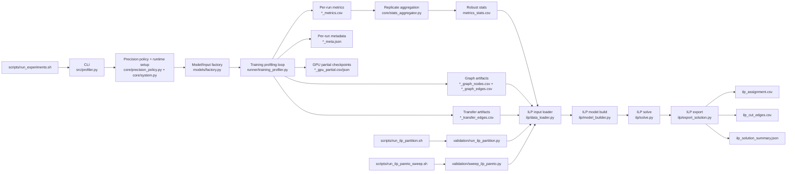

# Advanced Hybrid Profiler - Technical Documentation

**See [../README.md](../README.md) for quick start and general overview.**

This document describes the data schema, profiler outputs, and how metrics map to ILP optimization variables.

---

## ILP Flow Diagram – Profiler Metrics to Optimization Model

                ┌───────────────────────────────┐
                │   Profiler (per-layer CSV/JSON)│
                └───────────────┬───────────────┘
                                │
                                ▼
        ┌─────────────────────────────────────────────────┐
        │                 ILP Node (Layer i)              │
        └─────────────────────────────────────────────────┘
          │   Metrics captured:
          │   - FLOPs (theoretical_flops)
          │   - Memory: params_mb, grads_mb, activations_mb, optimizer_states_mb
          │   - Execution time: gpu_fwd_time_ms, cpu_fwd_time_ms, etc.
          │   - Energy: gpu_fwd_energy_j, cpu_fwd_energy_j
          │   - Efficiency: tflops, efficiency_ratio, layer_j_per_tflop_gpu/cpu
          │   - Overhead: dispatch_overhead_ratio (per-layer) and global overhead vectors
          │   - Transfers: transfer_h2d_ms, transfer_d2h_ms
          │
          ▼
        ┌─────────────────────────────────────────────────┐
        │             ILP Variables & Constraints         │
        └─────────────────────────────────────────────────┘
          │
          ├─► **Compute constraints**
          │     - Assign layer i to GPU or CPU
          │     - Respect device execution times (T_gpu, T_cpu)
          │
          ├─► **Memory constraints**
          │     - GPU memory ≤ gpu_mem_peak_mb
          │     - CPU memory ≤ process limits
          │     - Include optimizer_states_mb
          │
          ├─► **Energy constraints**
          │     - Total energy ≤ energy_total_gpu_j / energy_total_cpu_j
          │     - Per-layer energy shares (normalized vectors)
          │
          ├─► **Transfer constraints**
          │     - PCIe α–β model applied to activations_mb
          │     - Transfer times added to schedule
          │
          ├─► **Overhead constraints**
          │     - Global overhead ratios (framework_overhead_ratio_gpu/cpu)
          │     - Per-layer dispatch overhead considered in throughput
          │
          ▼
        ┌─────────────────────────────────────────────────┐
        │             ILP Objective Functions             │
        └─────────────────────────────────────────────────┘
          │
          ├─► Minimize total step time (compute + transfers + overhead)
          ├─► Minimize energy consumption (weighted J/TFLOP)
          ├─► Balance efficiency ratios across devices
          │
          ▼
        ┌─────────────────────────────────────────────────┐
        │              Optimized Hybrid Schedule          │
        └─────────────────────────────────────────────────┘

Figure X. Flow of profiler metrics into the ILP optimization model. Each profiled layer is represented as a node with associated compute, memory, energy, transfer, and overhead costs. These metrics are mapped to ILP variables and constraints, enabling the solver to assign layers to CPU or GPU under global resource limits. The objective functions minimize total step time and energy consumption while balancing efficiency across devices, producing an optimized hybrid execution schedule.

### How to use this diagram
- **Nodes**: Each layer becomes a decision variable in the ILP.  
- **Edges**: Transfers between CPU and GPU are modeled with α–β parameters.  
- **Constraints**: Memory, energy, and overhead are enforced globally.  
- **Objective**: Optimize for speed and energy efficiency simultaneously.  

## End-to-End Pipeline (Mermaid)

---

### Introducción y objetivos generales

El perfilador híbrido CPU–GPU desarrollado en este trabajo constituye una herramienta metodológica diseñada para producir una caracterización empírica, reproducible y de alta fidelidad del entrenamiento de modelos de aprendizaje profundo. Su propósito principal es suministrar, con granularidad de **módulo hoja** (capa), las métricas necesarias para parametrizar y validar el modelo de optimización entero lineal (ILP) presentado en el capítulo correspondiente de la tesis. Estas métricas abarcan dimensiones temporales (tiempos forward y backward, overhead de framework), energéticas (energía total por dispositivo y energía atribuida por capa), computacionales (FLOPs teóricos y TFLOPS empíricos), de memoria (parámetros, activaciones, picos globales) y de transferencia (modelo alfa–beta para PCIe). El diseño prioriza la trazabilidad de las mediciones, la separación explícita entre tiempo de kernel y overhead de despacho, y la robustez frente a la heterogeneidad de hardware y precisiones numéricas.

---

### Preparación experimental, gestión de precisión y fábrica de modelos

La fase de preparación del experimento persigue dos objetivos complementarios: minimizar la variabilidad no controlada y garantizar coherencia numérica entre dispositivos. Para ello se implementa una rutina de determinismo que fija semillas en Python, NumPy y PyTorch, desactiva heurísticas no deterministas de cuDNN y, cuando es posible, fuerza algoritmos deterministas en PyTorch. Estas medidas reducen la dispersión de las mediciones y facilitan comparaciones reproducibles entre ejecuciones y configuraciones.

La gestión de precisión numérica se centraliza en una política que mapea las etiquetas de usuario a tipos de PyTorch (`fp32`, `fp16`, `bf16`) y, antes de ejecutar, sondea el conjunto de instrucciones de CPU (`/proc/cpuinfo`). Para ejecución acelerada se exige AVX512_FP16 en `fp16`, y AVX512_BF16 o AMX_BF16+AMX_TILE en `bf16`. Si no existe una ruta acelerada para la precisión solicitada, el perfilador **no ejecuta** entrenamiento/profilado (sin fallback emulado a FP32) y genera artefactos de estado (`CSV`/`JSON`) con bandera de `skip` y motivo explícito. En la instanciación de modelos se adopta la siguiente política: para modelos HuggingFace (BERT, GPT2) se especifica `torch_dtype` en `from_pretrained` para materializar los pesos en la precisión deseada; para modelos de TorchVision y para el MLP propio se aplica la conversión posterior mediante `.half()` o `.to(torch.bfloat16)`. Los tensores de entrada se convierten únicamente si son de punto flotante; tensores discretos como `input_ids` y `attention_mask` se preservan en su tipo entero para mantener la semántica del modelo. Esta estrategia evita conversiones ambiguas que puedan inducir errores de análisis estático o inconsistencias numéricas.

La **fábrica de modelos** en `main()` garantiza que cada rama asigne `model` e `inp` de forma explícita y documentada. Para cada modelo se define la forma de entrada, la política de casting y la inicialización de dtype, de modo que las mediciones posteriores sean comparables y reproducibles. Además, se registra en los metadatos la precisión efectivamente ejecutada en CPU y GPU, lo que permite que el ILP incorpore restricciones de factibilidad relacionadas con la precisión.

---

### Instrumentación de capas, metodología de tiempos y estimación de FLOPs

La instrumentación se realiza a nivel de **módulos hoja** para evitar doble conteo. Cada módulo hoja recibe dos hooks: un **pre‑hook** que registra el inicio del despacho mediante `time.perf_counter()` y, en GPU, graba un evento CUDA (`torch.cuda.Event(enable_timing=True)`); y un **post‑hook** que, tras la ejecución de la capa, calcula las métricas relevantes. En GPU el tiempo de kernel se obtiene mediante la diferencia entre eventos CUDA sincronizados y se expresa en milisegundos; en CPU el tiempo de ejecución se obtiene por diferencia de `perf_counter`. La distinción entre tiempo de kernel y tiempo de pared permite definir el **overhead de despacho** por capa como la diferencia no negativa entre ambos tiempos:
\[
\text{dispatch\_ms} = \max\big(0,\ \text{wall\_ms} - \text{kernel\_ms}\big).
\]
Las cantidades por capa se acumulan en una estructura que contiene: **tipo de módulo**, **params_mb**, **output_bytes**, **time_ms_accum**, **dispatch_ms_accum**, **count**, **gpu_mem_peak_mb** y **flops** estimados.

La estimación teórica de FLOPs se realiza mediante fórmulas geométricas que reflejan la estructura de la operación y que son computacionalmente eficientes de evaluar en hooks. Para una convolución 2D se emplea la expresión
\[
\text{FLOPs}_{\text{conv}} = 2 \cdot C_{\text{out}} \cdot H_{\text{out}} \cdot W_{\text{out}} \cdot (\text{effective\_cin} \cdot K_x \cdot K_y),
\]
donde \(\text{effective\_cin} = \max\big(\tfrac{C_{\text{in}}}{\text{groups}},1\big)\). Para capas lineales la estimación es
\[
\text{FLOPs}_{\text{linear}} = 2 \cdot P \cdot \text{in\_features} \cdot \text{out\_features},
\]
con \(P\) igual al producto de las dimensiones de posición. Para mecanismos de atención se combinan términos que capturan la proyección y el producto de atención, incorporando la dependencia cuadrática en la longitud de secuencia \(S\). Estas estimaciones proporcionan el numerador del trabajo computacional por capa y son coherentes con la literatura sobre conteo de operaciones en redes neuronales.

Para complementar la estimación teórica, el perfilador ejecuta un micro‑benchmark GEMM que multiplica matrices \(N\times N\) durante varias iteraciones y mide la duración. El TFLOPS empírico se calcula como
\[
\text{TFLOPS} = \frac{2 \cdot N^3 \cdot \text{iterations}}{10^{12} \cdot \text{duration}_s}.
\]
Este valor empírico representa el **pico sostenido medido** en el entorno y precisión actuales y se utiliza para normalizar la eficiencia de cada capa:
\[
\text{efficiency\_ratio}_l = \frac{\text{tflops}_l}{\text{pico\_medido}}.
\]
La razón de emplear un pico empírico en lugar de valores teóricos de hoja de datos es que las condiciones reales de ejecución (memoria, concurrencia, librerías BLAS, versiones de drivers) determinan el rendimiento sostenido, y el ILP debe basarse en medidas representativas del entorno experimental.

---

### Medición energética, atribución por capa y calibración de transferencias PCIe

La medición energética se realiza en un hilo monitor (`EnergyMonitor`) que, en GPU, consulta periódicamente NVML para obtener potencia instantánea y, en CPU, utiliza pyRAPL cuando está disponible. Las lecturas de potencia se almacenan y se promedian; la energía total del intervalo se estima como la potencia media multiplicada por la duración del intervalo de medición. El diseño del monitor contempla inicialización y cierre seguros de sensores: `nvmlInit()` y `nvmlShutdown()` se envuelven en bloques `try/except` para evitar excepciones en entornos donde NVML no esté disponible o ya haya sido cerrado.

Dado que los sensores entregan energía agregada por dispositivo, la atribución a capas se efectúa en proporción al tiempo de ejecución de cada capa. Formalmente, si \(T_l\) es el tiempo promedio de la capa \(l\) y \(T_{\text{sum}}\) la suma de tiempos de capas del dispositivo, la fracción temporal es
\[
s_l = \frac{T_l}{T_{\text{sum}}}.
\]
La energía atribuida por paso a la capa es
\[
E_l^{\text{fwd}} = E_{\text{avg\_step}} \cdot s_l,
\]
con \(E_{\text{avg\_step}} = \dfrac{E_{\text{total}}}{\text{measure}}\). El trabajo de la capa en TFLOPs se define como
\[
W_l = \frac{\text{FLOPs}_l \cdot \text{count}_l}{10^{12}},
\]
y la eficiencia energética por capa se expresa en julios por TFLOP:
\[
\text{J/TFLOP}_l = \frac{E_l^{\text{fwd}}}{W_l}\quad\text{si }W_l>0.
\]
Para la fase backward se aplica, salvo medida directa, la heurística \(T^{\text{bwd}}_l = 2\cdot T^{\text{fwd}}_l\) y \(E^{\text{bwd}}_l = 2\cdot E^{\text{fwd}}_l\). Estas heurísticas se adoptan por su prevalencia en la literatura de offloading y por su simplicidad para el ILP; sin embargo, el perfilador permite sustituirlas por medidas directas si se dispone de ellas.

La calibración de transferencias PCIe se realiza mediante un modelo lineal alfa–beta. Se miden tiempos de copia para 1 MB y 100 MB en ambas direcciones, usando memoria pinneada para H2D y sincronización para obtener medidas deterministas. A partir de los dos puntos se deriva la pendiente \(\beta\) en MB/ms y la latencia fija \(\alpha\) en ms. El tiempo estimado de transferencia para un volumen \(V\) en MB se aproxima por
\[
t_{\text{transfer}} = \alpha + \frac{V}{\beta}.
\]
En la práctica, el perfilador utiliza el tamaño de salida de la capa (`output_bytes`) como proxy del volumen transferido; esta aproximación es de primer orden y se documenta como tal en la tesis, con la advertencia de que escenarios con compresión, concurrencia o colas de transferencia pueden desviarse de la linealidad.

---

### Salidas del perfilador, estructura del CSV y mapeo al ILP

El perfilador produce dos artefactos complementarios: un **CSV** con métricas por capa y un **JSON** con agregados y metadatos. El CSV está concebido para ser consumido directamente por el ILP sin transformaciones adicionales; el JSON documenta vectores y parámetros globales que facilitan auditoría y reproducibilidad.

A continuación se presenta una tabla que describe las columnas principales del CSV y su interpretación técnica. Cada celda contiene una sola línea de texto para facilitar su inclusión en la monografía y en tablas de apéndice.

| **Columna** | **Tipo** | **Unidad** | **Descripción** |
|---|---:|---:|---|
| **layer** | string | — | Identificador único del módulo hoja en el grafo del modelo |
| **type** | string | — | Clase del módulo (Conv2d, Linear, MultiheadAttention, etc.) |
| **params_mb** | float | MB | Tamaño de parámetros del módulo en megabytes |
| **optimizer_states_mb** | float | MB | Estimación de memoria para estados del optimizador por módulo |
| **theoretical_flops** | float | FLOPs | Estimación teórica de operaciones para la capa |
| **tflops** | float | TFLOPS | TFLOPS instantáneo observado para la capa |
| **efficiency_ratio** | float | — | Cociente entre TFLOPS de la capa y pico empírico del dispositivo |
| **activations_mb** | float | MB | Tamaño máximo observado de la salida de la capa en MB |
| **gpu_fwd_time_ms** | float | ms | Tiempo forward promedio en GPU por ejecución |
| **gpu_bwd_time_ms** | float | ms | Tiempo backward estimado o medido en GPU |
| **gpu_fwd_energy_j** | float | J | Energía atribuida al forward en GPU por paso promedio |
| **layer_j_per_tflop_gpu** | float | J/TFLOP | Energía por TFLOP en GPU para la capa |
| **cpu_fwd_time_ms** | float | ms | Tiempo forward promedio en CPU por ejecución |
| **cpu_fwd_energy_j** | float or None | J | Energía atribuida al forward en CPU; None si RAPL no disponible |
| **layer_j_per_tflop_cpu** | float or None | J/TFLOP | Energía por TFLOP en CPU; None si no hay medida |
| **gpu_mem_peak_mb** | float | MB | Pico global de memoria CUDA observado tras la capa |
| **dispatch_overhead_ratio** | float | — | Proporción de overhead de despacho respecto al tiempo de kernel (GPU) |
| **transfer_h2d_ms** | float | ms | Tiempo estimado H2D usando alfa–beta y `params_mb` como proxy de payload |
| **transfer_d2h_ms** | float | ms | Tiempo estimado D2H usando alfa–beta y activations_mb |
| **precision_requested** | string | — | Precisión solicitada por el usuario |
| **cpu_precision_executed** | string | — | Precisión efectivamente ejecutada en CPU |
| **gpu_precision_executed** | string | — | Precisión efectivamente ejecutada en GPU |
| **run_executed** | bool | — | `true` si se ejecutó el perfilado; `false` si se omitió |
| **skip_unsupported_precision** | bool | — | `true` cuando se omite por falta de ISA acelerada |
| **skip_reason** | string | — | Motivo detallado de omisión |

El **JSON** global contiene campos agregados y vectores que complementan el CSV. A modo de referencia, las entradas más relevantes del JSON son:

| **Campo JSON** | **Tipo** | **Descripción** |
|---|---:|---|
| **hardware_metadata** | dict | Versiones de Python, PyTorch, SO, CPU, GPU y driver |
| **gpu_total_layer_time_ms** | float | Suma de latencias promedio por capa en GPU |
| **cpu_total_layer_time_ms** | float | Suma de latencias promedio por capa en CPU |
| **gpu_step_time_ms** | float | Tiempo promedio por paso en GPU |
| **cpu_step_time_ms** | float | Tiempo promedio por paso en CPU |
| **framework_overhead_vector** | list | Vector de dispatch_overhead_ms por capa |
| **energy_distribution_vector** | list | Vector de shares de energía por capa y dispositivo |
| **measured_peak_tflops_gpu** | float | TFLOPS pico medido en GPU (micro‑benchmark) |
| **measured_peak_tflops_cpu** | float | TFLOPS pico medido en CPU (micro‑benchmark) |
| **pci_alpha_h2d / pci_beta_h2d** | float | Parámetros alfa y beta calibrados para H2D |
| **gpu_mem_peak_mb_global** | float | Pico global de memoria CUDA observado durante el experimento |
| **params_mb_total / activations_mb_total** | float | Sumatorias globales de parámetros y activaciones |
| **total_model_flops_per_step** | float | Suma de FLOPs forward del modelo dividida por `measure` |
| **optimizer_step_time_total_ms / optimizer_step_time_avg_ms** | float | Tiempo total y promedio de `optimizer.step()` medido |
| **execution_status** | string | Estado global (`completed` o `skipped_unsupported_precision`) |
| **execution_skip_reason** | string | Motivo de omisión (si aplica) |
| **cpu_instruction_flags** | list | Flags ISA detectadas en CPU |
| **cpu_isa_probe** | dict | Resultado estructurado del sondeo ISA usado por la política de precisión |

**Mapeo al ILP.** Cada fila del CSV se traduce directamente en parámetros del ILP: tiempos \(t_{l,d}^{\text{fwd}}\), \(t_{l,d}^{\text{bwd}}\); energías \(e_{l,d}^{\text{fwd}}\), \(e_{l,d}^{\text{bwd}}\); memorias \(m_{l}^{\text{params}}\), \(m_{l}^{\text{acts}}\), \(m_{l}^{\text{opt}}\); y transferencias \(h2d_l\), \(d2h_l\) con \(h2d_l\) derivado de `params_mb` y \(d2h_l\) de `activations_mb`. Las variables de decisión binarias \(x_{l}^{\text{GPU}}, x_{l}^{\text{CPU}}\) se imponen con \(x_{l}^{\text{GPU}}+x_{l}^{\text{CPU}}=1\). Una función objetivo representativa minimiza la suma ponderada de tiempos y energías:
\[
\min \sum_l \sum_{d\in\{\text{CPU,GPU}\}} x_{l}^{d}\big(t_{l,d}^{\text{fwd}}+t_{l,d}^{\text{bwd}}+\text{transfers}_l^d\big) + \lambda \sum_l \sum_{d} x_{l}^{d}\big(e_{l,d}^{\text{fwd}}+e_{l,d}^{\text{bwd}}\big),
\]
sujeta a restricciones de memoria:
\[
\sum_l x_{l}^{\text{GPU}}\big(m_{l}^{\text{params}}+m_{l}^{\text{grads}}+m_{l}^{\text{opt}}+m_{l}^{\text{acts}}\big) \le M_{\text{GPU}}^{\text{avail}}.
\]
Las `efficiency_ratio` pueden introducirse como penalizaciones adicionales para desalentar asignaciones que operen lejos del pico empírico.

---

### Robustez experimental, limitaciones metodológicas y recomendaciones

El diseño incorpora salvaguardas para garantizar la validez de las mediciones: sincronizaciones explícitas en GPU, validaciones contra valores nulos en cálculos energéticos, cierres seguros de NVML y RAPL, y denominadores protegidos en promedios. No obstante, la metodología presenta limitaciones que deben ser explicitadas en la monografía: la energía en CPU depende de la disponibilidad de RAPL; la heurística de backward es una aproximación que conviene validar para arquitecturas concretas; el modelo alfa–beta es lineal por dos puntos y puede no capturar no linealidades en escenarios con concurrencia o compresión; y el pico de memoria del asignador CUDA es un proxy conservador que puede sobreestimar el coste aislado de una capa.

Se recomiendan las siguientes prácticas metodológicas para asegurar rigor doctoral en los experimentos:

- **Repeticiones y estadística:** ejecutar múltiples repeticiones independientes y reportar medidas de dispersión (desviación estándar, intervalos de confianza) para cada métrica clave.
- **Calibración de heurísticas:** cuando sea posible, medir backward explícitamente para capas críticas y sustituir la heurística \(T_{\text{bwd}}=2T_{\text{fwd}}\) por valores empíricos.
- **Validación del ILP:** validar soluciones del ILP mediante ejecuciones reales en el entorno objetivo para detectar discrepancias debidas a solapes de transferencia y cómputo no modelados.

---

## Related Documentation

For more information, see:

| Document | Purpose |
|----------|---------|
| [../README.md](../README.md) | Project overview, quick start, setup instructions |
| [README.md](README.md) | Operational quick start and troubleshooting |
| [PROJECT_STRUCTURE.md](PROJECT_STRUCTURE.md) | Current architecture and folder map |
| [TESTING_VALIDATION_MAP.md](TESTING_VALIDATION_MAP.md) | End-to-end validation workflow |

## Getting Help

1. **Quick Start**: See [../README.md](../README.md)
2. **Usage Examples**: See [README.md](README.md)
3. **Troubleshooting**: See [README.md](README.md#troubleshooting)
4. **Project Structure**: See [PROJECT_STRUCTURE.md](PROJECT_STRUCTURE.md)
5. **Deeper Technical Details**: See individual section above

---

### Líneas futuras de mejora

- **Documentación exhaustiva:** incluir en el apéndice los artefactos CSV y JSON, versiones de librerías, firmware y drivers, y la configuración de hardware para facilitar reproducibilidad y auditoría.
- **Sensibilidad y análisis de robustez:** realizar análisis de sensibilidad del ILP frente a variaciones en alfa–beta, pico TFLOPS y energía medida para evaluar la estabilidad de las soluciones.

---

### Conclusión

El perfilador híbrido descrito articula una metodología integral que vincula instrumentación de bajo nivel, medición energética concurrente, estimación de FLOPs y calibración de transferencias en un pipeline reproducible. Sus salidas —CSV por capa y JSON global— proporcionan una base auditable y directamente utilizable para la formulación y resolución del ILP de la tesis. La elección de medir picos empíricos de TFLOPS, separar kernel de overhead de framework y tratar la memoria pico como proxy conservador responde a criterios de validez y seguridad en la optimización. En conjunto, la herramienta permite fundamentar decisiones de planificación y asignación de recursos con evidencia empírica sólida, facilitando análisis comparativos entre arquitecturas, precisiones y dispositivos en un contexto de investigación doctoral.

---

*Last Updated*: February 26, 2026